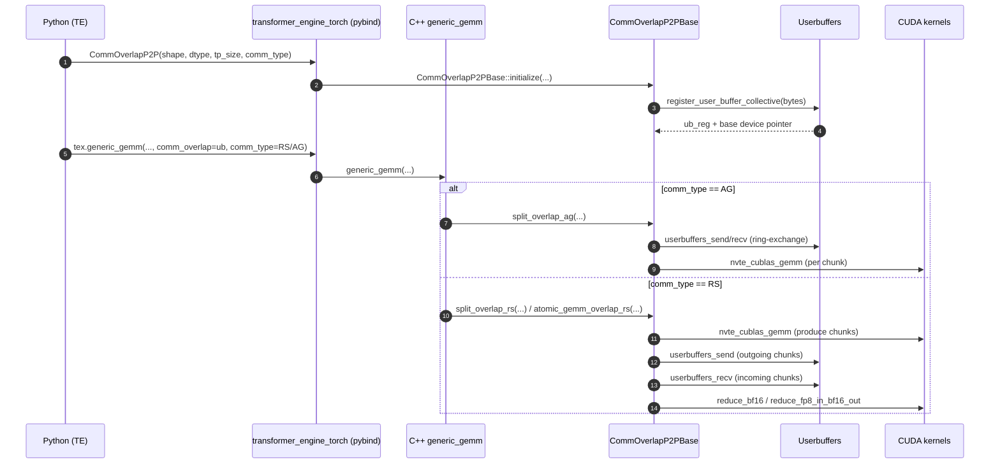
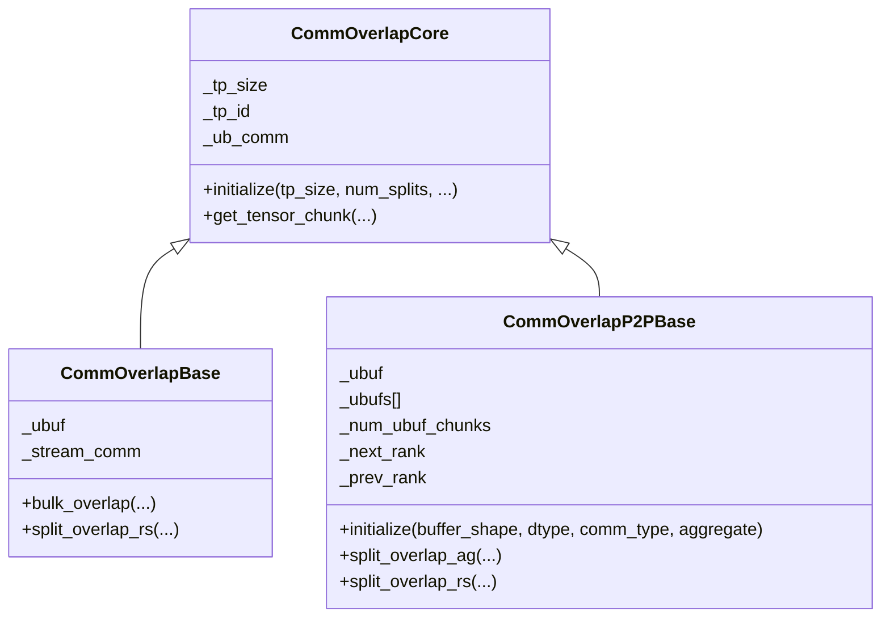

# Async TP GEMM overlap: why RS needs `(2 * tp_size - 1)` chunks

This note explains the `buffer_bytes = buffer_bytes / tp_size * (2 * tp_size - 1)` logic used by **async Reduce-Scatter (RS) + GEMM overlap** in TransformerEngine’s **ring-exchange (P2P)** overlap path, and contrasts it with the **All-Gather (AG) + GEMM** path and the **collective/pipelined** overlap path.

---

## Key Files (clickable)

- UB object construction (Python): [`../transformer_engine/pytorch/module/base.py#L381`](../transformer_engine/pytorch/module/base.py#L381)
- GEMM dispatch into overlap (Python): [`../transformer_engine/pytorch/cpp_extensions/gemm.py#L100`](../transformer_engine/pytorch/cpp_extensions/gemm.py#L100)
- `generic_gemm` overlap dispatch (C++): [`../transformer_engine/pytorch/csrc/extensions/gemm.cpp#L260`](../transformer_engine/pytorch/csrc/extensions/gemm.cpp#L260)
- PyBind exposure of `CommOverlapP2P` (C++): [`../transformer_engine/pytorch/csrc/extensions/pybind.cpp#L499`](../transformer_engine/pytorch/csrc/extensions/pybind.cpp#L499)
- `CommOverlapP2PBase` buffer sizing and chunking (C++): [`../transformer_engine/common/comm_gemm_overlap/comm_gemm_overlap.cpp#L662`](../transformer_engine/common/comm_gemm_overlap/comm_gemm_overlap.cpp#L662)
- P2P AG implementation (C++): [`../transformer_engine/common/comm_gemm_overlap/comm_gemm_overlap.cpp#L887`](../transformer_engine/common/comm_gemm_overlap/comm_gemm_overlap.cpp#L887)
- P2P RS implementation (C++): [`../transformer_engine/common/comm_gemm_overlap/comm_gemm_overlap.cpp#L1118`](../transformer_engine/common/comm_gemm_overlap/comm_gemm_overlap.cpp#L1118)
- Reduction kernel consumes contiguous inputs (CUDA): [`../transformer_engine/common/comm_gemm_overlap/userbuffers/userbuffers.cu#L2742`](../transformer_engine/common/comm_gemm_overlap/userbuffers/userbuffers.cu#L2742)
- Buffer byte calculation helper (CUDA): [`../transformer_engine/common/common.cu#L247`](../transformer_engine/common/common.cu#L247)

---

## Key Functions Index

| Function | File | Purpose |
|----------|------|---------|
| `initialize_ub(...)-> tex.CommOverlapP2P(...)` | `../transformer_engine/pytorch/module/base.py#L381` | Creates the P2P (ring-exchange) communicator object for AG or RS overlap |
| `general_gemm(..., ub=..., ub_type=...)` | `../transformer_engine/pytorch/cpp_extensions/gemm.py#L92` | Passes the overlap object and type into the C++ extension entrypoint |
| `generic_gemm(..., CommOverlapCore* comm_overlap, CommOverlapType comm_type, ...)` | `../transformer_engine/pytorch/csrc/extensions/gemm.cpp#L260` | Dispatches to `split_overlap_ag/rs` or `atomic_gemm_overlap_ag/rs` |
| `CommOverlapP2PBase::initialize(...)` | `../transformer_engine/common/comm_gemm_overlap/comm_gemm_overlap.cpp#L662` | Allocates/registers the UB memory and materializes `_ubufs[]` chunk views |
| `CommOverlapP2PBase::split_overlap_ag(...)` | `../transformer_engine/common/comm_gemm_overlap/comm_gemm_overlap.cpp#L887` | Ring-exchange all-gather of `B` while launching per-chunk GEMMs |
| `CommOverlapP2PBase::split_overlap_rs(...)` | `../transformer_engine/common/comm_gemm_overlap/comm_gemm_overlap.cpp#L1118` | Launches GEMM chunks, sends outputs, receives peers, then reduces locally |
| `reduce_bf16(inputs, output, num_inputs, input_size)` | `../transformer_engine/common/comm_gemm_overlap/userbuffers/userbuffers.cu#L2742` | Sums `num_inputs` contiguous buffers of length `input_size` into `output` |

---

## Call Chain (Mermaid sequence diagram)



---

## Dataflow (Mermaid flowchart)

```mermaid
flowchart LR
  subgraph AG[AG + GEMM (ring-exchange)]
    B_local[B local chunk] --> UB_AG[UB buffer: tp_size chunks]
    UB_AG -->|ring exchange| B_all[B all-gathered (contiguous)]
    A[A] --> GEMM_AG[GEMM per B chunk]
    B_all --> GEMM_AG
    GEMM_AG --> D[D output]
  end

  subgraph RS[GEMM + RS (ring-exchange)]
    A2[A] --> GEMM_RS[GEMM per B chunk]
    B2[B (chunked)] --> GEMM_RS
    GEMM_RS --> UB_OUT[UB buffer: outgoing chunks 0..tp_size-1]
    UB_OUT -->|send chunk i to dst rank| NET[P2P send/recv]
    NET --> UB_IN[UB buffer: received chunks tp_size..2tp_size-2]
    UB_IN --> REDUCE[local reduce over tp_size inputs]
    UB_OUT --> REDUCE
    REDUCE --> RS_OUT[rs_output (local shard)]
  end
```

---

## Component relationships (Mermaid class diagram)



---

## Big Picture: what “AG+GEMM” vs “GEMM+RS” means

At a high level:

- **AG + GEMM overlap**: we need every rank to see the **full** tensor-parallel input (or weight) to compute its GEMM, so we **all-gather** (AG) shards into a contiguous buffer while launching GEMM chunks that consume the shards as they arrive.
- **GEMM + RS overlap**: each rank’s GEMM produces **partial contributions** to the final output shard(s). Those contributions must be **reduced** (summed) across ranks and then **scattered** so each rank keeps only its local shard. In the **ring-exchange implementation**, the communication step is staged as **send/recv of full output chunks**, and the actual **reduce happens locally at the end**, which is why extra buffer space is needed.

The critical difference is:

- In P2P AG: the UB buffer is the **final all-gathered tensor** (tp chunks).
- In P2P RS: the UB buffer must temporarily hold **(a) produced chunks to send** and **(b) received chunks to reduce**, and those lifetimes overlap during pipelining.

---

## Execution Path Trace (frame-by-frame)

### Frame 1 — Python creates a ring-exchange UB object (`CommOverlapP2P`)

Source: [`../transformer_engine/pytorch/module/base.py#L381`](../transformer_engine/pytorch/module/base.py#L381)

```py
ub_obj = tex.CommOverlapP2P(
    shape,
    buffer_dtype,
    helper,
    tp_size,
    tex.CommOverlapType.RS if is_reduce_scatter else tex.CommOverlapType.AG,
    ...
)
```

Line-by-line intent:

- `shape`: the 2D UB “communication buffer” shape the overlap path uses internally.
- `tp_size`: tensor-parallel group size; this determines how many per-rank “chunks” exist.
- `comm_type`: selects **AG** vs **RS**, which will change the buffer chunking policy inside `CommOverlapP2PBase::initialize` (this is where the `(2*tp_size-1)` happens for RS).

**State before**: no UB memory registered, `_num_ubuf_chunks` not set.  
**State after**: a C++ `CommOverlapP2PBase` object exists, with its UB buffer registered and chunk views built (next frame).

---

### Frame 1.1 — PyBind constructs `CommOverlapP2P` which delegates into `CommOverlapP2PBase`

PyBind exposure of the class:

Source: [`../transformer_engine/pytorch/csrc/extensions/pybind.cpp#L499`](../transformer_engine/pytorch/csrc/extensions/pybind.cpp#L499)

```cpp
py::class_<CommOverlapP2P, std::shared_ptr<CommOverlapP2P>,
           transformer_engine::CommOverlapP2PBase, transformer_engine::CommOverlapCore>(m, "CommOverlapP2P")
  .def(py::init<const std::vector<size_t> &, at::ScalarType, CommOverlapHelper *, int,
                transformer_engine::CommOverlapType, ...>(),
       ...);
```

The C++ wrapper’s constructor immediately delegates to the common-core P2P base:

Source: [`../transformer_engine/pytorch/csrc/extensions/comm_gemm_overlap.cpp#L229`](../transformer_engine/pytorch/csrc/extensions/comm_gemm_overlap.cpp#L229)

```cpp
CommOverlapP2P::CommOverlapP2P(..., int tp_size, te::CommOverlapType comm_type, ...)
  : te::CommOverlapP2PBase(
      buffer_shape, GetTransformerEngineDType(buffer_dtype),
      helper->myrank, helper->numranks, helper->mylocal, helper->numlocal,
      helper->mynode, helper->numnodes,
      tp_size,
      std::bind(&CommOverlapHelper::ub_allgather, helper, _1, _2, _3, _4, _5),
      std::bind(&CommOverlapHelper::ub_barrier, helper, _1),
      comm_type, ...) {}
```

What matters for buffer sizing:

- The `comm_type` chosen in Python (AG vs RS) is passed unmodified into `CommOverlapP2PBase`.
- `CommOverlapP2PBase::initialize(..., comm_type, ...)` uses that to decide whether to allocate `tp_size` or `(2*tp_size - 1)` chunks.

---

### Frame 2 — Python calls `tex.generic_gemm(..., comm_overlap=..., comm_type=...)`

Source: [`../transformer_engine/pytorch/cpp_extensions/gemm.py#L178`](../transformer_engine/pytorch/cpp_extensions/gemm.py#L178)

```py
kwargs = {
    "comm_overlap": ub,
    "comm_type": ub_type,
    "extra_output": extra_output,
    ...
}
out, bias_grad, gelu_input, extra_output = tex.generic_gemm(*args, **kwargs)
```

Key point: `comm_type` is explicitly passed down so C++ can branch into AG vs RS overlap.

---

### Frame 3 — C++ dispatches to AG or RS overlap methods

Source: [`../transformer_engine/pytorch/csrc/extensions/gemm.cpp#L260`](../transformer_engine/pytorch/csrc/extensions/gemm.cpp#L260)

```cpp
if (comm_overlap) {
  if (bulk_overlap) {
    comm_overlap->bulk_overlap(..., comm_type.value(), extra_output_tensor, main_stream);
  } else if (comm_type.value() == CommOverlapType::AG) {
    if (comm_overlap->is_atomic_gemm()) {
      comm_overlap->atomic_gemm_overlap_ag(...);
    } else {
      comm_overlap->split_overlap_ag(...);
    }
  } else {
    if (comm_overlap->is_atomic_gemm()) {
      comm_overlap->atomic_gemm_overlap_rs(...);
    } else {
      comm_overlap->split_overlap_rs(...);
    }
  }
}
```

Interpretation:

- **AG**: calls `split_overlap_ag` or `atomic_gemm_overlap_ag`.
- **RS**: calls `split_overlap_rs` or `atomic_gemm_overlap_rs`.
- The **buffer sizing difference** we care about occurs earlier (during `CommOverlapP2PBase::initialize`), but it is **required** by the RS implementations called here.

---

## The core answer: why RS needs `(2 * tp_size - 1)` chunks

### Frame 4 — P2P buffer allocation and chunk views (`CommOverlapP2PBase::initialize`)

Source: [`../transformer_engine/common/comm_gemm_overlap/comm_gemm_overlap.cpp#L662`](../transformer_engine/common/comm_gemm_overlap/comm_gemm_overlap.cpp#L662)

```cpp
size_t buffer_bytes = get_buffer_size_bytes(buffer_shape[0], buffer_shape[1], buffer_dtype);
int buffer_chunk_bytes = buffer_bytes / _tp_size;
_num_ubuf_chunks = _tp_size;
if (_is_reduce_scatter) {
  buffer_bytes = buffer_bytes / _tp_size * (_tp_size * 2 - 1);
  _num_ubuf_chunks = _tp_size * 2 - 1;
}

_ub_reg = register_user_buffer_collective(&buffer_ptr, buffer_bytes, _ub_comm, true);
_ubuf = TensorWrapper(
    buffer_ptr,
    std::vector<size_t>{buffer_shape[0] / _tp_size * _num_ubuf_chunks, buffer_shape[1]},
    buffer_dtype);

for (int i = 0; i < _num_ubuf_chunks; i++) {
  _ubufs.push_back(TensorWrapper(
      reinterpret_cast<void *>(ubuf_byte_ptr),
      std::vector<size_t>{buffer_shape[0] / _tp_size, buffer_shape[1]},
      buffer_dtype));
  ubuf_byte_ptr += buffer_chunk_bytes;
}
```

Annotated walkthrough (what each line “means” for buffer sizing):

- `buffer_bytes = get_buffer_size_bytes(...)`
  - This is the “**base**” size that would hold `buffer_shape[0] * buffer_shape[1]` elements.
  - Definition: [`../transformer_engine/common/common.cu#L251`](../transformer_engine/common/common.cu#L251)
- `buffer_chunk_bytes = buffer_bytes / _tp_size`
  - We interpret the base buffer as `tp_size` equally-sized “chunks”.
  - Each chunk is the per-rank slice along dimension 0: `(buffer_shape[0] / tp_size, buffer_shape[1])`.
- Default path (`AG`):
  - `_num_ubuf_chunks = tp_size`
  - UB buffer holds exactly `tp_size` chunks → total bytes stays at `buffer_bytes`.
  - `_ubuf.shape == buffer_shape` (because `(buffer_shape[0]/tp_size) * tp_size == buffer_shape[0]`).
- RS path (`_is_reduce_scatter == true`):
  - `_num_ubuf_chunks = 2*tp_size - 1`
  - UB buffer holds **extra** `(tp_size - 1)` chunks, each `buffer_chunk_bytes` bytes.
  - Total chunks: `tp_size + (tp_size - 1) = 2*tp_size - 1`.
  - Therefore: `buffer_bytes = buffer_chunk_bytes * (2*tp_size - 1)`.

So the allocation is not “magic bytes”; it is simply:

> **RS needs `(2*tp_size - 1)` chunk slots** (each of `buffer_bytes/tp_size`) to overlap (1) outgoing GEMM outputs with (2) incoming outputs that must be reduced locally at the end.

To make the “bytes matter” explicit, the userbuffers registration function consumes `bytes` and aligns it for the underlying allocation/mapping:

Source: [`../transformer_engine/common/comm_gemm_overlap/userbuffers/userbuffers-host.cpp#L513`](../transformer_engine/common/comm_gemm_overlap/userbuffers/userbuffers-host.cpp#L513)

```cpp
int register_user_buffer_collective(void **gpubuff, size_t bytes, communicator *comm, bool alloc) {
  ...
  size_t aligned_size = bytes;
  ...
  aligned_size = (bytes + granularity - 1) / granularity * granularity;
  ...
}
```

---

## Why exactly `(2*tp_size - 1)` and not `(2*tp_size)`?

The RS implementations arrange memory so the local reduction reads `tp_size` **contiguous inputs** starting at chunk index `tp_size - 1`:

### Frame 5 — RS reduces `tp_size` inputs from a contiguous “reduce window”

Source: [`../transformer_engine/common/comm_gemm_overlap/comm_gemm_overlap.cpp#L1194`](../transformer_engine/common/comm_gemm_overlap/comm_gemm_overlap.cpp#L1194) (same pattern in atomic RS at [`../transformer_engine/common/comm_gemm_overlap/comm_gemm_overlap.cpp#L1101`](../transformer_engine/common/comm_gemm_overlap/comm_gemm_overlap.cpp#L1101))

```cpp
char *reduce_buf_ptr = reinterpret_cast<char *>(_ubufs[_tp_size - 1].dptr());
reduce_bf16(reduce_buf_ptr, rs_output_ptr, _tp_size, _ubufs[0].numel(), stream_main);
```

And `reduce_bf16` **assumes** its inputs are contiguous in memory:

Source: [`../transformer_engine/common/comm_gemm_overlap/userbuffers/userbuffers.cu#L2742`](../transformer_engine/common/comm_gemm_overlap/userbuffers/userbuffers.cu#L2742)

```cpp
const int tot_input_size = input_size * num_inputs;
VectorizedLoader<half_dtype, nvec, true> loader(inputs_half, tot_input_size);
...
for (int input_id = 1; input_id < num_inputs; ++input_id) {
  loader.load(tid + num_aligned_elements_per_input * input_id, tot_input_size);
  ...
}
```

This is why RS arranges a “reduce window” of exactly `tp_size` chunk buffers:

- Start: chunk index `tp_size - 1` (this is the **local** chunk for “self”)
- Then: `tp_size - 1` received chunks at indices `tp_size ... 2*tp_size-2`
- Total inputs in the window: `1 + (tp_size - 1) = tp_size`

Because chunk `tp_size - 1` is **both**:

1. a valid GEMM output chunk (the one that stays local), and
2. the first element of the contiguous reduction window,

we get to “reuse” one chunk slot that otherwise would have been separate.

That reuse is the “`- 1`” in `(2*tp_size - 1)`.

---

## RS implementation details (where those extra chunks are used)

### Frame 6 — RS “split overlap” produces outgoing chunks and receives incoming chunks

Source: [`../transformer_engine/common/comm_gemm_overlap/comm_gemm_overlap.cpp#L1150`](../transformer_engine/common/comm_gemm_overlap/comm_gemm_overlap.cpp#L1150)

```cpp
for (int i = 0; i < _tp_size; i++) {
  // 1) Produce GEMM output chunk i into chunk-id i (0..tp_size-1)
  auto output_chunk = get_buffer_chunk_by_id(D, i);
  nvte_cublas_gemm(..., output_chunk.data(), ...);

  if (i > 0) {
    // 2) Send previous output (chunk i-1) away and receive peer into chunk (i-1 + tp_size)
    int send_offset = comm_bytes * (i - 1);
    int recv_offset = comm_bytes * (i - 1 + _tp_size);
    userbuffers_send(_ub_reg, send_offset, _ub_reg, recv_offset, comm_bytes, ...);
    userbuffers_recv(_ub_reg, send_offset, _ub_reg, recv_offset, comm_bytes, ...);
  }
}

// 3) Reduce contiguous window starting at chunk (tp_size-1)
reduce_bf16(_ubufs[_tp_size - 1].dptr(), rs_output.dptr(), _tp_size, _ubufs[0].numel(), ...);
```

Chunk indexing and lifetimes (the key invariant):

- Outgoing GEMM chunks: stored in `_ubufs[0 .. tp_size-2]` long enough to be sent.
- Local chunk: stored in `_ubufs[tp_size-1]` and never sent; becomes the first element in the reduce window.
- Incoming chunks: stored in `_ubufs[tp_size .. 2*tp_size-2]` (exactly `tp_size-1` receive slots).

Therefore the **total** number of chunks you must allocate is:

```
outgoing slots (tp_size-1) +
reduce-window base slot (1) +
incoming slots (tp_size-1)
= 2*tp_size - 1
```

---

## AG implementation details (why it does NOT need extra chunks)

### Frame 7 — P2P AG uses exactly `tp_size` chunks (the all-gathered tensor)

Source: [`../transformer_engine/common/comm_gemm_overlap/comm_gemm_overlap.cpp#L662`](../transformer_engine/common/comm_gemm_overlap/comm_gemm_overlap.cpp#L662)

- In AG mode, `_num_ubuf_chunks = tp_size`, so `_ubufs.size() == tp_size`.
- Those chunks represent the all-gathered result. There is no “extra receive staging area” because the gathered tensor itself is the final communication product.

And the AG ring-exchange loop only needs to ring-permute those `tp_size` chunks:

Source: [`../transformer_engine/common/comm_gemm_overlap/comm_gemm_overlap.cpp#L994`](../transformer_engine/common/comm_gemm_overlap/comm_gemm_overlap.cpp#L994)

```cpp
for (int i = 0; i < _tp_size; i++) {
  int send_chunk_id = (_tp_size + _tp_id - i) % _tp_size;
  int recv_chunk_id = (_tp_size + _tp_id - i - 1) % _tp_size;
  ...
  if (i < _tp_size - 1) {
    userbuffers_send(..., send_offset, ..., comm_bytes, ...);
    userbuffers_recv(..., recv_offset, ..., comm_bytes, ...);
  }
}
```

There is no final local “reduce across tp inputs” step, so there is no need for `tp_size-1` extra chunk slots.

---

## Collective/pipelined overlap (`CommOverlapBase`) vs ring-exchange (`CommOverlapP2PBase`)

The `(2*tp_size-1)` sizing is **specific** to `CommOverlapP2PBase` (ring-exchange).

In the **collective/pipelined** implementation (`CommOverlapBase`), RS uses specialized reduce-scatter kernels that directly reduce and scatter without staging `tp_size-1` received chunks.

Source: [`../transformer_engine/common/comm_gemm_overlap/comm_gemm_overlap.cpp#L279`](../transformer_engine/common/comm_gemm_overlap/comm_gemm_overlap.cpp#L279)

```cpp
size_t buffer_bytes = get_buffer_size_bytes(buffer_shape[0], buffer_shape[1], buffer_dtype);
_ub_reg = register_user_buffer_collective(&buffer_ptr, buffer_bytes, _ub_comm, true);
_ubuf = TensorWrapper(buffer_ptr, buffer_shape, buffer_dtype);
```

No RS-specific scaling is done there; the RS pipeline kernels operate on `_ubuf` directly (e.g. `reducescatter2_userbuff_stridedoutput*`), so the extra receive staging required by the P2P RS approach is not needed.

---

## Summary (direct answers)

- **Why does async RS TP GEMM use `(2*tp_size - 1)` buffer bytes?**
  - In the ring-exchange RS implementation, each rank must:
    - hold `(tp_size - 1)` locally-produced output chunks until they are sent,
    - receive `(tp_size - 1)` peer chunks that contribute to its local reduce-scatter result,
    - and perform a final local reduction over `tp_size` contiguous chunk buffers.
  - The implementation reuses the “self” output chunk as the first element of the reduction window, saving one chunk and yielding `(2*tp_size - 1)` total chunk slots.

- **What’s the AG vs RS difference (implementation + buffer setup)?**
  - **AG (P2P ring-exchange)**:
    - UB holds the final all-gathered tensor: exactly `tp_size` chunk slots.
    - No final “sum over tp inputs” step, so no extra chunk slots.
  - **RS (P2P ring-exchange)**:
    - UB must hold both outgoing GEMM outputs and incoming chunks for the local reduction window.
    - Needs `2*tp_size - 1` chunk slots to pipeline send/recv and still have a contiguous `tp_size`-chunk window for `reduce_bf16` / `reduce_fp8_in_bf16_out`.
  - **RS (collective/pipelined `CommOverlapBase`)**:
    - Uses `reducescatter2_userbuff_*` kernels; reduction happens “inside” the comm primitive, so buffer size stays at the base `buffer_bytes`.
