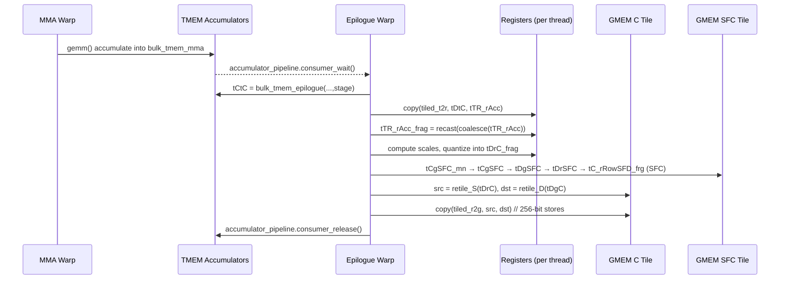
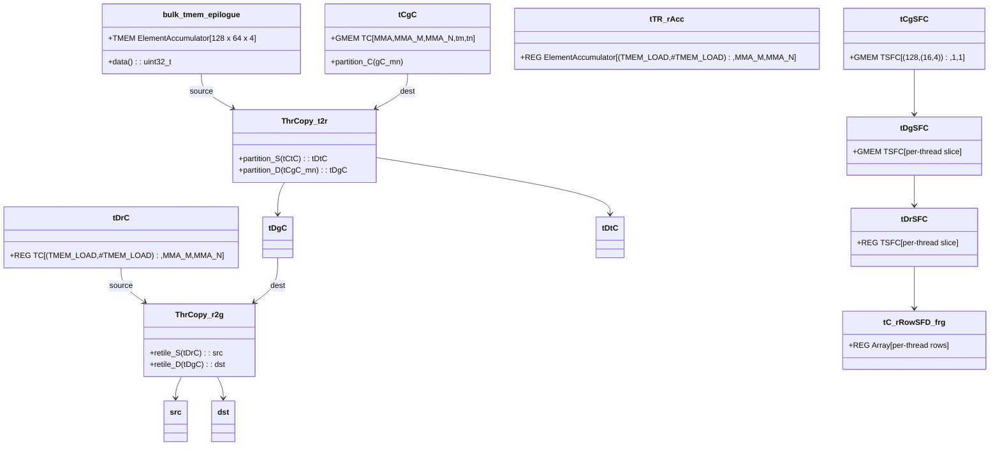

# RHT GEMM Epilogue TMEM → Register → GMEM Path (Shapes & Layouts)

**Kernel family (debug + production)**:  
`rht_gemm_device` in the debug kernel → `experiments/rht_gemm.cu`  
`rht_gemm_device` in production → `transformer_engine/common/hadamard_transform/hadamard_transform_cast_fusion.cu`

This note documents, **frame by frame**, the epilogue path that:

- Pulls C accumulators from **TMEM** into registers,
- Computes per‑vector NVFP4 SFC scales,
- Writes quantized FP4 outputs and SFC scales to GMEM.

All links below are relative to this file.

---

## 0. Key Functions / Symbols Index

| Symbol / Function | Location | Purpose |
|-------------------|----------|---------|
| `detail::rht_gemm_ntt_w_sfc` | [`hadamard_transform_cast_fusion.cu:549`](../transformer_engine/common/hadamard_transform/hadamard_transform_cast_fusion.cu#L549) | Host launcher configuring MMA / TMEM and calling `rht_gemm_device`. |
| `detail::rht_gemm_device` | [`hadamard_transform_cast_fusion.cu:126`](../transformer_engine/common/hadamard_transform/hadamard_transform_cast_fusion.cu#L126) | Device kernel with mainloop (DMA + MMA) and TMEM‑based epilogue. |
| `experiments::rht_gemm_device` (debug) | [`rht_gemm.cu:146`](../experiments/rht_gemm.cu#L146) | Instrumented version of the same kernel with `print_cute` tracing. |
| `bulk_tmem_epilogue` | [`hadamard_transform_cast_fusion.cu:242`](../transformer_engine/common/hadamard_transform/hadamard_transform_cast_fusion.cu#L242) | TMEM C‑fragment for epilogue, shape `((_128,_64),_1,_1,_4)`. |
| `thr_mma_epilogue.partition_C` | [`hadamard_transform_cast_fusion.cu:422`](../transformer_engine/common/hadamard_transform/hadamard_transform_cast_fusion.cu#L422) | Per‑warp partition of the GMEM C‑tile. |
| `make_tmem_copy(TMEM_LOAD_NEW{}, ...)` | [`hadamard_transform_cast_fusion.cu:423`](../transformer_engine/common/hadamard_transform/hadamard_transform_cast_fusion.cu#L423) | Constructs the TMEM→register tiled copy (`tiled_t2r`). |
| `make_tiled_copy_D(SM100_STORE_256bit_CACHE_NOALLOCATION, ...)` | [`hadamard_transform_cast_fusion.cu:424`](../transformer_engine/common/hadamard_transform/hadamard_transform_cast_fusion.cu#L424) | Constructs the register→GMEM 256‑bit store tiler (`tiled_r2g`). |
| TMEM load traits | [`copy_traits_sm100.hpp:1640`](../3rdparty/cutlass/include/cute/atom/copy_traits_sm100.hpp#L1640) | `Copy_Traits<SM100_TMEM_LOAD_32dp32b64x>`: thread/value layouts. |
| TiledCopy / ThrCopy helpers | [`copy_atom.hpp:240`](../3rdparty/cutlass/include/cute/atom/copy_atom.hpp#L240) | `make_tmem_copy`, `ThrCopy::partition_S`, `ThrCopy::partition_D`, `retile_S`, `retile_D`. |

---

## 1. Epilogue Context: Tiles, TMEM Fragment, and SFC Layout

We fix a concrete configuration that matches the debug run captured in  
[`experiments/debug.log:49–138`](../experiments/debug.log#L49-L138):

- `M = 128`, `N = 384` (so the epilogue tile `gC_mn` is `(128, 64)` and `tiles_in_n = 6`).
- MMA epilogue shape: `(_128,_64,_16)` (see `mma_epilogue` in the log).
- TMEM accumulator fragment for epilogue:

  ```text
  acc_shape_epilogue  = ((_128,_64),_1,_1)
  bulk_tmem_epilogue  = tmem_[32b](0x0000.0000)
                        o ((_128,_64),_1,_1,_4):((_65536,_1),_0,_0,_64)
  ```

  (See [`experiments/debug.log:129–138`](../experiments/debug.log#L129-L138).)

### 1.1 GMEM C and SFC tiles

From the debug trace for `mC` and `gC_mn`:

```text
mC      = subptr[4b](...) o (128,384):(64,_1)
gC_mn   = subptr[4b](...) o (_128,_64,1,6):(64,_1,8192,_64)
gSFC_mn = gmem_ptr[8b](...) o (_128,(_16,_4),1,6):(24,(_0,_1),3072,_4)
```

Source: [`experiments/debug.log:51–55`](../experiments/debug.log#L51-L55) and  
[`experiments/debug.log:72–75`](../experiments/debug.log#L72-L75).

Interpretation:

- `gC_mn` shape: `(BLK_M, BLK_N, 1, tiles_in_n)` = `(_128,_64,1,6)` with row‑major tiling within each 128×64 tile.
- `gSFC_mn` shape: `(_128,(_16,_4),1,6)` with stride `(24,(_0,_1),3072,_4)`; each C tile has 128 rows and `(16,4)` SFC components per row (16 groups × 4 components).

The production kernel builds these tiles as:

```cpp
// GMEM C and SFC tiles (production)
Tensor mC = make_tensor(
    cute::subbyte_iterator<TC>(C), make_shape(M,N), dC);   // (M,N)
...
Tensor mSFC = make_tensor(make_gmem_ptr(SFC), sfc_layout);
...
auto epilogue_tiler = Shape<_128,_64,_64>{};
Tensor gC_mn = local_tile(
    mC, epilogue_tiler, make_coord(_,_,_), Step<_1,_1,X>{});   // (BLK_M,BLK_N)
Tensor gSFC_mn = local_tile(
    mSFC, epilogue_tiler, make_coord(_,_,_), Step<_1,_1,X>{}); // (BLK_M,BLK_N)
```

Source: [`hadamard_transform_cast_fusion.cu:173–183,205–211`](../transformer_engine/common/hadamard_transform/hadamard_transform_cast_fusion.cu#L173-L211).

---

## 2. Epilogue Thread‑Local Objects (Per Warp)

Within `rht_gemm_device`, the epilogue warp branch is:

```cpp
// Epilogue warp path
} else if (is_epilogue_warp) {
  const float global_amax_val = *global_amax;
  static constexpr int FragmentSize = 256 / sizeof_bits_v<TC>;
  ...
  uint32_t tmem_base_ptr = shared_storage.tmem_base_ptr;
  bulk_tmem_epilogue.data() = tmem_base_ptr;
  int thread_idx = threadIdx.x % 128;

  Tensor tCgC = thr_mma_epilogue.partition_C(gC_mn); // (MMA,MMA_M,MMA_N,tm,tn)
  auto tiled_t2r = make_tmem_copy(
      TMEM_LOAD_NEW{}, bulk_tmem_epilogue(_,_,_,_0{}));
  auto tiled_r2g = make_tiled_copy_D(
      Copy_Atom<SM100_STORE_256bit_CACHE_NOALLOCATION, TC>{}, tiled_t2r);
  auto thr_t2r   = tiled_t2r.get_slice(thread_idx);
  auto thr_r2g   = tiled_r2g.get_slice(thread_idx);
  ...
}
```

Source: [`hadamard_transform_cast_fusion.cu:412–427`](../transformer_engine/common/hadamard_transform/hadamard_transform_cast_fusion.cu#L412-L427).

Key points:

- `tCgC` has shape `(MMA, MMA_M, MMA_N, tile_m, tile_n)`; for our 1‑CTA debug case this effectively reduces to `(1, MMA_M, MMA_N,1,tiles_in_n)`.
- `bulk_tmem_epilogue` has shape `((_128,_64),_1,_1,_4)` and is bound to a TMEM base pointer.
- `tiled_t2r` is the TMEM‑to‑register tiled copy configured for `TMEM_LOAD_NEW = SM100_TMEM_LOAD_32dp32b64x`.
- `tiled_r2g` is the register‑to‑GMEM 256‑bit store tiler derived from `tiled_t2r` via `make_tiled_copy_D`.

The TMEM load traits used by `make_tmem_copy` are:

```cpp
template<>
struct Copy_Traits<SM100_TMEM_LOAD_32dp32b64x> {
  using ThrID   = Layout<_32>;
  using ValID   = Layout<Shape<_2048,_32>, Stride<_1, TMEM::DP_b>>;
  using SrcLayout = Layout<Shape<_32,_65536>, Stride<_0,_1>>;
  using DstLayout = Layout<Shape<_32,_2048>,  Stride<_2048,_1>>;
  using RefLayout = SrcLayout;
};
```

Source: [`copy_traits_sm100.hpp:1640–1654`](../3rdparty/cutlass/include/cute/atom/copy_traits_sm100.hpp#L1640-L1654).

From the debug run, the TMEM fragment layout is:

```text
bulk_tmem_epilogue
  = tmem_[32b](0x0000.0000)
    o ((_128,_64),_1,_1,_4):((_65536,_1),_0,_0,_64)
```

Source: [`experiments/debug.log:133–138`](../experiments/debug.log#L133-L138).

So for each pipeline stage `s ∈ {0..3}`, the C‑tile in TMEM:

- Shape: `((_128,_64),_1,_1)` → 128×64 scalar floats,
- Stride: `((_65536,_1),_0,_0)` → contiguous in N, large stride in M.

---

## 3. Frame‑by‑Frame Epilogue Trace (Inner Loop)

We now follow the inner epilogue loop for **one** `(tile_idx_m, tile_idx_n + k_tile)` tile and a fixed `thread_idx`:

```cpp
do {
  for (int k_tile = 0;
       k_tile < K_TILE_MAX && k_tile + tile_idx_n < tiles_in_n;
       ++k_tile) {
    Tensor tCgC_mn = tCgC(_,_,_,tile_idx_m, tile_idx_n + k_tile);
    Tensor tCgSFC_mn = gSFC_mn(_,_,tile_idx_m, tile_idx_n + k_tile);
    accumulator_pipeline.consumer_wait(accumulator_pipe_consumer_state);

    auto tCtC = bulk_tmem_epilogue(_,_,_,
        accumulator_pipe_consumer_state.index());
    Tensor tDtC = thr_t2r.partition_S(tCtC);
    Tensor tDgC = thr_t2r.partition_D(tCgC_mn);

    Tensor tTR_rAcc = make_tensor<ElementAccumulator>(shape(tDgC));
    Tensor tDrC     = make_tensor<TC>(shape(tDgC));
    Tensor tTR_rAcc_frag =
        recast<cutlass::Array<ElementAccumulator, FragmentSize>>(
            coalesce(tTR_rAcc));
    Tensor tDrC_frag =
        recast<cutlass::Array<TC, FragmentSize>>(coalesce(tDrC));

    Tensor src = thr_r2g.retile_S(tDrC);
    Tensor dst = thr_r2g.retile_D(tDgC);

    Tensor tCgSFC = make_tensor(
        tCgSFC_mn.data(),
        make_layout(
            make_shape(shape(tCgSFC_mn), Int<1>{}, Int<1>{}),
            make_stride(stride(tCgSFC_mn), Int<0>{}, Int<0>{})));

    Tensor tDgSFC = filter(thr_t2r.partition_D(tCgSFC));
    Tensor tDrSFC = make_tensor<TSFC>(shape(tDgSFC));

    static constexpr int NumVecs = size(tDgC) / VectorSize;
    Tensor tC_rRowSFD_frg =
        recast<cutlass::Array<TSFC, NumVecs>>(tDrSFC);
    ...
  }
} while (...);
```

Source (debug kernel): [`rht_gemm.cu:706–770`](../experiments/rht_gemm.cu#L706-L770).  
Production kernel: [`hadamard_transform_cast_fusion.cu:435–463`](../transformer_engine/common/hadamard_transform/hadamard_transform_cast_fusion.cu#L435-L463).

We now annotate each frame’s tensor **type**, **shape**, and **layout**.

---

### 3.1 `tCgC_mn` and `tCgSFC_mn` – per‑tile GMEM views

```cpp
Tensor tCgC_mn   = tCgC(_,_,_,tile_idx_m, tile_idx_n + k_tile);
Tensor tCgSFC_mn = gSFC_mn(_,_,tile_idx_m, tile_idx_n + k_tile);
```

**Before slicing**:

- `tCgC = thr_mma_epilogue.partition_C(gC_mn);`  
  Source: [`hadamard_transform_cast_fusion.cu:422`](../transformer_engine/common/hadamard_transform/hadamard_transform_cast_fusion.cu#L422).

  - `tCgC` shape: `(MMA, MMA_M, MMA_N, tile_m, tile_n_group)`.
  - For our debug case: `MMA = 1`, `MMA_M × MMA_N = (128, 64)` (`mma_epilogue` is `128×64×16`).

- `gC_mn` shape: `(_128,_64,1,tiles_in_n)` from the log.

**After slicing**:

- `tCgC_mn` shape: `(MMA, MMA_M, MMA_N)` = `(1, MMA_M, MMA_N)` mapping the **128×64** C tile for this `(tile_idx_m, tile_idx_n + k_tile)`.
- `tCgSFC_mn` shape: `(_128,(_16,_4))` (from `gSFC_mn`).

---

### 3.2 `tCtC` – TMEM tile for current stage

```cpp
auto tCtC = bulk_tmem_epilogue(_,_,_,
    accumulator_pipe_consumer_state.index());
```

Given:

- `bulk_tmem_epilogue` shape: `((_128,_64),_1,_1,_4)` with stride `((_65536,_1),_0,_0,_64)`  
  (debug log: [`experiments/debug.log:133–138`](../experiments/debug.log#L133-L138)).

Fixing `stage = accumulator_pipe_consumer_state.index()`:

- `tCtC` type: `Tensor<ElementAccumulator, LayoutTMEMC>`.
- `tCtC` shape: `((_128,_64),_1,_1)` → 128×64 accumulator tile.
- `tCtC` stride: `((_65536,_1),_0,_0)` → contiguous in N, large stride in M.

---

### 3.3 `tDtC` – per‑thread TMEM source view

```cpp
Tensor tDtC = thr_t2r.partition_S(tCtC);
```

`thr_t2r` is a `ThrCopy` over the TMEM tiler:

```cpp
auto tiled_t2r = make_tmem_copy(TMEM_LOAD_NEW{}, bulk_tmem_epilogue(_,_,_,_0{}));
auto thr_t2r   = tiled_t2r.get_slice(thread_idx);
```

Source: [`hadamard_transform_cast_fusion.cu:423–425`](../transformer_engine/common/hadamard_transform/hadamard_transform_cast_fusion.cu#L423-L425).

Using the TMEM load traits:

```cpp
using CopyOp = SM100_TMEM_LOAD_32dp32b64x;
Copy_Traits<CopyOp>::ValID
  = Layout<Shape<_2048,_32>, Stride<_1, TMEM::DP_b>>;
```

Source: [`copy_traits_sm100.hpp:1640–1647`](../3rdparty/cutlass/include/cute/atom/copy_traits_sm100.hpp#L1640-L1647).

`ThrCopy::partition_S` is implemented as:

```cpp
template <class STensor>
auto partition_S(STensor&& stensor) const {
  auto thr_tensor = make_tensor(
      static_cast<STensor&&>(stensor).data(),
      TiledCopy::tidfrg_S(stensor.layout()));
  return thr_tensor(thr_idx_, _, repeat<rank_v<STensor>>(_));
}
```

Source: [`copy_atom.hpp:320–334`](../3rdparty/cutlass/include/cute/atom/copy_atom.hpp#L320-L334).

Resulting shape (per the kernel comments and TMEM load semantics):

- `tDtC` type: `Tensor<ElementAccumulator, LayoutTmemSrc>`.
- `tDtC` shape: `((TMEM_LOAD,#TMEM_LOAD), MMA_M, MMA_N)` where:
  - `TMEM_LOAD = 32` (threads participating in the TMEM load),
  - `#TMEM_LOAD = 64` (32‑bit words per lane),
  - `MMA_M × MMA_N = 128 × 64` per warp.

This is a logical view: `tDtC` tiles the 128×64 C‑tile across `(TMEM_LOAD,#TMEM_LOAD)` and `(MMA_M,MMA_N)` indices in a way compatible with the TMEM copy atom.

---

### 3.4 `tDgC` – per‑thread GMEM destination view

```cpp
Tensor tDgC = thr_t2r.partition_D(tCgC_mn);
```

`ThrCopy::partition_D` mirrors `partition_S` but uses `tidfrg_D`:

```cpp
template <class DTensor>
auto partition_D(DTensor&& dtensor) const {
  auto thr_tensor = make_tensor(
      static_cast<DTensor&&>(dtensor).data(),
      TiledCopy::tidfrg_D(dtensor.layout()));
  return thr_tensor(thr_idx_, _, repeat<rank_v<DTensor>>(_));
}
```

Source: [`copy_atom.hpp:336–348`](../3rdparty/cutlass/include/cute/atom/copy_atom.hpp#L336-L348).

Result:

- `tDgC` type: `Tensor<ElementAccumulator, LayoutGmemDstC>` (still accumulator type).
- `tDgC` shape: identical logical shape to `tDtC`:
  - `((TMEM_LOAD,#TMEM_LOAD), MMA_M, MMA_N)`.
- Layout: derived from the GMEM layout of `tCgC_mn` so that each `(TMEM_LOAD,#TMEM_LOAD)` & `(MMA_M,MMA_N)` coordinate maps to the matching C element in GMEM.

Together, `(tDtC, tDgC)` define a per‑thread TMEM→GMEM mapping for the C tile.

---

### 3.5 `tTR_rAcc` / `tDrC` – register tiles for accumulators and outputs

```cpp
Tensor tTR_rAcc = make_tensor<ElementAccumulator>(shape(tDgC));
Tensor tDrC     = make_tensor<TC>(shape(tDgC));
```

Result:

- `tTR_rAcc`:
  - Type: `Tensor<ElementAccumulator, LayoutRmemAcc>`.
  - Shape: `shape(tDgC)` = `((TMEM_LOAD,#TMEM_LOAD), MMA_M, MMA_N)`.
  - Layout: canonical register layout (CUTE default for that shape).
  - Role: register accumulator buffer loaded from TMEM (`copy(tiled_t2r, tDtC, tTR_rAcc)`).

- `tDrC`:
  - Type: `Tensor<TC, LayoutRmemC>`.
  - Shape: same as `tTR_rAcc`.
  - Role: final quantized C values (FP4) that will be written to GMEM.

---

### 3.6 `tTR_rAcc_frag` / `tDrC_frag` – fragmentized register views

```cpp
Tensor tTR_rAcc_frag =
    recast<cutlass::Array<ElementAccumulator, FragmentSize>>(
        coalesce(tTR_rAcc));
Tensor tDrC_frag =
    recast<cutlass::Array<TC, FragmentSize>>(coalesce(tDrC));
```

Using:

```cpp
coalesce(Tensor<Engine,Layout> const& tensor) {
  return make_tensor(tensor.data(), coalesce(tensor.layout()));
}
```

Source: [`tensor_impl.hpp:605–620`](../3rdparty/cutlass/include/cute/tensor_impl.hpp#L605-L620).

Let:

- `K = size(tDgC)` be the total number of per‑thread scalar elements in the C tile.

Then:

- `tTR_rAcc_frag`:
  - Type: `Tensor<cutlass::Array<ElementAccumulator, FragmentSize>, LayoutFragAcc>`.
  - Shape: `(K / FragmentSize)` (1D fragment tensor).
  - Each element is a `FragmentSize`‑wide contiguous slice of the flattened accumulator space.

- `tDrC_frag`:
  - Type: `Tensor<cutlass::Array<TC, FragmentSize>, LayoutFragC>`.
  - Shape: same as `tTR_rAcc_frag`.

The kernel later reinterprets these fragments as:

```cpp
auto compute_frgs =
    reinterpret_cast<cutlass::Array<ElementAccumulator, VectorSize> *>(
        tTR_rAcc_frag.data());
auto output_frgs =
    reinterpret_cast<cutlass::Array<TC, VectorSize> *>(
        tDrC_frag.data());
```

Source: [`hadamard_transform_cast_fusion.cu:481–482`](../transformer_engine/common/hadamard_transform/hadamard_transform_cast_fusion.cu#L481-L482).

---

### 3.7 `src` / `dst` – register and GMEM views for 256‑bit stores

```cpp
Tensor src = thr_r2g.retile_S(tDrC);
Tensor dst = thr_r2g.retile_D(tDgC);
```

`thr_r2g` is a `ThrCopy` built from:

```cpp
auto tiled_r2g = make_tiled_copy_D(
    Copy_Atom<SM100_STORE_256bit_CACHE_NOALLOCATION, TC>{}, tiled_t2r);
auto thr_r2g   = tiled_r2g.get_slice(thread_idx);
```

Source: [`hadamard_transform_cast_fusion.cu:423–426`](../transformer_engine/common/hadamard_transform/hadamard_transform_cast_fusion.cu#L423-L426).

`retile_S` / `retile_D` are defined as:

```cpp
template <class STensor>
static auto retile_S(STensor&& stensor) {
  return make_tensor(
      static_cast<STensor&&>(stensor).data(),
      TiledCopy::retile(stensor.layout()));
}
template <class DTensor>
static auto retile_D(DTensor&& dtensor) {
  return make_tensor(
      static_cast<DTensor&&>(dtensor).data(),
      TiledCopy::retile(dtensor.layout()));
}
```

Source: [`copy_atom.hpp:350–369`](../3rdparty/cutlass/include/cute/atom/copy_atom.hpp#L350-L369).

Conceptually:

- `src`:
  - Type: `Tensor<TC, LayoutR2GSrc>`.
  - Shape: same number of elements as `tDrC` but re‑tiled so that the innermost dimension matches the 256‑bit store vector (8×FP32 slots or 16×FP16‑width slots depending on `TC`).
  - This layout is what the SM100 store atom consumes.

- `dst`:
  - Type: `Tensor<TC, LayoutR2GDst>`.
  - Shape: same logical `(TMEM_LOAD,#TMEM_LOAD,MMA_M,MMA_N)` tile as `tDgC`.
  - Layout: re‑tiled GMEM layout matching the 256‑bit store pattern.

Later in the epilogue the code executes:

```cpp
copy(tiled_r2g, src, dst);
```

to actually write the quantized FP4 output tile to GMEM via 256‑bit stores.

An example of this pattern in CUTLASS’ stock epilogue is:

```cpp
auto tiled_r2g = make_tiled_copy_D(
    Copy_Atom<SM100_STORE_256bit_CACHE_NOALLOCATION, ElementD>{}, tiled_t2r);
auto thr_r2g = tiled_r2g.get_slice(threadIdx.x);
Tensor src = thr_r2g.retile_S(tTR_rD);
Tensor dst = thr_r2g.retile_D(tTR_gD(_,_,_,epi_m,epi_n));
copy_if(tiled_r2g, prd, src, dst);
```

Source: [`sm100_epilogue_nosmem.hpp:772–781`](../3rdparty/cutlass/include/cutlass/epilogue/collective/sm100_epilogue_nosmem.hpp#L772-L781).

---

### 3.8 `tCgSFC` – reshaped SFC tile for TMEM tiler

```cpp
Tensor tCgSFC = make_tensor(
    tCgSFC_mn.data(),
    make_layout(
        make_shape(shape(tCgSFC_mn), Int<1>{}, Int<1>{}),
        make_stride(stride(tCgSFC_mn), Int<0>{}, Int<0>{})));
```

Starting from:

```text
gSFC_mn = gmem_ptr[8b](...) o (_128,(_16,_4),1,6):(24,(_0,_1),3072,_4)
```

and `tCgSFC_mn = gSFC_mn(_,_,tile_idx_m, tile_idx_n + k_tile)`:

- `tCgSFC_mn` shape: `(_128,(_16,_4))` with stride `(24,(_0,_1))`.

We append two degenerate dimensions and preserve the original strides:

- `tCgSFC` shape: `((_128,(_16,_4)), _1, _1)`.
- `tCgSFC` stride: `((24,(_0,_1)), _0, _0)`.

This gives the TMEM tiler a 3‑mode tensor whose first mode is exactly the SFC per‑C tile layout; the last two modes are dummy.

---

### 3.9 `tDgSFC` – per‑thread SFC GMEM view

```cpp
Tensor tDgSFC = filter(thr_t2r.partition_D(tCgSFC));
```

Before filtering:

- `thr_t2r.partition_D(tCgSFC)` creates a per‑thread tensor with:
  - Modes for `(TMEM_LOAD,#TMEM_LOAD)` and the epilogue tiler,
  - Plus the extra degenerates from `tCgSFC`.
  - Many modes have size 1 or stride 0 (broadcast / unused).

`filter` removes those zero‑stride / size‑1 modes:

```cpp
auto filter(Layout<Shape,Stride> const& layout) {
  return coalesce(filter_zeros(layout));
}
```

Source: [`layout.hpp:920–948`](../3rdparty/cutlass/include/cute/layout.hpp#L920-L948).

Result:

- `tDgSFC` type: `Tensor<TSFC, LayoutSFCPerThread>`.
- `tDgSFC` shape: a compact per‑thread slice of SFC values covering exactly the SFC entries this thread needs to handle for its subset of C.
- Layout: contiguous along the inner `(16,4)` SFC component dimension with outer modes mapping to thread‑local rows / vectors.

---

### 3.10 `tDrSFC` – per‑thread SFC register tile

```cpp
Tensor tDrSFC = make_tensor<TSFC>(shape(tDgSFC));
```

- Type: `Tensor<TSFC, LayoutSFCReg>`.
- Shape: `shape(tDgSFC)`.
- Role: register buffer to which SFC values (or derived scales) will be written.

---

### 3.11 `NumVecs` and `tC_rRowSFD_frg` – per‑vector SFC fragment

```cpp
static constexpr int NumVecs = size(tDgC) / VectorSize;
Tensor tC_rRowSFD_frg =
    recast<cutlass::Array<TSFC, NumVecs>>(tDrSFC);
```

Here:

- `size(tDgC)` = total number of C elements for this thread.
- `VectorSize = 16` (see `VectorSize` in `rht_gemm_device`).

Thus:

- `NumVecs` = number of 16‑element C vectors (per thread) in the tile.
- `tC_rRowSFD_frg`:
  - Element type: `cutlass::Array<TSFC, NumVecs>`.
  - Shape: same as `tDrSFC`, but the innermost scalar dimension is collapsed into an array of length `NumVecs`.
  - Role: per‑row SFC fragment. Later, the kernel writes the per‑vector SFC scales into this fragment:

    ```cpp
    auto pvscales_cvted =
        cutlass::NumericArrayConverter<TSFC, ElementAccumulator, NumVecs>{}(
            pvscales);
    tC_rRowSFD_frg(_0{}) = pvscales_cvted;
    ```

    Source: [`hadamard_transform_cast_fusion.cu:488–492`](../transformer_engine/common/hadamard_transform/hadamard_transform_cast_fusion.cu#L488-L492).

This encodes all per‑vector SFC scales (for this thread’s share of the tile) in a single `TSFC[NumVecs]` array per row.

---

## 4. Mermaid Diagrams

### 4.1 Sequence Diagram – Epilogue Data Flow per Tile



### 4.2 Flowchart – Tensor Transformations in the Epilogue

```mermaid
flowchart TD
  A[tCgC_mn (GMEM C tile)] --> B[tDgC (GMEM dst per thread)]
  A2[tCtC (TMEM C tile)]   --> C[tDtC (TMEM src per thread)]

  C --> D[tTR_rAcc (REG accum)]
  D --> E[tTR_rAcc_frag (Array<Acc,FragmentSize>)]
  E --> F[compute_frgs (Array<Acc,VectorSize>*)]
  F --> G[output_frgs (Array<TC,VectorSize>*)]
  G --> H[tDrC (REG C)]

  H --> I[src = retile_S(tDrC)]
  B --> J[dst = retile_D(tDgC)]
  I --> K[copy(tiled_r2g, src, dst)]
  J --> K

  S[tCgSFC_mn (GMEM SFC tile)] --> S1[tCgSFC (reshape)]
  S1 --> S2[tDgSFC (per‑thread GMEM view)]
  S2 --> S3[tDrSFC (REG SFC)]
  S3 --> S4[tC_rRowSFD_frg (Array<TSFC,NumVecs>)]
```

### 4.3 Class Diagram – Main Epilogue Tensor Objects



---

## 5. Summary (Shapes & Types)

For a single `(tile_idx_m, tile_idx_n + k_tile)` and thread:

- `tCtC` – TMEM accumulator tile  
  - Type: `ElementAccumulator` (float).  
  - Shape: `((_128,_64),_1,_1)` (128×64).  
  - Layout: TMEM, contiguous in N, large stride in M.

- `tDtC` – TMEM source view (per thread)  
  - Type: `ElementAccumulator`.  
  - Shape: `((TMEM_LOAD,#TMEM_LOAD), MMA_M, MMA_N)` with `TMEM_LOAD=32`, `#TMEM_LOAD=64`.  
  - Layout: derived from `Copy_Traits<SM100_TMEM_LOAD_32dp32b64x>::ValID`.

- `tDgC` – GMEM destination view (per thread)  
  - Type: `ElementAccumulator`.  
  - Shape: `((TMEM_LOAD,#TMEM_LOAD), MMA_M, MMA_N)` (same logical shape).  
  - Layout: row‑major over the C tile, tiled for the TMEM load pattern.

- `tTR_rAcc` – register accumulators  
  - Type: `ElementAccumulator`.  
  - Shape: `shape(tDgC)`.  
  - Layout: canonical register layout.

- `tDrC` – register C (post‑quantization)  
  - Type: `TC` (FP4 element type).  
  - Shape: `shape(tDgC)`.  
  - Layout: canonical register layout.

- `tTR_rAcc_frag` / `tDrC_frag` – fragment views  
  - Types: `cutlass::Array<ElementAccumulator, FragmentSize>` and `cutlass::Array<TC, FragmentSize>`.  
  - Shape: `(size(tDgC) / FragmentSize)`.  
  - Layout: 1D contiguous fragments over flattened tiles.

- `src` – register view for SM100 stores  
  - Type: `TC`.  
  - Shape: `size(tDrC)` elements, re‑tiled to vectorize 256‑bit store ops.  
  - Layout: innermost dimension matches SM100 256‑bit store vector.

- `dst` – GMEM view for SM100 stores  
  - Type: `TC`.  
  - Shape: same logical tile as `tDgC`.  
  - Layout: re‑tiled GMEM layout compatible with SM100 stores.

- `tCgSFC` – reshaped SFC GMEM tile  
  - Type: `TSFC`.  
  - Shape: `((_128,(_16,_4)),_1,_1)`.  
  - Layout: `((24,(_0,_1)),_0,_0)`.

- `tDgSFC` – per‑thread SFC GMEM view  
  - Type: `TSFC`.  
  - Shape: filtered compact shape over the SFC slice needed by this thread.  
  - Layout: contiguous over `(16,4)` SFC components.

- `tDrSFC` – per‑thread SFC registers  
  - Type: `TSFC`.  
  - Shape: `shape(tDgSFC)`.

- `tC_rRowSFD_frg` – per‑row SFC fragment  
  - Type: `cutlass::Array<TSFC, NumVecs>`.  
  - Shape: same outer shape as `tDrSFC`.  
  - Layout: one `TSFC[NumVecs]` per logical “row” / lane, containing all per‑vector scales used to re‑scale the accumulators for quantization.

These are the exact shapes, layouts, and types used in the fused NVFP4 RHT epilogue on SM100, as evidenced by the debug kernel (`experiments/rht_gemm.cu`) and the production kernel (`hadamard_transform_cast_fusion.cu`).

