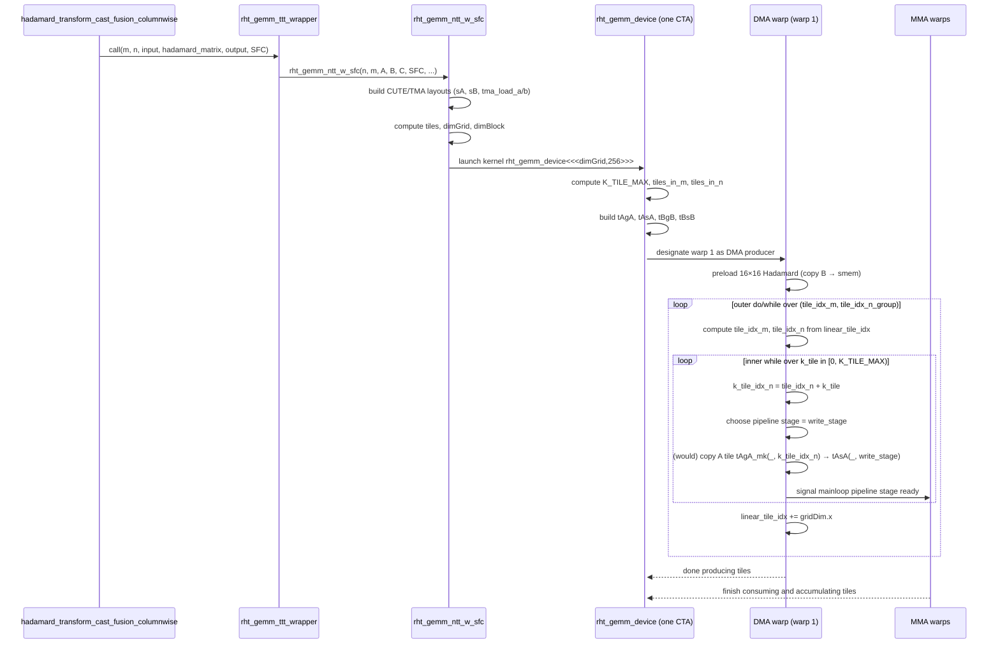

# RHT GEMM Tile Indexing and TMA Scheduling

**Kernel family**: `hadamard_transform_cast_fusion_columnwise` → `detail::rht_gemm_ttt_wrapper` → `detail::rht_gemm_ntt_w_sfc` → `rht_gemm_device`  
**This note focuses on** the **tile indexing logic** inside `rht_gemm_device`, in particular:

- How `blockIdx.x` maps to `(tile_idx_m, tile_idx_n)` for the 2D tile grid.
- What the DMA warp loads in the **inner `while` loop** (shapes and counts).
- How the **outer `do/while` loop** walks over tiles, with a concrete example `M = 256`, `N = 512` for a non‑zero threadblock (`blockIdx.x = 1`).

All links below are **relative to this file**.

---

## 0. Key Files and Functions

- Experimental kernel and standalone driver (what this doc traces):
  - `experiments/rht_gemm.cu`  
    Entry `main()` and device kernel template `rht_gemm_device`.  
    [`experiments/rht_gemm.cu:140–205`](../experiments/rht_gemm.cu#L140-L205)  
    [`experiments/rht_gemm.cu:283–444`](../experiments/rht_gemm.cu#L283-L444)  

- Production fused RHT + quantization path (where the same kernel shape is used):
  - `transformer_engine/common/hadamard_transform/hadamard_transform_cast_fusion.cu`  
    - GEMM‑style wrapper and kernel launch:  
      [`hadamard_transform_cast_fusion.cu:640–672`](../transformer_engine/common/hadamard_transform/hadamard_transform_cast_fusion.cu#L640-L672)  
    - Transpose wrapper (`rht_gemm_ttt_wrapper`) that swaps `(m, n)` and calls `rht_gemm_ntt_w_sfc`:  
      [`hadamard_transform_cast_fusion.cu:675–707`](../transformer_engine/common/hadamard_transform/hadamard_transform_cast_fusion.cu#L675-L707)  
    - Public API `hadamard_transform_cast_fusion_columnwise`:  
      [`hadamard_transform_cast_fusion.cu:714–780`](../transformer_engine/common/hadamard_transform/hadamard_transform_cast_fusion.cu#L714-L780)

### Key Functions Index

| Function / Symbol | File | Purpose |
|-------------------|------|---------|
| `hadamard_transform_cast_fusion_columnwise` | `transformer_engine/common/hadamard_transform/hadamard_transform_cast_fusion.cu` | Public API for fused RHT + NVFP4 columnwise quantization. |
| `detail::rht_gemm_ttt_wrapper` | `transformer_engine/common/hadamard_transform/hadamard_transform_cast_fusion.cu` | Swaps `(m, n)` and forwards to `rht_gemm_ntt_w_sfc` with RHT GEMM layout. |
| `detail::rht_gemm_ntt_w_sfc` | `transformer_engine/common/hadamard_transform/hadamard_transform_cast_fusion.cu` | Configures TMA layouts, MMA tiling, and launches `rht_gemm_device`. |
| `rht_gemm_device` | `experiments/rht_gemm.cu` (same structure as production kernel) | Device kernel doing TMA‑based loads + Tensor Core MMA + NVFP4 SFC epilogue. |
| `SharedStorage` | `experiments/rht_gemm.cu` | Shared memory layout: TMA pipeline barriers + A/B smem tiles. |

---

## 1. Big Picture: What Tiles Exist?

At the GEMM level (after the transpose wrapper), the logical matrices for RHT GEMM look like:

- `A`: `n × m`, **column‑major**, BF16 (activations).
- `B`: `16 × 16`, **row‑major**, BF16 (Hadamard matrix).
- `C`: `n × m`, **row‑major**, FP4 (`TC`), RHT output in NVFP4 layout.
- `SFC`: `n × (m / 16)`, **row‑major**, FP8 (`TSFC`), per‑block decode scales.

Inside `rht_gemm_device` (experiment version in  
[`experiments/rht_gemm.cu:140–205`](../experiments/rht_gemm.cu#L140-L205)), the important tile shapes are:

- **CTA tile along M** (rows of `A` / `C`): `size<0>(cluster_tile) = 128`.
- **Column tile width** used by the main loop: **64 columns**.
  - `tiles_in_n = (N + 64 - 1) / 64` is the number of 64‑wide column tiles.
- **RHT matrix tile** `B`: always `16 × 16`, pre‑loaded once per CTA.
- **Mainloop tiler for A**:
  ```cpp
  auto mainloop_tiler = Shape<_128, _16, _64>{};
  Tensor gA_mk =
      local_tile(mA, mainloop_tiler, make_coord(_, _, _), Step<_1, X, _1>{});
  ```
  For the debug run (`M = 128`, `N = 1024`) this prints:
  ```text
  gA_mk
  ArithTuple(_0,_0) o (_128,_64,1,16):(_1@0,_1@1,_128@0,_64@1)
  ```
  Interpreting the layout:
  - Dim0: `0..127` → row index.
  - Dim1: `0..63` → column **within** a 64‑wide tile.
  - Dim3: `0..15` → which 64‑wide tile you are in (since `16 × 64 = 1024`).

So **each TMA A‑tile corresponds to a `128 × 64` patch** of `A`:

- Rows: `128` consecutive rows (one CTA row tile).
- Columns: `64` consecutive columns (one N‑tile).

The inner loop in the DMA warp iterates over these `128 × 64` A‑patches along N, and the outer loop iterates over different `(tile_idx_m, tile_idx_n)` tile groups across the matrix.

---

## 2. Call Chain and Execution Frames

This section gives a frame‑by‑frame view from the public API down to the tile indexing code, focusing only on the frames that affect which tiles a threadblock is responsible for.

### 2.1 High‑Level Call Chain

1. **`hadamard_transform_cast_fusion_columnwise` (host API)**  
   [`hadamard_transform_cast_fusion.cu:714–780`](../transformer_engine/common/hadamard_transform/hadamard_transform_cast_fusion.cu#L714-L780)
   - Validates tensor dtypes and shapes.
   - Collapses batch/sequence dims into `m`, and the last dim into `n`.
   - Extracts `input` (BF16), `output_t` (FP4), `scale_inv_t` (FP8), `global_amax`.
   - Sets up optional stochastic rounding RNG state.
   - Calls `detail::rht_gemm_ttt_wrapper<TA, TB, TC, TSFC, kEnableStochasticRounding>(m, n, ...)`.

2. **`detail::rht_gemm_ttt_wrapper`**  
   [`hadamard_transform_cast_fusion.cu:675–707`](../transformer_engine/common/hadamard_transform/hadamard_transform_cast_fusion.cu#L675-L707)
   - Swaps `(m, n)` to match the GEMM view:
     - Calls `rht_gemm_ntt_w_sfc` with `(n, m, A, B, C, SFC, ...)`.
   - Conceptually, this is where the **logical A matrix becomes `n × m`**, matching the comments in `experiments/rht_gemm.cu`.

3. **`detail::rht_gemm_ntt_w_sfc`**  
   (body above the snippet at  
   [`hadamard_transform_cast_fusion.cu:640–672`](../transformer_engine/common/hadamard_transform/hadamard_transform_cast_fusion.cu#L640-L672))
   - Builds the CUTE tensors for `A`, `B`, `C`, `SFC`.
   - Chooses MMA op `SM100_MMA_F16BF16_SS<..., 128, 16>` and the CTA tile shape:
     ```cpp
     auto cga_shape       = Shape<_1, _1, _1>{};
     auto cga_tile_shape  = Shape<_128, _16, _16>{};
     auto cluster_tile_mainloop = Shape<_128, _16, _64>{};
     ```
   - Builds smem layouts (`sA`, `sB`) and TMA descriptors (`tma_load_a`, `tma_load_b`).
   - Computes the **1D grid size**:
     ```cpp
     uint32_t tiles =
         size(ceil_div(M, get<0>(cga_tile_shape))) *
         size(ceil_div(N, k_tile_size));  // k_tile_size = K
     dim3 dimGrid(tiles, 1, 1);
     dim3 dimBlock(256);
     ```
   - Launches `rht_gemm_device<<<dimGrid, dimBlock, smem_size, stream>>>(M, N, k_tile_size, cga_tile_shape, ...)`.

4. **`rht_gemm_device` (device kernel)**  
   [`experiments/rht_gemm.cu:140–205`](../experiments/rht_gemm.cu#L140-L205) and  
   [`experiments/rht_gemm.cu:283–444`](../experiments/rht_gemm.cu#L283-L444)
   - Computes `K_TILE_MAX`, `tiles_in_m`, `tiles_in_n`, and initializes `tile_idx_m`, `tile_idx_n` from `blockIdx.x`.
   - Partitions the TMA A/B tensors into per‑CTA views (`tAgA`, `tBgB`) and smem views (`tAsA`, `tBsB`).
   - Designates warps:
     - Warp 0: MMA consumer.
     - Warp 1: DMA producer (the one running the inner/outer loops we care about).
     - Warps 4–7: epilogue consumers.
   - Sets up the mainloop pipeline (`MainloopPipeline`) and accumulator pipeline.
   - DMA warp:
     - Preloads the 16×16 Hadamard matrix `B` once.
     - Runs the nested **outer `do/while`** + **inner `while`** loop to schedule TMA loads of A tiles.

### 2.2 Sequence Diagram (Host → Device Tile Loop)



---

## 3. Tile Indexing Core: `K_TILE_MAX`, `tiles_in_m`, `tiles_in_n`

The key indexing math lives in  
[`experiments/rht_gemm.cu:158–168`](../experiments/rht_gemm.cu#L158-L168):

```cpp
// Total number of k-tiles
// K = k_tile_size is heuristically chosen, defaults to 2048
// K_TILE_MAX determines the "stride" along columns (N) in groups of 64 cols
const int K_TILE_MAX = min(N, K) / 64;
uint32_t tiles_in_m =
    (M + size<0>(cluster_tile) - 1) / size<0>(cluster_tile);
uint32_t tiles_in_n = (N + 64 - 1) / 64;
uint32_t linear_tile_idx = blockIdx.x;
uint32_t tile_idx_m = linear_tile_idx % tiles_in_m;
uint32_t tile_idx_n = (linear_tile_idx / tiles_in_m) * K_TILE_MAX;
```

Frame‑by‑frame interpretation:

1. **`K_TILE_MAX = min(N, K) / 64;`**
   - `K` is the host‑side `k_tile_size` (2048 in both the experiment and production kernels).
   - `N` is the logical outer dimension seen by the kernel (`n` after the transpose wrapper).
   - `min(N, K)` is the **maximum contiguous column span** (in elements) that a single CTA is allowed to stream along N.
   - Dividing by `64` gives the maximum number of **64‑wide column tiles** this CTA will handle **per outer‑loop iteration**.

2. **`tiles_in_m`**
   - `cluster_tile` is `Shape<_128, _16, _16>` (CTA tile shape) passed in from the host.  
     [`hadamard_transform_cast_fusion.cu:640–667`](../transformer_engine/common/hadamard_transform/hadamard_transform_cast_fusion.cu#L640-L667)
   - `size<0>(cluster_tile) = 128`, so:
     ```text
     tiles_in_m = ceil_div(M, 128)
     ```
   - This is the **number of CTA rows** the matrix is split into.

3. **`tiles_in_n`**
   - `tiles_in_n = ceil_div(N, 64)` is the total number of 64‑column tiles needed along N.

4. **Flattened CTA index: `linear_tile_idx`**
   - The grid is 1‑D (`dimGrid.x = tiles`) but conceptually represents a 2D grid:
     - `tile_m` ∈ `[0, tiles_in_m)` (CTA rows).
     - `tile_n_group` ∈ `[0, tiles_in_n_groups)`, where each group corresponds to up to `K_TILE_MAX` consecutive 64‑wide tiles along N.
   - Host code chooses:
     ```cpp
     uint32_t tiles =
         size(ceil_div(M, get<0>(cga_tile_shape))) *
         size(ceil_div(N, k_tile_size));
     ```
     So:
     - `tiles_in_m = ceil_div(M, 128)`.
     - `tiles_in_n_groups = ceil_div(N, K)` (each group covers up to `K` columns).

5. **Mapping `blockIdx.x` to `(tile_idx_m, tile_idx_n)`**
   - `tile_idx_m = linear_tile_idx % tiles_in_m`:
     - The **row tile index** (which 128‑row band this CTA is responsible for).
   - `tile_idx_n = (linear_tile_idx / tiles_in_m) * K_TILE_MAX`:
     - `linear_tile_idx / tiles_in_m` is the **column‑group index** (which `K`‑wide group we’re in).
     - Multiplying by `K_TILE_MAX` yields the **starting 64‑tile index** for that group.
   - The inner loop then refines `tile_idx_n` to exact 64‑tile indices via `k_tile_idx_n = tile_idx_n + k_tile`.

In summary:

- The **outer dimension decomposition** is:
  - `tiles_in_m` CTA rows of height 128.
  - `tiles_in_n_groups = ceil_div(N, K)` CTA column groups, each of up to `K` columns (i.e., up to `K_TILE_MAX` 64‑wide tiles).
- The **inner dimension decomposition** is:
  - Within a given `(tile_idx_m, tile_idx_n_group)`, the DMA warp streams up to `K_TILE_MAX` consecutive 64‑wide tiles via `k_tile`.

---

## 4. What the Inner Loop Actually Loads

The DMA warp’s logic is in  
[`experiments/rht_gemm.cu:351–444`](../experiments/rht_gemm.cu#L351-L444). First, it preloads the RHT matrix `B`:

```cpp
if (is_dma_warp) {
    if (elect_one_sync()) {
        printf("Initialize TMA Load B...\n");
        cute::set_barrier_transaction_bytes(shared_storage.tma_barrier[0],
                                            kTmaRhtTensorTransactionBytes);
        copy(tma_load_b.with(shared_storage.tma_barrier[0],
                             tma_mcast_mask_b),
             tBgB(_, 0, 0), tBsB(_, 0));
    }
    cute::wait_barrier(shared_storage.tma_barrier[0], 0 /*tma_phase_bit*/);
    ...
}
```

Annotated:

- **`tBgB`** is the per‑CTA TMA source view for `B`:
  - Debug print (for `M = 128`, `N = 1024`):
    ```text
    tBgB
    ArithTuple(_0,_0) o (((_16,_16),_1),1,1):(((_1@0,_1@1),_0),_16@0,_16@1)
    ```
  - This is effectively a `16 × 16` tile (the full Hadamard matrix).
- **`tBsB`** is the smem view for `B`, laid out for MMA:
  - Same logical shape as `tBgB` (16×16) but in smem.
- The DMA warp performs **one TMA transfer**:
  - `copy(tma_load_b.with(...), tBgB(_, 0, 0), tBsB(_, 0));`
  - → Loads the full `16 × 16` Hadamard matrix into shared memory for the entire CTA.

After `B` is loaded and the TMA barrier is satisfied, the DMA warp prints the shapes for the A load:

```cpp
if (elect_one_sync()) {
    auto tAgA_mk = tAgA(_, 0, _);
    print_cute("DMA WARP: Loading tAgA_mk(_,k_tile_idx_n)",
               tAgA_mk(_, 0));
    print_cute("DMA WARP: Loading tAsA(_,write_stage)", tAsA(_, 0));
}
```

From the debug log:

```text
tAgA
ArithTuple(_0,_0) o (((_64,_8),(_2,_8)),1,16):(((_1@0,_1@1),(_64@0,_8@1)),_128@0,_64@1)
tAsA
Sw<3,4,3>_smem_ptr[16b](...) o ((_512,_16),(_1,_13)):((_1,_512),(_0,_8192))
DMA WARP: Loading tAgA_mk(_,k_tile_idx_n)
ArithTuple(0,0) o (((_64,_8),(_2,_8))):(((_1@0,_1@1),(_64@0,_8@1)))
```

Interpretation:

- `tAgA` is the **per‑CTA TMA source view for A**, with shape:
  - `(((64, 8), (2, 8)), 1, K_TILE_MAX)`
  - The nested shapes multiply out to:
    - Rows: `64 × 2 = 128`.
    - Columns: `8 × 8 = 64`.
    - Last dimension: `K_TILE_MAX` (e.g., 16 for `N = 1024`).
- `tAsA` is the **smem destination view for A**:
  - First dim: `(512, 16)` → `512 × 16 = 8192` BF16 elements.
  - Second dim: `(1, 13)` → 13 pipeline stages (from `K_PIPE_MAX`).
  - Total per stage: `8192` elements = `128 × 64` (one A tile).

Pulling that together:

- **Each TMA A‑tile is `128 × 64` elements.**
- **`K_TILE_MAX` is the number of such tiles per CTA “column group”.**
- The DMA warp chooses:
  - **N‑tile index** via `k_tile_idx_n` (0‑based, in units of 64 columns).
  - **pipeline stage** via `write_stage`.

### 4.1 Annotated Inner Loop

The core inner loop is:  
[`experiments/rht_gemm.cu:369–435`](../experiments/rht_gemm.cu#L369-L435)

```cpp
do {
    bool is_first_wave = linear_tile_idx == blockIdx.x;
    uint32_t skip_wait = is_first_wave;
    auto tAgA_mk = tAgA(_, tile_idx_m, _);
    int k_tile = 0;
    auto barrier_token = mainloop_pipeline.producer_try_acquire(
        mainloop_pipe_producer_state, skip_wait);

    CUTE_NO_UNROLL
    while (k_tile < K_TILE_MAX && k_tile + tile_idx_n < tiles_in_n) {
        int k_tile_idx_n = tile_idx_n + k_tile;
        ...
        ++k_tile;
        skip_wait =
            (is_first_wave && k_tile < MainloopPipelineStageCount);
        ...
        int write_stage = mainloop_pipe_producer_state.index();
        ++mainloop_pipe_producer_state;
        ...
        // if (cute::elect_one_sync()) {
        //     copy(tma_load_a.with(*tma_barrier, tma_mcast_mask_a),
        //          tAgA_mk(_, k_tile_idx_n), tAsA(_, write_stage));
        // }
    }
    linear_tile_idx += gridDim.x;
    tile_idx_m = linear_tile_idx % tiles_in_m;
    tile_idx_n = (linear_tile_idx / tiles_in_m) * K_TILE_MAX;
} while (tile_idx_m < tiles_in_m && tile_idx_n < tiles_in_n);
```

Line‑by‑line:

1. **`is_first_wave` / `skip_wait`**
   - `is_first_wave` is true only for the **first** outer‑loop iteration for a given CTA (when `linear_tile_idx == blockIdx.x`).
   - `skip_wait` is used to tell the pipeline not to block on the first few stages while they are being primed.

2. **`auto tAgA_mk = tAgA(_, tile_idx_m, _);`**
   - Fixes the CTA’s **row tile index** (`tile_idx_m`) in the TMA view:
     - You now have a tensor whose last dimension indexes into N‑tiles (`k_tile_idx_n`).
   - Conceptually: `tAgA_mk[:, :, n_tile]` is the `128 × 64` block of A at:
     - Rows: `[tile_idx_m * 128, (tile_idx_m + 1) * 128)`.
     - Columns: `[n_tile * 64, (n_tile + 1) * 64)`.

3. **Initialize `k_tile`, `barrier_token`**
   - `k_tile` starts at 0 for this `(tile_idx_m, tile_idx_n_group)`.
   - `producer_try_acquire` gets a handle (`barrier_token`) for the current pipeline stage without blocking (depending on `skip_wait`).

4. **Inner `while (k_tile < K_TILE_MAX && k_tile + tile_idx_n < tiles_in_n)`**
   - Loop over up to `K_TILE_MAX` column tiles, but never beyond `tiles_in_n`:
     - `k_tile_idx_n = tile_idx_n + k_tile` is the **absolute N‑tile index** (0‑based, 64‑wide units).
   - For each iteration:
     - (If the `copy` were uncommented) the DMA warp would:
       - Pick **pipeline stage** `write_stage`.
       - Schedule a TMA A‑tile load:
         ```cpp
         copy(tma_load_a.with(*tma_barrier, tma_mcast_mask_a),
              tAgA_mk(_, k_tile_idx_n),  // 128 × 64 A patch from gmem
              tAsA(_, write_stage));     // corresponding 128 × 64 slot in smem
         ```
     - Update `k_tile++` and `skip_wait` for the next tile.
     - Advance `mainloop_pipe_producer_state` so the next tile maps to the next pipeline stage (wrapping modulo `K_PIPE_MAX`).

5. **Outer loop updates**
   - After the inner loop finishes its `k_tile` iterations (for the current tile group), the CTA advances:
     ```cpp
     linear_tile_idx += gridDim.x;
     tile_idx_m = linear_tile_idx % tiles_in_m;
     tile_idx_n = (linear_tile_idx / tiles_in_m) * K_TILE_MAX;
     ```
   - This is the classic **grid‑stride loop** pattern, but expressed in terms of the logical 2D tile grid:
     - Each CTA jumps by `gridDim.x` in the flattened tile index space.
     - The modulo/division recover new `(tile_idx_m, tile_idx_n_group)` for the next round.

Net effect of the inner loop:

- **Per outer‑loop iteration**, the DMA warp:
  - Streams up to `K_TILE_MAX` A‑tiles of size `128 × 64` from gmem to smem.
  - Each tile corresponds to a distinct 64‑wide N‑tile (`k_tile_idx_n`).
  - Each tile is written into a distinct pipeline stage `write_stage` in `tAsA`.

Net effect of the outer loop:

- The CTA repeats this process for **multiple (row, column‑group) tile pairs** until the entire `(tiles_in_m × tiles_in_n)` space is covered by all CTAs cooperatively.

---

## 5. Concrete Example: `M = 256`, `N = 512`, `blockIdx.x = 1`

Now let’s walk through a full example that differs from the compiled experiment, but uses the same formulas:

- `M = 256`, `N = 512`
- `K = k_tile_size = 2048`
- `cluster_tile = Shape<_128, _16, _16>` (unchanged)

### 5.1 Derived Quantities

Using the definitions in  
[`experiments/rht_gemm.cu:158–168`](../experiments/rht_gemm.cu#L158-L168) and the host grid setup in  
[`hadamard_transform_cast_fusion.cu:640–667`](../transformer_engine/common/hadamard_transform/hadamard_transform_cast_fusion.cu#L640-L667):

1. **Along M (rows):**
   - `tiles_in_m = ceil_div(M, 128) = ceil_div(256, 128) = 2`.
   - So CTA row tiles:
     - `tile_idx_m = 0` → rows `[0, 128)`.
     - `tile_idx_m = 1` → rows `[128, 256)`.

2. **Along N (columns):**
   - `tiles_in_n = ceil_div(N, 64) = ceil_div(512, 64) = 8`.  
     → There are 8 column tiles, each 64 columns wide.
   - `K_TILE_MAX = min(N, K) / 64 = min(512, 2048) / 64 = 8`.  
     → A CTA can stream **up to 8 column tiles** per outer‑loop iteration.

3. **Grid size (`dimGrid.x`)**
   - Host chooses:
     ```text
     tiles = ceil_div(M, 128) * ceil_div(N, K)
           = 2 * ceil_div(512, 2048)
           = 2 * 1
           = 2
     ```
   - So `gridDim.x = 2` and `blockIdx.x ∈ {0, 1}`.
   - Both CTAs will share the work **only along M**; along N, each CTA can cover the full width in a single outer iteration because `K_TILE_MAX = tiles_in_n`.

### 5.2 Threadblock 1 (`blockIdx.x = 1`): Tile Indices

Initial state inside `rht_gemm_device`:

- `linear_tile_idx = blockIdx.x = 1`.
- `tiles_in_m = 2`, `tiles_in_n = 8`, `K_TILE_MAX = 8`, `gridDim.x = 2`.

Compute initial tile indices:

```text
tile_idx_m = linear_tile_idx % tiles_in_m
           = 1 % 2
           = 1          → CTA row tile 1 (rows [128, 256))

tile_idx_n = (linear_tile_idx / tiles_in_m) * K_TILE_MAX
           = (1 / 2) * 8
           = 0 * 8
           = 0          → starting column tile index 0 (cols [0, 64))
```

So **CTA 1** starts at:

- Rows `[128, 256)` (the second 128‑row band).
- Columns starting at tile index `0` (i.e., the leftmost 64‑wide tile).

### 5.3 Inner Loop: Which Tiles Are Loaded?

At the top of the outer loop:

```cpp
bool is_first_wave = (linear_tile_idx == blockIdx.x);  // true on first iteration
auto tAgA_mk = tAgA(_, tile_idx_m, _);                 // tile_idx_m = 1
int k_tile = 0;
```

Within the inner `while`:

- Condition:
  ```text
  k_tile < K_TILE_MAX           → k_tile < 8
  k_tile + tile_idx_n < tiles_in_n → k_tile + 0 < 8
  ```
  So `k_tile` takes values `0, 1, 2, 3, 4, 5, 6, 7` (8 iterations).

- Each iteration:
  ```text
  k_tile_idx_n = tile_idx_n + k_tile = 0 + k_tile ∈ {0..7}
  ```
  The (commented) TMA copy would be:
  ```cpp
  copy(tma_load_a.with(*tma_barrier, tma_mcast_mask_a),
       tAgA_mk(_, k_tile_idx_n),  // one 128 × 64 tile of A
       tAsA(_, write_stage));     // pipeline stage for this tile
  ```

Geometrically, CTA 1 loads the following **A tiles** (each `128 × 64`):

| `k_tile_idx_n` | Row range (M)       | Column range (N)     |
|----------------|---------------------|----------------------|
| 0              | `[128, 256)`        | `[0,   64)`          |
| 1              | `[128, 256)`        | `[64,  128)`         |
| 2              | `[128, 256)`        | `[128, 192)`         |
| 3              | `[128, 256)`        | `[192, 256)`         |
| 4              | `[128, 256)`        | `[256, 320)`         |
| 5              | `[128, 256)`        | `[320, 384)`         |
| 6              | `[128, 256)`        | `[384, 448)`         |
| 7              | `[128, 256)`        | `[448, 512)`         |

So for `M = 256`, `N = 512`:

- **CTA 0** (`blockIdx.x = 0`) will similarly load 8 tiles covering rows `[0, 128)` and all columns `[0, 512)`.
- **CTA 1** (`blockIdx.x = 1`) loads 8 tiles covering rows `[128, 256)` and all columns `[0, 512)`.

Each of the 8 inner iterations:

- Schedules a `128 × 64` A‑tile load into a particular `write_stage` of `tAsA`.
- Advances the mainloop pipeline state to keep A tiles flowing toward the MMA warp.

### 5.4 Outer Loop Exit Condition

After the inner loop finishes its 8 iterations, CTA 1 updates:

```text
linear_tile_idx += gridDim.x   → 1 + 2 = 3
tile_idx_m = 3 % 2             → 1
tile_idx_n = (3 / 2) * 8       → 1 * 8 = 8
```

The outer `do/while` condition:

```text
tile_idx_m < tiles_in_m   → 1 < 2  → true
tile_idx_n < tiles_in_n   → 8 < 8  → false
```

Since `tile_idx_n < tiles_in_n` is false, CTA 1 **terminates** its outer loop. No further A tiles are assigned to it.

Taken together:

- `gridDim.x = 2` CTAs, `tiles_in_m = 2`, `tiles_in_n = 8`, `K_TILE_MAX = 8`.
- Each CTA **only needs one outer iteration** to cover its entire row band along N.
- The nested loops ensure:
  - **All rows [0, 256)** are covered.
  - **All columns [0, 512)** are covered.
  - Each CTA covers a full 128‑row band across N.

---

## 6. Flowchart: DMA Warp Tile Scheduling

```mermaid
flowchart TD
    Start([Start CTA])
    CheckDMA{warp_idx == 1?}
    PreloadB[Preload 16×16 B via TMA<br/>tBgB(_,0,0) → tBsB(_,0)]
    InitIdx[Compute K_TILE_MAX,<br/>tiles_in_m, tiles_in_n,<br/>tile_idx_m, tile_idx_n]
    OuterLoop{tile_idx_m < tiles_in_m<br/>and tile_idx_n < tiles_in_n?}
    InitWave[is_first_wave = (linear_tile_idx == blockIdx.x),<br/>k_tile = 0,<br/>tAgA_mk = tAgA(_, tile_idx_m, _)]
    InnerLoop{k_tile < K_TILE_MAX<br/>and k_tile + tile_idx_n < tiles_in_n?}
    ComputeIdx[k_tile_idx_n = tile_idx_n + k_tile]
    StageIdx[write_stage = mainloop_pipe_producer_state.index();<br/>++mainloop_pipe_producer_state]
    TmaCopy[(copy A tile<br/>tAgA_mk(_, k_tile_idx_n) → tAsA(_, write_stage))]
    IncK[++k_tile]
    AdvanceIdx[linear_tile_idx += gridDim.x;<br/>tile_idx_m = linear_tile_idx % tiles_in_m;<br/>tile_idx_n = (linear_tile_idx / tiles_in_m) * K_TILE_MAX]
    End([Done DMA warp])

    Start --> CheckDMA
    CheckDMA -- no --> End
    CheckDMA -- yes --> PreloadB --> InitIdx --> OuterLoop
    OuterLoop -- no --> End
    OuterLoop -- yes --> InitWave --> InnerLoop
    InnerLoop -- no --> AdvanceIdx --> OuterLoop
    InnerLoop -- yes --> ComputeIdx --> StageIdx --> TmaCopy --> IncK --> InnerLoop
```

---

## 7. Class / Component Relationships (Conceptual)

```mermaid
classDiagram
    class SharedStorage~ElementA,ElementB,ASmemLayout,BSmemLayout~ {
        +AccumulatorPipelineStorage accumulator
        +MainloopPipelineStorage mainloop
        +uint64_t tma_barrier[1]
        +uint32_t tmem_base_ptr
        +TensorStorage tensors
    }

    class TensorStorage {
        +smem_A : array_aligned<ElementA, cosize(ASmemLayout)>
        +smem_B : array_aligned<ElementB, cosize(BSmemLayout)>
    }

    class MainloopPipeline {
        +Params
        +PipelineState
        +producer_try_acquire(...)
        +producer_get_barrier(...)
    }

    class AccumulatorPipeline {
        +Params
        +PipelineState
    }

    class TiledMMA {
        +AtomThrID
        +partition_A(...)
        +partition_B(...)
        +make_fragment_A(...)
        +make_fragment_B(...)
        +make_fragment_C(...)
    }

    SharedStorage "1" o-- "1" TensorStorage : owns
    SharedStorage "1" o-- "1" MainloopPipeline : uses
    SharedStorage "1" o-- "1" AccumulatorPipeline : uses
    TiledMMA "1" --> "many" MainloopPipeline : consumes A/B tiles
    MainloopPipeline "1" --> "many" TMA_LoadA : schedules A TMA ops
    MainloopPipeline "1" --> "many" TMA_LoadB : schedules B TMA ops
```

This diagram reflects how:

- `SharedStorage` aggregates all shared memory state for a CTA (A/B tiles + pipelines + barriers).
- `MainloopPipeline` orchestrates the **flow of A tiles** from the DMA warp to the MMA warp via pipeline stages.
- `AccumulatorPipeline` manages the flow of accumulator fragments between MMA and epilogue warps.
- `TiledMMA` describes how warps interpret the smem tiles and accumulators for Tensor Core MMA.

---

## 8. Summary

- The **inner `while` loop** in the DMA warp schedules TMA loads of `128 × 64` A tiles:
  - One tile per `k_tile` / `k_tile_idx_n`.
  - Up to `K_TILE_MAX = min(N, K) / 64` tiles per outer‑loop iteration.
  - Each tile goes into a distinct pipeline stage `write_stage` in `tAsA`.
- The **outer `do/while` loop** walks over a 2D tile grid:
  - `tile_idx_m` selects the CTA’s 128‑row band.
  - `tile_idx_n` selects the starting 64‑tile index for the current `K`‑sized column group.
  - `linear_tile_idx += gridDim.x` gives a grid‑stride sweep over all `(tile_idx_m, tile_idx_n_group)` assignments.
- For `M = 256`, `N = 512`, `blockIdx.x = 1`:
  - CTA 1 covers rows `[128, 256)` and **all 8 column tiles** `[0, 512)` in a single outer‑loop iteration, issuing 8 TMA loads of 128×64 A patches.

