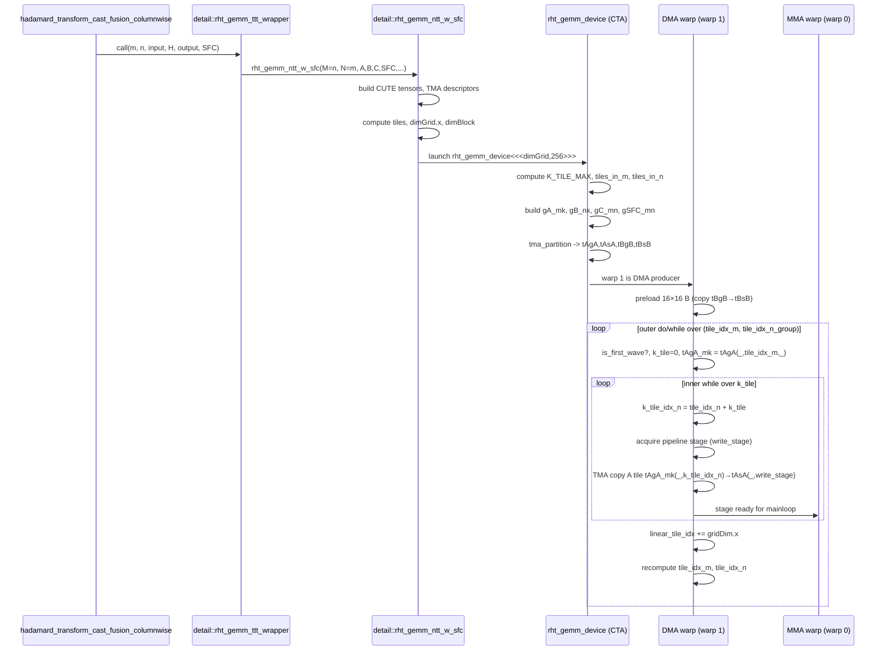

# RHT GEMM Tile Indexing (Production Kernel)

**Kernel family (all in one file)**:  
`hadamard_transform_cast_fusion_columnwise` → `detail::rht_gemm_ttt_wrapper` → `detail::rht_gemm_ntt_w_sfc` → `detail::rht_gemm_device`

**Source (only file referenced in this note)**:  
`transformer_engine/common/hadamard_transform/hadamard_transform_cast_fusion.cu`

This document explains:

- How the GEMM view (`M`, `N`) and grid are set up on the host.
- How `blockIdx.x` is mapped to 2D tile indices `(tile_idx_m, tile_idx_n)` inside `rht_gemm_device`.  
- What the **DMA warp** loads in the inner `while` loop (tile shapes and counts).  
- How the **outer `do/while` loop** walks the tile grid, with a concrete example `M = 256`, `N = 512` for a non‑zero threadblock (`blockIdx.x = 1`).

All code snippets and line references below are from  
`transformer_engine/common/hadamard_transform/hadamard_transform_cast_fusion.cu` and are **relative to this file**.

---

## 0. Key Functions Index

| Function / Symbol | Location | Purpose |
|-------------------|----------|---------|
| `hadamard_transform_cast_fusion_columnwise` | [`hadamard_transform_cast_fusion.cu:714`](../transformer_engine/common/hadamard_transform/hadamard_transform_cast_fusion.cu#L714) | Public API for fused RHT + NVFP4 columnwise quantization. |
| `detail::rht_gemm_ttt_wrapper` | [`hadamard_transform_cast_fusion.cu:677`](../transformer_engine/common/hadamard_transform/hadamard_transform_cast_fusion.cu#L677) | Swaps `(m, n)` and forwards to `rht_gemm_ntt_w_sfc` with RHT GEMM layout. |
| `detail::rht_gemm_ntt_w_sfc` | [`hadamard_transform_cast_fusion.cu:549`](../transformer_engine/common/hadamard_transform/hadamard_transform_cast_fusion.cu#L549) | Configures TMA layouts, MMA tiling, and launches `rht_gemm_device`. |
| `detail::rht_gemm_device` | [`hadamard_transform_cast_fusion.cu:126`](../transformer_engine/common/hadamard_transform/hadamard_transform_cast_fusion.cu#L126) | Device kernel doing TMA‑based loads + Tensor Core MMA + NVFP4 SFC epilogue. |

---

## 1. High‑Level Call Chain (Top‑Down)

### 1.1 `hadamard_transform_cast_fusion_columnwise` (host API)

Location: [`hadamard_transform_cast_fusion.cu:714–780`](../transformer_engine/common/hadamard_transform/hadamard_transform_cast_fusion.cu#L714-L780)

Key responsibilities:

- Validate that `input_` is BF16 with delayed scaling, and that the Hadamard matrix is 16×16 BF16.
- Collapse the user tensor into a 2D GEMM view (`m`, `n`):
  - `m` = product of outer/batch dims.  
  - `n` = last dimension (multiple of 16).
- Extract:
  - `input` BF16 data (`TA`),  
  - NVFP4 output data (`TC`),  
  - FP8 decode scales (`TSFC`),  
  - global amax.
- Configure optional stochastic rounding via `rng_state`.
- Call into the GEMM wrapper (note: the wrapper swaps `m` and `n`):

```cpp
// hadamard_transform_cast_fusion.cu:745–748, 675–707
using TA   = cute::bfloat16_t;
using TB   = cute::bfloat16_t;
using TC   = cutlass::float_e2m1_t;
using TSFC = cutlass::float_ue4m3_t;
...
detail::rht_gemm_ttt_wrapper<TA, TB, TC, TSFC, kEnableStochasticRounding>(
    m, n,
    reinterpret_cast<const TA*>(input.dptr),
    reinterpret_cast<const TB*>(hadamard_matrix.dptr),
    reinterpret_cast<TC*>(output_t.dptr),
    reinterpret_cast<TSFC*>(scale_inv_t.dptr),
    reinterpret_cast<const float*>(global_amax.dptr),
    rng_state,
    sm_count,
    stream,
    k_tile_size);
```

### 1.2 `detail::rht_gemm_ttt_wrapper`

Location: [`hadamard_transform_cast_fusion.cu:677–707`](../transformer_engine/common/hadamard_transform/hadamard_transform_cast_fusion.cu#L677-L707)

Key idea: **transpose view** + reshape to utilize SMs.

```cpp
template <typename TA, typename TB, typename TC, typename TSFC,
          bool kEnableStochasticRounding = false>
void rht_gemm_ttt_wrapper(int m, int n,
                          TA const* A,
                          TB const* B,
                          TC      * C,
                          TSFC    * SFC,
                          float const* global_amax,
                          const size_t* rng_state,
                          uint32_t sm_count,
                          cudaStream_t stream,
                          int k_tile_size = 1024)
{
  // After swapping m, n, RHT-GEMM views:
  // A: n x m: col-major
  // B: 16 x 16: row-major
  // C: n x m: row-major
  // SFC: n x (m/16): row-major
  rht_gemm_ntt_w_sfc<TA, TB, TC, TSFC, kEnableStochasticRounding>(
      n, m,
      A, B, C,
      SFC, global_amax,
      rng_state,
      sm_count, stream,
      k_tile_size);
}
```

**Important**: From this point on:

- `M` in the device kernel corresponds to `n` from the public API.
- `N` in the device kernel corresponds to `m` from the public API.

So the GEMM view is:

- `A`: **`M × N`** in column‑major (BF16).
- `B`: `16 × 16` in row‑major (BF16).
- `C`: `M × N` in row‑major (FP4).
- `SFC`: `M × (N/16)` in row‑major (FP8 scales).

### 1.3 `detail::rht_gemm_ntt_w_sfc` (host GEMM launcher)

Location: [`hadamard_transform_cast_fusion.cu:549–673`](../transformer_engine/common/hadamard_transform/hadamard_transform_cast_fusion.cu#L549-L673)

This function:

- Interprets the raw pointers `A`, `B`, `C`, `SFC` as CUTE tensors.
- Builds the TMA‑based load descriptors (`tma_load_a`, `tma_load_b`).
- Selects tiling and shared memory layouts.
- Computes the grid configuration and launches `rht_gemm_device`.

Core configuration:

```cpp
// hadamard_transform_cast_fusion.cu:561–569
auto dA = make_stride(Int<1>{}, m);   // (dM,dK)
auto dB = make_stride(Int<1>{}, 16);  // (dN,dK)
auto dC = make_stride(n, Int<1>{});   // (dM,dN)

auto cga_shape            = Shape<_1, _1, _1>{};
auto cga_tile_shape       = Shape<_128,_16,_16>{};
auto cluster_tile_mainloop = Shape<_128,_16,_64>{};
```

- `cga_tile_shape = (128, 16, 16)` is the **cluster GEMM tile**.
- `cluster_tile_mainloop = (128, 16, 64)` is the mainloop’s `(M, N, K)` tile for A.

TMA layouts:

```cpp
// hadamard_transform_cast_fusion.cu:601–610, 612–629
auto mma_shape_A = partition_shape_A(
    mma, make_shape(size<0>(cluster_tile_mainloop),
                    size<2>(cluster_tile_mainloop)));
...
auto sA = UMMA::tile_to_mma_shape(SmemLayoutAtomA{}, append(mma_shape_A, sP));
auto sB = UMMA::tile_to_mma_shape(SmemLayoutAtomB{}, append(mma_shape_B, sP));
...
Tensor tensorA = make_tensor(A, make_layout(make_shape(M,N), dA));   // (M,N)
Tensor tensorB = make_tensor(B, make_layout(make_shape(16,16), dB)); // (16,16)
...
auto tma_load_a = make_tma_copy_A_sm100(
    SM90_TMA_LOAD{}, tensorA, sA(_,_,_,0), cluster_tile_mainloop, mma);
auto tma_load_b = make_tma_copy_B_sm100(
    SM90_TMA_LOAD{}, tensorB, sB(_,_,_,0), cga_tile_shape, mma);
```

Grid size and launch:

```cpp
// hadamard_transform_cast_fusion.cu:631–640, 642–666
NVTE_CHECK(M % size<0>(cga_tile_shape) == 0, ...);         // M multiple of 128
NVTE_CHECK(N % (4 * size<1>(cga_tile_shape)) == 0, ...);   // N multiple of 64

uint32_t tiles =
    size(ceil_div(M, get<0>(cga_tile_shape))) *
    size(ceil_div(N, k_tile_size));

tiles = (tiles < sm_count) ? tiles : sm_count;

dim3 dimBlock(256);
dim3 dimCluster(size<0>(cga_shape), size<1>(cga_shape), size<2>(cga_shape));
dim3 dimGrid(tiles, 1, 1);

auto* kernel_ptr = &rht_gemm_device<...>;
(*kernel_ptr)<<<dimGrid, dimBlock, smem_size, stream>>>(
    M,  N,  k_tile_size, cga_tile_shape,
    A, dA, sA, tma_load_a,
    B, dB, sB, tma_load_b,
    C, dC, sC,
    SFC,
    mma, global_amax,
    rng_state);
```

**Key facts for tile indexing:**

- `dimGrid.x = tiles` is **1D**, but logically represents a 2D grid:
  - Along `M`: `M / 128` tiles (since `size<0>(cga_tile_shape) = 128`).
  - Along `N`: `ceil_div(N, k_tile_size)` groups, each of width up to `k_tile_size` columns.
- `k_tile_size` (host’s `K`) is the **group width along N** in elements (e.g., 2048).

---

## 2. Device Kernel Setup: `rht_gemm_device`

Location: [`hadamard_transform_cast_fusion.cu:126–260`](../transformer_engine/common/hadamard_transform/hadamard_transform_cast_fusion.cu#L126-L260)

Signature and high‑level structure:

```cpp
template <class MShape, class NShape, class KShape, class ClusterTileShape,
          class TA, class AStride, class ASmemLayout, class TmaLoadA,
          class TB, class BStride, class BSmemLayout, class TmaLoadB,
          class TC, class CStride, class CSmemLayout,
          class TSFC,
          class TiledMMA,
          bool kEnableStochasticRounding = false>
__global__ static
void rht_gemm_device(MShape M, NShape N, KShape K, ClusterTileShape cluster_tile,
                     TA const* A, AStride dA, ASmemLayout sAlayout,
                     CUTE_GRID_CONSTANT TmaLoadA const tma_load_a,
                     TB const* B, BStride dB, BSmemLayout sBlayout,
                     CUTE_GRID_CONSTANT TmaLoadB const tma_load_b,
                     TC * C, CStride dC, CSmemLayout,
                     TSFC * SFC,
                     TiledMMA mma,
                     float const* global_amax,
                     const size_t* rng_state)
{
  using namespace cute;
  ...
```

The kernel:

- Receives dynamic `M`, `N`, and `K` (the `k_tile_size`).
- Reconstructs CUTE tensors for `mA`, `mB`, `mC`, `mSFC`.
- Defines tile shapes for mainloop and epilogue:

```cpp
// hadamard_transform_cast_fusion.cu:173–183, 205–211
Tensor mA = tma_load_a.get_tma_tensor(make_shape(M,N));
Tensor mB = tma_load_b.get_tma_tensor(make_shape(16,16));
Tensor mC = make_tensor(subbyte_iterator<TC>(C), make_shape(M,N), dC); // (M,N)
...
auto sfc_shape  = make_shape(
    M,
    make_shape( make_shape(Int<16>{}, _4{}), N / 64 )
);
...
Tensor mSFC = make_tensor(make_gmem_ptr(SFC), sfc_layout);
...
auto mainloop_tiler = Shape<_128,_16,_64>{};
auto epilogue_tiler = Shape<_128,_64,_64>{};
Tensor gA_mk = local_tile(mA, mainloop_tiler, make_coord(_,_, _), Step<_1, X,_1>{});
Tensor gB_nk = local_tile(mB, cluster_tile,    make_coord(_,_, _), Step< X,_1,_1>{}); // (BLK_N,BLK_K,k)
Tensor gC_mn = local_tile(mC, epilogue_tiler,  make_coord(_,_, _), Step<_1,_1, X>{}); // (BLK_M,BLK_N)
Tensor gSFC_mn = local_tile(mSFC, epilogue_tiler, make_coord(_,_, _), Step<_1,_1, X>{});
```

From this:

- The **mainloop A‑tile** shape is `(128, 16, 64)`:
  - Interpreted as: 128 rows, 64 columns (in two 16‑wide MMA stripes).
- The **epilogue tile** shape is `(128, 64, 64)` for `C` and `SFC`.

The kernel then builds shared memory tensors:

```cpp
// hadamard_transform_cast_fusion.cu:213–217
extern __shared__ char shared_memory[];
using SharedStorage = SharedStorage<TA, TB, ASmemLayout, BSmemLayout>;
SharedStorage& shared_storage = *reinterpret_cast<SharedStorage*>(shared_memory);
Tensor tCsA = make_tensor(make_smem_ptr(shared_storage.tensors.smem_A.data()),
                          sAlayout); // (MMA,MMA_M,MMA_K,PIPE)
Tensor tCsB = make_tensor(make_smem_ptr(shared_storage.tensors.smem_B.data()),
                          sBlayout); // (MMA,MMA_N,MMA_K,PIPE)
```

and partitions `gA_mk` / `gB_nk` into per‑warp views (`tCgA`, `tCgB`), then into TMA partition views (`tAgA`, `tAsA`, `tBgB`, `tBsB`).

---

## 3. Tile Indexing Core (`K_TILE_MAX`, `tiles_in_m`, `tiles_in_n`)

The tile indexing logic is set up near the top of `rht_gemm_device`:

```cpp
// hadamard_transform_cast_fusion.cu:191–203
auto cluster_shape = Shape<_1, _1, _1>{};
...
// Total number of k-tiles
const int K_TILE_MAX  = min(N, K) / 64;
uint32_t tiles_in_m = (M + size<0>(cluster_tile) - 1) / size<0>(cluster_tile);
uint32_t tiles_in_n = (N + 64 - 1) / 64;
uint32_t linear_tile_idx = blockIdx.x;
uint32_t tile_idx_m = linear_tile_idx % tiles_in_m;
uint32_t tile_idx_n = (linear_tile_idx / tiles_in_m) * K_TILE_MAX;
```

Line‑by‑line interpretation:

1. **`K_TILE_MAX = min(N, K) / 64`**
   - `N` is the logical outer dimension (`m` from the public API).
   - `K` is the host‑supplied `k_tile_size` (e.g., 2048).
   - `min(N, K)` is the **maximum contiguous N‑span** (in elements) a CTA can process in one outer‑loop chunk.
   - Dividing by 64 converts that into a **number of 64‑wide column tiles**.  
     (Each 64‑wide tile corresponds to one mainloop epilogue column tile in N.)

2. **`tiles_in_m`**
   - `size<0>(cluster_tile)` is `128` (the CTA tile height in rows):
     ```cpp
     tiles_in_m = ceil_div(M, 128)
     ```
   - This is the number of **row tiles** of size 128 along M.

3. **`tiles_in_n`**
   - `tiles_in_n = ceil_div(N, 64)` is the number of 64‑wide column tiles needed to cover N.

4. **Initial tile index from `blockIdx.x`**
   - `linear_tile_idx = blockIdx.x` is the CTA’s flattened tile index.
   - `tile_idx_m = linear_tile_idx % tiles_in_m`:
     - Selects which **128‑row band** this CTA starts in.
   - `tile_idx_n = (linear_tile_idx / tiles_in_m) * K_TILE_MAX`:
     - `(linear_tile_idx / tiles_in_m)` is the CTA’s **column group index** (in units of `K_TILE_MAX` tiles).
     - Multiplying by `K_TILE_MAX` gives the starting 64‑tile index along N.

So conceptually:

- The full 2D tile grid is:
  - `M` direction: indices `0..tiles_in_m-1`, each 128 rows.
  - `N` direction: indices `0..tiles_in_n-1`, each 64 columns.
- The device splits N into **groups of up to `K_TILE_MAX` 64‑wide tiles**, and `blockIdx.x` selects an `(m_tile, n_group)` pair.

---

## 4. DMA Warp Inner and Outer Loops

The DMA warp is responsible for:

- Preloading the 16×16 Hadamard matrix `B` into shared memory.
- Streaming A tiles (`128 × 64`) from global memory into shared memory using TMA, one per pipeline stage.

The relevant code is in the `is_dma_warp` branch inside `rht_gemm_device`:

```cpp
// hadamard_transform_cast_fusion.cu:268–273, 328–369
int warp_idx = cutlass::canonical_warp_idx_sync();

bool is_mma_warp     = (warp_idx == 0);
bool is_dma_warp     = (warp_idx == 1);
bool is_epilogue_warp = (warp_idx >= 4 && warp_idx <= 7);
...
if (is_dma_warp) {
  if (elect_one_sync()) {
    cute::set_barrier_transaction_bytes(shared_storage.tma_barrier[0],
                                        kTmaRhtTensorTransactionBytes);
    copy(tma_load_b.with(shared_storage.tma_barrier[0], tma_mcast_mask_b),
         tBgB(_,0,0), tBsB(_,0));
  }
  cute::wait_barrier(shared_storage.tma_barrier[0], 0 /*tma_phase_bit*/);
  if (elect_one_sync()){
    auto tAgA_mk = tAgA(_,0,_);
    print_cute("DMA WARP: Loading tAgA_mk(_,k_tile_idx_n)", tAgA_mk(_,0));
    print_cute("DMA WARP: Loading tAsA(_,write_stage)", tAsA(_,0));
  }

  do {
    bool is_first_wave = linear_tile_idx == blockIdx.x;
    uint32_t skip_wait = is_first_wave;
    auto tAgA_mk = tAgA(_,tile_idx_m,_);
    int k_tile = 0;
    auto barrier_token =
        mainloop_pipeline.producer_try_acquire(mainloop_pipe_producer_state,
                                               skip_wait);

    CUTE_NO_UNROLL
    while (k_tile < K_TILE_MAX && k_tile + tile_idx_n < tiles_in_n) {
      int k_tile_idx_n = tile_idx_n + k_tile;
      ++k_tile;
      skip_wait = (is_first_wave && k_tile < MainloopPipelineStageCount);

      mainloop_pipeline.producer_acquire(mainloop_pipe_producer_state,
                                         barrier_token);
      using BarrierType = typename MainloopPipeline::ProducerBarrierType;
      BarrierType* tma_barrier =
          mainloop_pipeline.producer_get_barrier(mainloop_pipe_producer_state);
      int write_stage = mainloop_pipe_producer_state.index();
      ++mainloop_pipe_producer_state;
      barrier_token = mainloop_pipeline.producer_try_acquire(
          mainloop_pipe_producer_state, skip_wait);
      if (cute::elect_one_sync()) {
        copy(tma_load_a.with(*tma_barrier, tma_mcast_mask_a),
             tAgA_mk(_,k_tile_idx_n), tAsA(_,write_stage));
      }
    }
    linear_tile_idx += gridDim.x;
    tile_idx_m = linear_tile_idx % tiles_in_m;
    tile_idx_n = (linear_tile_idx / tiles_in_m) * K_TILE_MAX;
  } while (tile_idx_m < tiles_in_m && tile_idx_n < tiles_in_n);
  mainloop_pipeline.producer_tail(mainloop_pipe_producer_state);
}
```

### 4.1 Preload of B

The first `copy` in the DMA warp:

- `tBgB` is the per‑CTA TMA source view for `B` (16×16).
- `tBsB` is the per‑CTA shared memory view for `B`.
- **Exactly one TMA transaction** loads the entire 16×16 Hadamard matrix into shared memory for the CTA.

### 4.2 TMA Partition of A (`tAgA`, `tAsA`)

The TMA partition is constructed earlier:

```cpp
// hadamard_transform_cast_fusion.cu:253–259
Layout cta_layout_mnk  = make_layout(cluster_shape);
Layout cta_layout_vmnk = tiled_divide(cta_layout_mnk,
                                      make_tile(typename TiledMMA::AtomThrID{}));
auto cta_coord_vmnk  = cta_layout_vmnk.get_flat_coord(block_rank_in_cluster);

auto [tAgA, tAsA] = tma_partition(
    tma_load_a,
    get<2>(cta_coord_vmnk), make_layout(size<2>(cta_layout_vmnk)),
    group_modes<0,3>(tCsA),
    group_modes<0,3>(tCgA));
```

Conceptually:

- `tAgA` is the **gmem view** of A for this CTA, sliced into:
  - One coordinate for the CTA’s row tile (`tile_idx_m`).
  - One coordinate for `k_tile_idx_n` (the N‑tile index measured in 64‑step units).
- `tAsA` is the **smem view** matching the shared memory pipeline layout (`(MMA, MMA_M, MMA_K, PIPE)`).

From the debug prints (when enabled), `tAgA`’s shape corresponds to **`128 × 64` tiles** per `(tile_idx_m, k_tile_idx_n)` and `tAsA` has one `128 × 64` region per pipeline stage.

Thus the TMA `copy`:

```cpp
copy(tma_load_a.with(*tma_barrier, tma_mcast_mask_a),
     tAgA_mk(_,k_tile_idx_n),  // gmem: one 128×64 patch of A
     tAsA(_,write_stage));     // smem: one pipeline stage slot
```

loads a **single A tile of size 128×64** into shared memory.

### 4.3 Inner Loop: Tiles Loaded and Counts

The inner `while` loop:

```cpp
while (k_tile < K_TILE_MAX && k_tile + tile_idx_n < tiles_in_n) {
  int k_tile_idx_n = tile_idx_n + k_tile;
  ++k_tile;
  ...
  int write_stage = mainloop_pipe_producer_state.index();
  ++mainloop_pipe_producer_state;
  ...
  copy(...,
       tAgA_mk(_,k_tile_idx_n),
       tAsA(_,write_stage));
}
```

For a fixed `(tile_idx_m, tile_idx_n)`:

- `k_tile` runs from 0 up to `K_TILE_MAX - 1`, but early‑terminates if `k_tile + tile_idx_n == tiles_in_n` (end of N).
- `k_tile_idx_n = tile_idx_n + k_tile` selects the absolute column tile index (64‑wide units).
- Each iteration:
  - Schedules one TMA load of a `128 × 64` tile from A.
  - Writes it to a particular `write_stage` in the mainloop pipeline.

So **per outer‑loop iteration**, the DMA warp loads up to:

- `min(K_TILE_MAX, tiles_in_n - tile_idx_n)` tiles, each of shape `128 × 64`.

### 4.4 Outer Loop: Grid‑Stride Over Tile Groups

At the end of each outer iteration:

```cpp
linear_tile_idx += gridDim.x;
tile_idx_m = linear_tile_idx % tiles_in_m;
tile_idx_n = (linear_tile_idx / tiles_in_m) * K_TILE_MAX;
```

This is a **grid‑stride loop** over the flattened tile grid:

- `linear_tile_idx` jumps by `gridDim.x`, so each CTA revisits new `(tile_idx_m, tile_idx_n_group)` pairs until the entire tile grid is covered.
- The loop condition:

```cpp
while (tile_idx_m < tiles_in_m && tile_idx_n < tiles_in_n);
```

ensures the CTA stops once it falls outside either the row or column tile range.

Net effect:

- CTAs cooperatively cover all `(tile_idx_m, tile_idx_n)`:
  - `tile_idx_m ∈ [0, tiles_in_m)`.
  - `tile_idx_n ∈ [0, tiles_in_n)` in steps of `K_TILE_MAX` per outer iteration.
- Within each outer iteration, the inner loop covers up to `K_TILE_MAX` consecutive 64‑wide tiles along N.

---

## 5. Concrete Example: `M = 256`, `N = 512`, `blockIdx.x = 1`

We now walk through a full example using only the production kernel logic:

- `M = 256`, `N = 512` (values passed into `rht_gemm_device` from `rht_gemm_ntt_w_sfc`).
- `K = k_tile_size = 2048`.
- `cluster_tile` is the same `cga_tile_shape = (128, 16, 16)` as on the host.
- Assume `sm_count ≥ 2` and that the host picks:

```text
tiles = ceil_div(M, 128) * ceil_div(N, K)
      = ceil_div(256, 128) * ceil_div(512, 2048)
      = 2 * 1
      = 2
→ dimGrid.x = 2  (blockIdx.x ∈ {0, 1})
```

So there are **two CTAs**:

- CTA 0: `blockIdx.x = 0`.
- CTA 1: `blockIdx.x = 1` (our non‑trivial example).

### 5.1 Derived Quantities

Inside `rht_gemm_device`:

```text
K_TILE_MAX = min(N, K) / 64
           = min(512, 2048) / 64
           = 512 / 64
           = 8

tiles_in_m = ceil_div(M, size<0>(cluster_tile))
           = ceil_div(256, 128)
           = 2

tiles_in_n = ceil_div(N, 64)
           = ceil_div(512, 64)
           = 8
```

Thus:

- There are **2 row tiles** of height 128: `tile_idx_m ∈ {0, 1}`.
- There are **8 column tiles** of width 64: `tile_idx_n ∈ {0, 1, ..., 7}`.
- `K_TILE_MAX = 8` means a single outer iteration can process **all 8 column tiles** for a given row tile.

### 5.2 Initial Tile Assignment for `blockIdx.x = 1`

Initial state:

```text
linear_tile_idx = blockIdx.x = 1

tile_idx_m = linear_tile_idx % tiles_in_m
           = 1 % 2
           = 1

tile_idx_n = (linear_tile_idx / tiles_in_m) * K_TILE_MAX
           = (1 / 2) * 8
           = 0 * 8
           = 0
```

So CTA 1 (our example CTA) starts at:

- `tile_idx_m = 1` → row range `[128, 256)` (the second 128‑row band).
- `tile_idx_n = 0` → column tiles starting at index 0 (left edge).

### 5.3 Inner Loop: Which A Tiles Are Loaded?

At the top of the outer loop body, CTA 1 (DMA warp) sets:

```cpp
bool is_first_wave = (linear_tile_idx == blockIdx.x); // true for first outer iter
uint32_t skip_wait = is_first_wave;
auto tAgA_mk = tAgA(_, tile_idx_m, _);                // tile_idx_m = 1
int k_tile = 0;
...
while (k_tile < K_TILE_MAX && k_tile + tile_idx_n < tiles_in_n) {
  int k_tile_idx_n = tile_idx_n + k_tile;
  ++k_tile;
  ...
  copy(..., tAgA_mk(_,k_tile_idx_n), tAsA(_,write_stage));
}
```

Given our values:

- Condition: `k_tile < 8` and `k_tile + 0 < 8` → `k_tile = 0..7`.
- So `k_tile_idx_n = 0..7`.

Each iteration schedules **one TMA A‑tile load**:

- Tile shape: `128 × 64` (rows × columns).
- Row range: fixed by `tile_idx_m = 1` → rows `[128, 256)`.
- Column range: determined by `k_tile_idx_n`:

| `k_tile` | `k_tile_idx_n` | Column range (N)    |
|----------|----------------|---------------------|
| 0        | 0              | `[0,   64)`         |
| 1        | 1              | `[64,  128)`        |
| 2        | 2              | `[128, 192)`        |
| 3        | 3              | `[192, 256)`        |
| 4        | 4              | `[256, 320)`        |
| 5        | 5              | `[320, 384)`        |
| 6        | 6              | `[384, 448)`        |
| 7        | 7              | `[448, 512)`        |

So **CTA 1’s inner loop** loads **8 distinct A tiles**, each covering:

- Rows `[128, 256)`.
- Columns `[j*64, (j+1)*64)`, for `j = 0..7`.

Each tile is assigned to a distinct pipeline `write_stage` in `tAsA`, so the MMA warp can consume them sequentially.

### 5.4 Outer Loop Advancement and Exit

After the inner loop completes:

```text
linear_tile_idx += gridDim.x
                 = 1 + 2
                 = 3

tile_idx_m = linear_tile_idx % tiles_in_m
           = 3 % 2
           = 1

tile_idx_n = (linear_tile_idx / tiles_in_m) * K_TILE_MAX
           = (3 / 2) * 8
           = 1 * 8
           = 8
```

The outer loop condition is:

```text
tile_idx_m < tiles_in_m   → 1 < 2   → true
tile_idx_n < tiles_in_n   → 8 < 8   → false
```

So the outer `do/while` **terminates** for CTA 1. It has:

- Completed all tiles for its row band `[128, 256)`.
- Covered all 8 column tiles (N from 0 to 512).

CTA 0 (`blockIdx.x = 0`) similarly covers:

- `tile_idx_m = 0`, `tile_idx_n = 0` initially.
- Loads 8 tiles covering rows `[0, 128)` and all 8 column tiles `[0, 512)`.
- Then advances to `linear_tile_idx = 2`, which also leads to `tile_idx_n = 8` and exits.

Thus, across CTAs:

- CTA 0: rows `[0, 128)`, all columns `[0, 512)`.
- CTA 1: rows `[128, 256)`, all columns `[0, 512)`.

Every `128 × 64` tile is covered exactly once, and the outer loop ensures grid‑stride traversal if `dimGrid.x` were larger.

---

## 6. Diagrams

### 6.1 Sequence Diagram (Host → Device)



### 6.2 Flowchart (DMA Warp Tile Scheduling)

```mermaid
flowchart TD
    Start([Start CTA])
    CheckDMA{warp_idx == 1?}
    PreloadB[Preload B: TMA 16×16<br/>tBgB(_,0,0)→tBsB(_,0)]
    InitIdx[Compute K_TILE_MAX,<br/>tiles_in_m, tiles_in_n,<br/>tile_idx_m, tile_idx_n]
    Outer{tile_idx_m < tiles_in_m<br/>and tile_idx_n < tiles_in_n?}
    InitWave[is_first_wave?<br/>k_tile=0,<br/>tAgA_mk = tAgA(_,tile_idx_m,_)]
    Inner{k_tile < K_TILE_MAX<br/>and k_tile + tile_idx_n < tiles_in_n?}
    ComputeN[k_tile_idx_n = tile_idx_n + k_tile]
    Stage[Acquire pipeline stage,<br/>write_stage = mainloop_pipe_producer_state.index()]
    TmaCopy[(TMA copy A tile<br/>tAgA_mk(_,k_tile_idx_n)→tAsA(_,write_stage))]
    IncK[++k_tile]
    Advance[linear_tile_idx += gridDim.x;<br/>tile_idx_m = linear_tile_idx % tiles_in_m;<br/>tile_idx_n = (linear_tile_idx / tiles_in_m) * K_TILE_MAX]
    End([Done DMA warp])

    Start --> CheckDMA
    CheckDMA -- no --> End
    CheckDMA -- yes --> PreloadB --> InitIdx --> Outer
    Outer -- no --> End
    Outer -- yes --> InitWave --> Inner
    Inner -- no --> Advance --> Outer
    Inner -- yes --> ComputeN --> Stage --> TmaCopy --> IncK --> Inner
```

### 6.3 Class / Component Relationships (Within the Kernel)

```mermaid
classDiagram
    class SharedStorage~TA,TB,ASmemLayout,BSmemLayout~ {
        +AccumulatorPipelineStorage accumulator
        +MainloopPipelineStorage mainloop
        +uint64_t tma_barrier[1]
        +uint32_t tmem_base_ptr
        +TensorStorage tensors
    }
    class TensorStorage {
        +smem_A : array_aligned<TA, cosize(ASmemLayout)>
        +smem_B : array_aligned<TB, cosize(BSmemLayout)>
    }
    class MainloopPipeline {
        +Params
        +PipelineState
        +producer_try_acquire(...)
        +producer_get_barrier(...)
        +producer_acquire(...)
        +producer_tail(...)
    }
    class AccumulatorPipeline {
        +Params
        +PipelineState
    }
    class TiledMMA {
        +partition_A(...)
        +partition_B(...)
        +make_fragment_A(...)
        +make_fragment_B(...)
        +make_fragment_C(...)
    }

    SharedStorage "1" o-- "1" TensorStorage
    SharedStorage "1" o-- "1" MainloopPipeline
    SharedStorage "1" o-- "1" AccumulatorPipeline
    TiledMMA "1" --> "many" MainloopPipeline
    MainloopPipeline "1" --> "many" TMA_LoadA
    MainloopPipeline "1" --> "many" TMA_LoadB
```

---

## 7. Summary

- All tile indexing is contained in `rht_gemm_device` in  
  `transformer_engine/common/hadamard_transform/hadamard_transform_cast_fusion.cu`.
- `tiles_in_m = ceil_div(M, 128)` and `tiles_in_n = ceil_div(N, 64)` define the logical 2D tile grid (rows of 128, columns of 64).
- `K_TILE_MAX = min(N, K) / 64` limits how many 64‑wide tiles along N a CTA processes in one outer iteration.
- `blockIdx.x` is mapped to `(tile_idx_m, tile_idx_n_group)` via:
  - `tile_idx_m = blockIdx.x % tiles_in_m`.
  - `tile_idx_n = (blockIdx.x / tiles_in_m) * K_TILE_MAX`.
- The DMA warp’s **inner `while` loop** streams up to `K_TILE_MAX` A tiles of size `128 × 64` from global memory to shared memory, one per pipeline stage.
- The **outer `do/while` loop** advances `linear_tile_idx` by `gridDim.x` and recomputes `(tile_idx_m, tile_idx_n)` to cover the full tile grid in grid‑stride fashion.
- For `M = 256`, `N = 512`, `blockIdx.x = 1`, CTA 1 loads exactly 8 tiles covering rows `[128, 256)` and all columns `[0, 512)`—each tile `128 × 64`—before exiting the outer loop.

