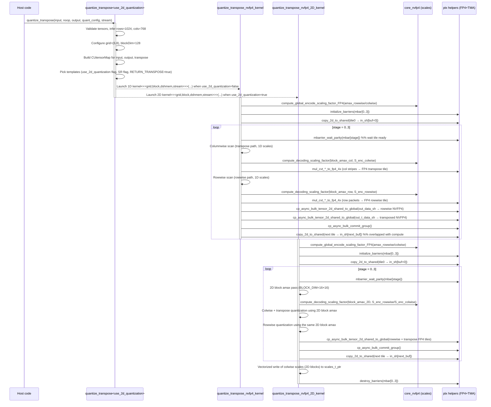
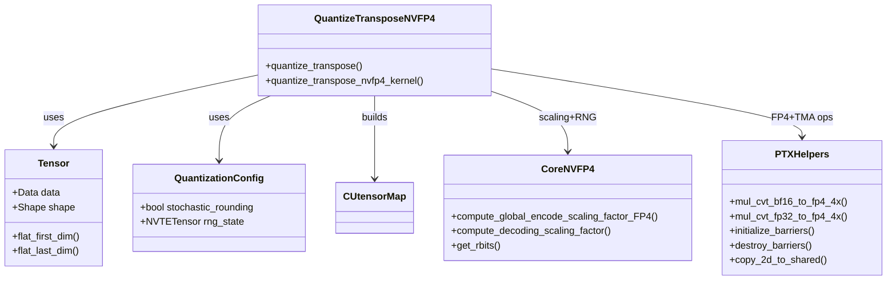

# NVFP4 Quantize+Transpose Kernels (1D + 2D, 1024×768, SR ON/OFF, RETURN_TRANSPOSE=True)

**Input shape**: 1024 × 768 (rows × cols, BF16)\
**Launcher**: `quantize_transpose<use_2d_quantization>`\
**Kernels**:
- 1D scaling: `quantize_transpose_kernel::quantize_transpose_nvfp4_kernel`
- 2D scaling: `quantize_transpose_kernel::quantize_transpose_nvfp4_2D_kernel`

**Cases covered**:
- Case A – 1D, `USE_STOCHASTIC_ROUNDING = false`, `RETURN_TRANSPOSE = true`
- Case B – 1D, `USE_STOCHASTIC_ROUNDING = true`,  `RETURN_TRANSPOSE = true`
- Case C – 2D, `USE_STOCHASTIC_ROUNDING = false`, `RETURN_TRANSPOSE = true`
- Case D – 2D, `USE_STOCHASTIC_ROUNDING = true`,  `RETURN_TRANSPOSE = true`

The walkthrough is **top‑down**:
1. Host launcher (`quantize_transpose`) and kernel selection.
2. Kernel high‑level design (tiling, pipeline, shared‑memory layout).
3. Detailed execution path inside the 1D kernel.
4. Detailed execution path inside the 2D kernel.
5. Specialization for SR OFF vs SR ON in both modes.

All links below are **relative to this file** and use GitHub‑style `#L` anchors so they are clickable from VS Code.

---

## 0. Quick Reference

### 0.1 Key Files

- Quantize+transpose (1D + 2D kernels, launcher)  
  `transformer_engine/common/cast/nvfp4/quantize_transpose_nvfp4.cuh`  
  - Constants and tiling:  
    [L37–L107](../transformer_engine/common/cast/nvfp4/quantize_transpose_nvfp4.cuh#L37-L107)  
  - 1D kernel `quantize_transpose_nvfp4_kernel`:  
    [L109–L620](../transformer_engine/common/cast/nvfp4/quantize_transpose_nvfp4.cuh#L109-L620)  
  - 2D kernel `quantize_transpose_nvfp4_2D_kernel`:  
    [L622–L1152](../transformer_engine/common/cast/nvfp4/quantize_transpose_nvfp4.cuh#L622-L1152)  
  - Host launcher `quantize_transpose<use_2d_quantization>`:  
    [L1156–L1281](../transformer_engine/common/cast/nvfp4/quantize_transpose_nvfp4.cuh#L1156-L1281)

- NVFP4 scaling core (scaling factors, RNG helper)  
  `transformer_engine/common/cast/nvfp4/core_nvfp4.cuh`  
  - Block decode scale `compute_decoding_scaling_factor`:  
    [L40–L49](../transformer_engine/common/cast/nvfp4/core_nvfp4.cuh#L40-L49)  
  - Global encode scale `compute_global_encode_scaling_factor_FP4`:  
    [L77–L92](../transformer_engine/common/cast/nvfp4/core_nvfp4.cuh#L77-L92)  
  - RNG bits helper `get_rbits`:  
    [L94–L107](../transformer_engine/common/cast/nvfp4/core_nvfp4.cuh#L94-L107)

- PTX helpers (FP4 conversions, TMA/mbarrier wrappers)  
  `transformer_engine/common/util/ptx.cuh`  
  - FP4 conversion from BF16/FP32 (`mul_cvt_*_to_fp4_4x`):  
    [L460–L575](../transformer_engine/common/util/ptx.cuh#L460-L575)  
    [L620–L642](../transformer_engine/common/util/ptx.cuh#L620-L642)  
  - Barrier + TMA helpers (`initialize_barriers`, `destroy_barriers`, `copy_2d_to_shared`):  
    [L1513–L1645](../transformer_engine/common/util/ptx.cuh#L1513-L1645)

### 0.2 Key Functions Index

| Function / Kernel | File:Lines | Purpose |
|-------------------|------------|---------|
| `quantize_transpose<false>` | [`quantize_transpose_nvfp4.cuh:1156–1281`](../transformer_engine/common/cast/nvfp4/quantize_transpose_nvfp4.cuh#L1156-L1281) | Host launcher for NVFP4 quantize+transpose; configures grid, TMA maps, templates, and launches 1D/2D kernels. |
| `quantize_transpose_nvfp4_kernel` | [`quantize_transpose_nvfp4.cuh:109–620`](../transformer_engine/common/cast/nvfp4/quantize_transpose_nvfp4.cuh#L109-L620) | 1D kernel: rowwise + columnwise NVFP4 quantization with optional transpose, using TMA and double‑buffering. |
| `compute_global_encode_scaling_factor_FP4` | [`core_nvfp4.cuh:77–92`](../transformer_engine/common/cast/nvfp4/core_nvfp4.cuh#L77-L92) | Computes global encode scale from global amax so that FP8×FP4 dynamic range covers tensor. |
| `compute_decoding_scaling_factor` (NVFP4) | [`core_nvfp4.cuh:40–49`](../transformer_engine/common/cast/nvfp4/core_nvfp4.cuh#L40-L49) | Computes per‑block decode scale (stored as FP8) from block amax and global encode scale. |
| `get_rbits` | [`core_nvfp4.cuh:94–107`](../transformer_engine/common/cast/nvfp4/core_nvfp4.cuh#L94-L107) | Pulls 32‑bit random lane from `uint4` Philox state, refreshing as needed (used for SR). |
| `mul_cvt_bf16_to_fp4_4x` | [`ptx.cuh:460–503,563–575`](../transformer_engine/common/util/ptx.cuh#L460-L503) | Converts 4×BF16 to 4×FP4 with scaling and either stochastic or RN rounding (inline PTX). |
| `mul_cvt_fp32_to_fp4_4x` | [`ptx.cuh:575–642`](../transformer_engine/common/util/ptx.cuh#L575-L642) | Same as above but starting from FP32 pairs (`float2`). |
| `initialize_barriers` / `destroy_barriers` | [`ptx.cuh:1513–1536`](../transformer_engine/common/util/ptx.cuh#L1513-L1536) | Set up and tear down shared‑memory `mbarrier` objects for TMA pipelines. |
| `copy_2d_to_shared` | [`ptx.cuh:1555–1580`](../transformer_engine/common/util/ptx.cuh#L1555-L1580) | Initiates async TMA copy from tensor map (global) to shared memory and arms barrier. |

---

## 1. Call Chain & Architecture

### 1.1 Mermaid Sequence Diagram (Execution Flow, 1D + 2D)



### 1.2 Mermaid Flowchart (Dataflow)

```mermaid
flowchart TD
    A[BF16 input tensor<br/>1024×768] --> B[Host quantize_transpose&lt;false&gt;]
    B --> C[Create CUtensorMap<br/>input/output/transpose]
    C --> D[Configure grid=(6,8)<br/>blockDim=128]
    D --> E[Each CTA handles<br/>128×128 chunk]

    E --> F[Stage loop 0..3<br/>32×128 tiles]
    F --> G[TMA: copy_2d_to_shared<br/>tile → in_sh]

    G --> H[Columnwise pass<br/>RETURN_TRANSPOSE=true]
    H --> I[Compute block amax<br/>per 16‑element column block]
    I --> J[compute_decoding_scaling_factor<br/>(FP8 scale)]
    J --> K[mul_cvt_*_to_fp4_4x<br/>+ SR or RN rounding]
    K --> L[Write FP4 to out_t_data_sh<br/>(transposed layout)]

    G --> M[Rowwise pass]
    M --> N[Compute block amax<br/>per 16×8 packet]
    N --> O[compute_decoding_scaling_factor<br/>(FP8 scale)]
    O --> P[mul_cvt_*_to_fp4_4x<br/>+ SR or RN rounding]
    P --> Q[Write FP4 to out_data_sh<br/>(rowwise layout)]

    L --> R[TMA: shared→global<br/>columnwise_data (768×1024)]
    Q --> S[TMA: shared→global<br/>data (1024×768)]

    J --> T[colwise_scale_inv<br/>768×64 scales]
    O --> U[rowwise_scale_inv<br/>1024×48 scales]
```

### 1.3 Mermaid Class Diagram (Module Relationships)



---

## 2. Host Launcher: `quantize_transpose<false>` (1D/2D)

**Source**: [`quantize_transpose_nvfp4.cuh:1156–1281`](../transformer_engine/common/cast/nvfp4/quantize_transpose_nvfp4.cuh#L1156-L1281)

### 2.1 Setup and Validation

```cpp
template <bool use_2d_quantization>
void quantize_transpose(const Tensor &input, const Tensor *noop, Tensor *output,
                        const QuantizationConfig *quant_config, cudaStream_t stream) {
#if FP4_TYPE_SUPPORTED
  using namespace quantize_transpose_kernel;
  using namespace ptx;
  bool use_stochastic_rounding = quant_config ? quant_config->stochastic_rounding : false;

  bool return_transpose = output->has_columnwise_data();
```

- For our **1D** scenarios (Cases A/B) the template argument is `use_2d_quantization = false`; for our **2D** scenarios (Cases C/D) it is `true`. The function body is the same; the 1D vs 2D choice is done later by picking the kernel symbol.
- `use_stochastic_rounding` is the runtime flag that controls the `USE_STOCHASTIC_ROUNDING` template parameter in the kernel (Case A vs Case B).
- `return_transpose` is `true` because the caller has allocated `columnwise_data` and `columnwise_scale_inv` on `output`.

Validation and shape extraction:

```cpp
  checkCuDriverContext(stream);
  CheckNoopTensor(*noop, "cast_noop");
  CheckInputTensor(input, "input");
  CheckOutputTensor(*output, "output", false);

  NVTE_CHECK(input.has_data(), "Cannot quantize tensor without rowwise data.");
  NVTE_CHECK(output->has_data(), "NVFP4 output tensor must be allocated.");
  NVTE_CHECK(is_fp4_dtype(output->data.dtype), "Output must have FP4 type.");
  NVTE_CHECK(output->scale_inv.dptr != nullptr, "Scaling tensor must be allocated");
  if (return_transpose) {
    NVTE_CHECK(output->has_columnwise_data(), "NVFP4 transposed output tensor must be allocated.");
    NVTE_CHECK(is_fp4_dtype(output->columnwise_data.dtype),
               "Transposed output must have FP4 type.");
    NVTE_CHECK(output->columnwise_scale_inv.dptr != nullptr,
               "Transposed scaling tensor must be allocated");
  }

  const size_t rows = input.flat_first_dim();
  const size_t cols = input.flat_last_dim();

  NVTE_CHECK(rows % 32 == 0, "Number of tensor rows must be a multiple of 32");
  NVTE_CHECK(cols % 32 == 0, "Number of tensor cols must be a multiple of 32");
```

- For our analysis **rows = 1024**, **cols = 768**. Both are multiples of 32, so the TMA alignment constraints are satisfied.
- The `NVTE_CHECK` calls are host‑side and will abort early if metadata is invalid; the device kernels are never launched in that case.

### 2.2 Grid/Block Geometry for 1024×768

```cpp
  const size_t blocks_Y = DIVUP(rows, CHUNK_DIM_Y);
  const size_t blocks_X = DIVUP(cols, CHUNK_DIM_X);
  const dim3 grid(blocks_X, blocks_Y);
  const size_t block_size = THREADS_NUM;
```

Using compile‑time constants from  
[`quantize_transpose_nvfp4.cuh:37–65`](../transformer_engine/common/cast/nvfp4/quantize_transpose_nvfp4.cuh#L37-L65):

- `CHUNK_DIM_Y = 128`, `CHUNK_DIM_X = 128`, `THREADS_NUM = 128`.
- For **rows=1024**, **cols=768**:
  - `blocks_Y = DIVUP(1024, 128) = 8`
  - `blocks_X = DIVUP(768, 128)  = 6`
  - `grid = dim3(6, 8)` (6 CTAs in X, 8 CTAs in Y).
  - `blockDim.x = 128`.

So each block (for both 1D and 2D kernels) processes a **128×128 chunk**:

- Block `(bx, by)` covers:
  - Rows: `[by * 128, by * 128 + 128)`
  - Cols: `[bx * 128, bx * 128 + 128)`
- With 8 row‑blocks and 6 col‑blocks, the 1024×768 matrix is exactly tiled, so no boundary predicates are triggered in this shape.

### 2.3 Scale Tensors and RNG State

```cpp
  const size_t scale_stride = output->scale_inv.shape[1];
  const size_t scale_stride_transpose =
      return_transpose ? output->columnwise_scale_inv.shape[1] : 0;

  nvfp4_scale_t *const scales_ptr = reinterpret_cast<nvfp4_scale_t *>(output->scale_inv.dptr);
  nvfp4_scale_t *const scales_transpose_ptr =
      reinterpret_cast<nvfp4_scale_t *>(output->columnwise_scale_inv.dptr);

  const float *noop_ptr = reinterpret_cast<const float *>(noop->data.dptr);
  const float *const amax_rowwise_ptr = reinterpret_cast<const float *>(output->amax.dptr);
  const float *const amax_colwise_ptr =
      reinterpret_cast<const float *>(output->columnwise_amax.dptr);
```

- `scales_ptr` is a `[rows, cols/16]` tensor: for 1024×768, that’s **1024 × 48** rowwise scales.
- `scales_transpose_ptr` is a `[cols, rows/16]` tensor: **768 × 64** columnwise scales for the transposed view.
- `amax_rowwise_ptr` and `amax_colwise_ptr` hold global running amax values; they drive the global encode scales in the kernel.

RNG state for stochastic rounding:

```cpp
  const NVTETensor rng_state_tensor = (quant_config != nullptr) ? quant_config->rng_state : nullptr;
  const size_t *rng_state = nullptr;
  if (rng_state_tensor != nullptr) {
    Tensor &rng_state_te_tensor = *convertNVTETensor(rng_state_tensor);
    NVTE_CHECK(rng_state_te_tensor.dtype() == DType::kInt64,
               "RNG state should contain 2 64-bit values.");
    NVTE_CHECK(rng_state_te_tensor.data.shape == std::vector<size_t>{2},
               "Shape of the RNG state should be [2]");
    rng_state = reinterpret_cast<const size_t *>(rng_state_te_tensor.data.dptr);
  }
```

- When **SR OFF (Case A)**, either `quant_config` is null or `stochastic_rounding == false`; the launcher still passes `rng_state` (possibly null) but the kernel instantiation will ignore it in FP4 conversions.
- When **SR ON (Case B)**, `rng_state` points to two 64‑bit integers: `seed` and `offset`. The kernel seeds a Philox PRNG per thread using these values.

### 2.4 Tensor Maps and Dynamic Shared Memory

```cpp
  using IType = bf16;

  alignas(64) CUtensorMap tensor_map_input{};
  alignas(64) CUtensorMap tensor_map_output{};
  alignas(64) CUtensorMap tensor_map_output_transpose{};

  create_2D_tensor_map(tensor_map_input, input.data, rows, cols,
                       BUFF_DIM_Y, BUFF_DIM_X, cols, 0, sizeof(IType) * 8);

  create_2D_tensor_map(tensor_map_output, output->data, rows, cols,
                       BUFF_DIM_Y, BUFF_DIM_X, cols, 0, 4);
  if (return_transpose) {
    create_2D_tensor_map(tensor_map_output_transpose, output->columnwise_data, cols, rows,
                         BUFF_DIM_X, BUFF_DIM_Y, rows, 0, 4);
  }
```

- Input tensor map: BF16, logical shape 1024×768, tiling into 32×128 tiles (see constants below) with stride `cols=768`.
- Output tensor map (rowwise): FP4 elements (4 bits) with same logical shape 1024×768.
- Transposed tensor map: logical shape 768×1024, with tile dims 128×32 (note tile dims flipped vs rowwise). This is what `RETURN_TRANSPOSE=true` enables.

Dynamic shared‑memory size:

```cpp
  constexpr size_t buff_elems = BUFF_DIM_Y * BUFF_DIM_X;
  constexpr size_t buff_elems_total = BUFFS_NUM * buff_elems;
  constexpr size_t buff_size_aligned_in =
      DIVUP_TO_MULTIPLE(buff_elems_total * sizeof(IType), TMA_SHMEM_ALIGNMENT);
  constexpr size_t buff_size_aligned_out =
      DIVUP_TO_MULTIPLE((buff_elems_total * 4) / 8, TMA_SHMEM_ALIGNMENT);
  constexpr size_t buff_size_scales =
      (CHUNK_DIM_Y * CHUNK_DIM_X) / 16 * sizeof(nvfp4_scale_t);

  constexpr size_t in_mem = buff_size_aligned_in;
  constexpr size_t out_data_mem = buff_size_aligned_out;
  constexpr size_t out_data_transpose_mem = buff_size_aligned_out;
  constexpr size_t out_scales_transpose_mem = buff_size_scales;

  constexpr size_t out_mem = out_data_mem + out_data_transpose_mem;
  constexpr size_t dshmem_size =
      in_mem + out_mem + out_scales_transpose_mem + TMA_SHMEM_ALIGNMENT;
```

- Two input tiles (`BUFFS_NUM=2`), each 32×128 BF16 elements.
- Corresponding output tiles for rowwise and transpose, plus a shared‑memory buffer holding columnwise scales.
- `dshmem_size` is passed to `cudaFuncSetAttribute` and as the dynamic shared‑memory size for the kernel launch.

### 2.5 Kernel Selection and Launch (1D vs 2D and SR ON/OFF)

```cpp
  TRANSFORMER_ENGINE_SWITCH_CONDITION(
      use_stochastic_rounding, USE_STOCHASTIC_ROUNDING,

      TRANSFORMER_ENGINE_SWITCH_CONDITION(return_transpose, RETURN_TRANSPOSE, {
        auto kernel = quantize_transpose_nvfp4_kernel<COMPUTE_ACTIVATIONS, ParamOP, OP, IType,
                                                      USE_STOCHASTIC_ROUNDING, RETURN_TRANSPOSE>;

        if constexpr (use_2d_quantization) {
          kernel = quantize_transpose_nvfp4_2D_kernel<COMPUTE_ACTIVATIONS, ParamOP, OP, IType,
                                                      USE_STOCHASTIC_ROUNDING, RETURN_TRANSPOSE>;
        }

        cudaFuncSetAttribute(kernel, cudaFuncAttributeMaxDynamicSharedMemorySize, dshmem_size);
        kernel<<<grid, block_size, dshmem_size, stream>>>(
            tensor_map_input, tensor_map_output, tensor_map_output_transpose, scales_ptr,
            scales_transpose_ptr, noop_ptr, amax_rowwise_ptr, amax_colwise_ptr, rows, cols,
            scale_stride, scale_stride_transpose, rng_state);
      }););
```

For our **1D, RETURN_TRANSPOSE=true** cases (A/B):

- `COMPUTE_ACTIVATIONS = false`, `ParamOP = Empty`, `OP = nullptr`.
- `use_2d_quantization` template parameter is `false`, so the `if constexpr` is **not taken**; we always call the 1D kernel:
  - `quantize_transpose_nvfp4_kernel<false, Empty, nullptr, bf16, USE_STOCHASTIC_ROUNDING, true>`
- **Case A (SR OFF)**: `USE_STOCHASTIC_ROUNDING = false`.
- **Case B (SR ON)**: `USE_STOCHASTIC_ROUNDING = true`.

The rest of the behavior (grid/block mapping, pipelining, memory layout) is identical between the two; only the FP4 rounding behavior and RNG use differ.

For our **2D, RETURN_TRANSPOSE=true** cases (C/D):

- `use_2d_quantization = true` (template parameter).
- The `if constexpr (use_2d_quantization)` branch is taken, and `kernel` is rebound to:

```cpp
quantize_transpose_nvfp4_2D_kernel<
    /*COMPUTE_ACTIVATIONS=*/false,
    Empty,
    nullptr,
    bf16,
    USE_STOCHASTIC_ROUNDING,
    RETURN_TRANSPOSE>
```

- `USE_STOCHASTIC_ROUNDING` again comes from `use_stochastic_rounding`, giving:
  - Case C – `USE_STOCHASTIC_ROUNDING=false`.
  - Case D – `USE_STOCHASTIC_ROUNDING=true`.

The 2D kernel uses the same TMA/tiling infrastructure but changes how amax and scales are computed (16×16 2D blocks instead of 1D stripes).

---

## 3. 1D Kernel Overview: `quantize_transpose_nvfp4_kernel`

**Source**: [`quantize_transpose_nvfp4.cuh:109–620`](../transformer_engine/common/cast/nvfp4/quantize_transpose_nvfp4.cuh#L109-L620)

### 3.1 Template and Responsibilities

```cpp
template <bool COMPUTE_ACTIVATIONS, typename ParamOP, float (*OP)(float, const ParamOP &),
          typename IType, bool USE_STOCHASTIC_ROUNDING, bool RETURN_TRANSPOSE>
__global__ void __launch_bounds__(THREADS_NUM)
    quantize_transpose_nvfp4_kernel(const __grid_constant__ CUtensorMap tensor_map_input,
                                    const __grid_constant__ CUtensorMap tensor_map_output,
                                    const __grid_constant__ CUtensorMap tensor_map_output_t,
                                    nvfp4_scale_t *const scales_ptr,
                                    nvfp4_scale_t *const scales_t_ptr, const float *noop,
                                    const float *const amax_rowwise_ptr,
                                    const float *const amax_colwise_ptr, const size_t rows,
                                    const size_t cols, const size_t scale_stride,
                                    const size_t scale_stride_t, const size_t *rng_state) {
```

In our instantiations:

- `COMPUTE_ACTIVATIONS = false` → no fused activation; `OP` and `ParamOP` are unused.
- `IType = bf16`.
- `USE_STOCHASTIC_ROUNDING` is either `false` (Case A) or `true` (Case B).
- `RETURN_TRANSPOSE = true`.

The kernel simultaneously:

1. **Loads** BF16 tiles from `tensor_map_input` via TMA into shared memory (`in_sh`).
2. **Columnwise pass**:
   - Scans each 16‑element NVFP4 block along columns (per tile) to compute a per‑block amax.
   - Computes columnwise decode scale (`S_dec_b_fp8`) using `compute_decoding_scaling_factor`.
   - Quantizes to FP4 while writing a **transposed** tile into `out_t_data_sh`.
   - Stores these decode scales to `out_colwise_scales_sh`.
3. **Rowwise pass**:
   - Scans 16×8 packets to compute rowwise block amax.
   - Computes rowwise decode scales and quantizes into `out_data_sh` (non‑transposed layout).
   - Stores rowwise scales directly to `scales_ptr` (rowwise global scale tensor).
4. **Stores** FP4 tiles via TMA back to global memory for both rowwise and transposed outputs.
5. **Vector‑stores** columnwise scales (`scales_t_ptr`) from shared memory at the very end.

All of this is pipelined over **4 stages** per CTA using **double‑buffered SMEM** and TMA `mbarrier`s.

### 3.2 Compile‑Time Constants and Tiling

**Source**: [`quantize_transpose_nvfp4.cuh:37–93`](../transformer_engine/common/cast/nvfp4/quantize_transpose_nvfp4.cuh#L37-L93)

```cpp
constexpr size_t SCALE_DIM = 16;  // NVFP4 block (x16 elts)

constexpr size_t CHUNK_DIM_Y = 128;
constexpr size_t CHUNK_DIM_X = 128;
constexpr size_t THREADS_NUM = 128;

constexpr size_t TILE_DIM_Y = 32;
constexpr size_t TILE_DIM_X = 128;

constexpr size_t TILES_Y = CHUNK_DIM_Y / TILE_DIM_Y; // 128 / 32 = 4
constexpr size_t TILES_X = CHUNK_DIM_X / TILE_DIM_X; // 128 / 128 = 1
constexpr size_t STAGES  = TILES_Y * TILES_X;        // 4

constexpr size_t BUFFS_NUM   = 2;
constexpr size_t BUFF_DIM_Y  = TILE_DIM_Y;  // 32
constexpr size_t BUFF_DIM_X  = TILE_DIM_X;  // 128

// Shared-memory bank conflict helpers
constexpr size_t PACK_SIZE = 8;
constexpr size_t WAVES     = SCALE_DIM / PACK_SIZE;  // 16/8 = 2

constexpr size_t THREADS_X_ROWWISE = TILE_DIM_X / SCALE_DIM;       // 128 / 16 = 8
constexpr size_t THREADS_Y_ROWWISE = THREADS_NUM / THREADS_X_ROWWISE; // 128 / 8 = 16

constexpr size_t ITERATIONS_NORMAL    = BUFF_DIM_Y / THREADS_Y_ROWWISE; // 32 / 16 = 2
constexpr size_t ITERATIONS_TRANSPOSE = BUFF_IN_DIM_Y / SCALE_DIM;      // 32 / 16 = 2
```

Interpretation for our 1024×768 input:

- **Per‑CTA chunk**: 128×128.
- **Per‑stage tile**: 32×128; there are 4 such stages (0..3) stacked along the Y direction.
- **Thread layout for rowwise pass**:
  - Logical 2D grid of threads: 16 (`THREADS_Y_ROWWISE`) × 8 (`THREADS_X_ROWWISE`) = 128 threads.
  - Each thread covers a 32‑row × 16‑column "stripe" in two passes (`ITERATIONS_NORMAL=2`).
- **Columnwise pass**:
  - All 128 threads are used as a 1D array (`tid_X_colwise`) to process 128 columns of the tile.
  - In 2 iterations (`ITERATIONS_TRANSPOSE=2`), they cover 32 rows (2 × 16).

Shared‑memory and bank conflict helpers:

```cpp
constexpr size_t TOTAL_BANKS_WIDTH = (32 * 4 * 8) / 4;  // 256
constexpr size_t THREADS_PER_BANK  = TOTAL_BANKS_WIDTH / SCALE_DIM; // 256 / 16 = 8
```

- Each shared‑memory bank is 4 bytes; 32 banks → 128 bytes. For 4‑bit elements, we treat 256 4‑bit lanes as spanning the 32 banks.
- `THREADS_PER_BANK = 8` means that 8 rowwise threads together span one "bank group" worth of contiguous FP4 data; this is exploited when swizzling indices to reduce bank conflicts.

---

## 4. Inside the 1D Kernel: Step‑by‑Step Execution

We now trace the kernel **frame‑by‑frame** along the execution path, focusing on:
- setup (RNG, global scaling),
- shared‑memory layout,
- pipelined TMA loads/stores,
- columnwise and rowwise passes,
- and SR ON/OFF behavior.

### 4.1 Entry, No‑Op Fast Path, and RNG Setup

**Source**: [`quantize_transpose_nvfp4.cuh:120–151`](../transformer_engine/common/cast/nvfp4/quantize_transpose_nvfp4.cuh#L120-L151)

```cpp
#if (defined __CUDA_ARCH__) && (__CUDA_ARCH__ >= 1000)
  constexpr bool NO_ACTIVATIONS_NOT_FP32_INPUT =
      (!COMPUTE_ACTIVATIONS) && (!std::is_same_v<IType, float>);

  using IType2 = typename ptx::FPx2<IType>;

  if constexpr (!COMPUTE_ACTIVATIONS) {
    if (noop != nullptr && noop[0] == 1.0f) {
      return;
    }
  }
```

- `NO_ACTIVATIONS_NOT_FP32_INPUT` is `true` in our instantiation (`COMPUTE_ACTIVATIONS=false`, `IType=bf16`), so certain optimized code paths for BF16 are selected later.
- If the host passed a `noop` tensor with value 1.0, the kernel **immediately returns**, skipping any computation or global memory writes.

RNG and SR setup:

```cpp
  const size_t rng_sequence =
      threadIdx.x + blockIdx.x * THREADS_NUM + blockIdx.y * gridDim.x * THREADS_NUM;
  const size_t rng_seed = rng_state != nullptr ? rng_state[0] : 0;
  const size_t rng_offset = rng_state != nullptr ? rng_state[1] : 0;
  transformer_engine::curanddx::detail::philox4x32_native_state<10> rng;
  rng.init(rng_seed, rng_sequence, rng_offset);
  uint4 random_uint4 = USE_STOCHASTIC_ROUNDING ? rng.generate4() : uint4{0, 0, 0, 0};
  int rnd_idx = 0;
```

- Every thread in every CTA gets a **unique Philox stream**:
  - `rng_sequence` is a linear index over threads across the 2D grid (X major, then Y).
  - `rng_offset` is a global offset provided by the host.
- **Case A (SR OFF)**:
  - `USE_STOCHASTIC_ROUNDING=false` → `random_uint4 = {0,0,0,0}`.
  - Later calls to `get_rbits` always see zeros, and FP4 conversion uses deterministic round‑to‑nearest.
- **Case B (SR ON)**:
  - `USE_STOCHASTIC_ROUNDING=true` → `random_uint4 = rng.generate4()`.
  - Each use of `get_rbits(rng, random_uint4, rnd_idx)` returns one 32‑bit lane from this `uint4`. When `rnd_idx` hits 4, a new `uint4` is generated, ensuring decorrelated random streams.

`get_rbits` implementation (simplified):

```cpp
__device__ __forceinline__ uint32_t
get_rbits(philox4x32_native_state<10> &rng, uint4 &random_uint4, int &rnd_idx) {
  if (rnd_idx == 4) {
    rnd_idx = 0;
    random_uint4 = rng.generate4();
  }
  const uint32_t *const rbits_arr = reinterpret_cast<uint32_t *>(&random_uint4);
  const uint32_t rbits = rbits_arr[rnd_idx++];
  return rbits;
}
```

### 4.2 Block, Thread, and Scale Indexing

**Source**: [`quantize_transpose_nvfp4.cuh:153–183`](../transformer_engine/common/cast/nvfp4/quantize_transpose_nvfp4.cuh#L153-L183)

```cpp
  constexpr bool IS_CACHED_ACT_OP = COMPUTE_ACTIVATIONS;

  const size_t block_offset_Y = blockIdx.y * CHUNK_DIM_Y;
  const size_t block_offset_X = blockIdx.x * CHUNK_DIM_X;

  const size_t block_offset_Y_t = blockIdx.x * CHUNK_DIM_X;
  const size_t block_offset_X_t = blockIdx.y * CHUNK_DIM_Y;

  const size_t chunk_rows = rows - block_offset_Y;
```

- For our configuration, `rows=1024`, `CHUNK_DIM_Y=128`:
  - For `blockIdx.y = 0..7`, `chunk_rows = 1024 - 128*by = 1024, 896, …, 128`.
  - Since **rows is a multiple of 128**, every CTA sees `chunk_rows >= CHUNK_DIM_Y`, so the "full chunk" fast path for colwise scale stores is always taken.
- `block_offset_X` and `block_offset_Y` choose which **128×128** region of the input each CTA covers.
- `block_offset_Y_t` and `block_offset_X_t` are the **transposed offsets** used when writing into `tensor_map_output_t` (transposed layout).

Scale block offsets:

```cpp
  const size_t scales_block_offset_Y_rowwise = blockIdx.y * CHUNK_DIM_Y;
  const size_t scales_block_offset_X_rowwise = blockIdx.x * SCALES_PER_CHUNK_X;
  const size_t scales_block_offset_Y_t = blockIdx.x * CHUNK_DIM_X;
  const size_t scales_block_offset_X_t = blockIdx.y * SCALES_PER_CHUNK_Y;
```

- Rowwise scales:
  - Each row has `cols/SCALE_DIM = 768/16 = 48` scale factors.
  - One CTA in X covers `SCALES_PER_CHUNK_X = CHUNK_DIM_X/SCALE_DIM = 8` scales per row.
  - With 6 CTAs in X, we cover all 48 scales per row for 1024 rows.
- Columnwise scales (transpose view):
  - For transposed tensor shaped 768×1024, each column has `rows/SCALE_DIM = 1024/16 = 64` scale factors.
  - For each original chunk (128×128), the colwise scales for its 128 columns are stored in a `[cols, rows/16]` layout using these offsets.

Thread indexing for rowwise and colwise views:

```cpp
  const size_t tid_Y_rowwise = threadIdx.x / THREADS_X_ROWWISE;  // 0..15
  const size_t tid_X_rowwise = threadIdx.x % THREADS_X_ROWWISE;  // 0..7
  const size_t tid_X_colwise = threadIdx.x;                      // 0..127
  const size_t tid_Y_t       = tid_X_colwise;

  const size_t thread_offset_Y_rowwise = tid_Y_rowwise;
  const size_t thread_offset_X_rowwise = tid_X_rowwise * SCALE_DIM;  // 0,16,...,112
  const size_t thread_offset_X_colwise = tid_X_colwise;

  const size_t row_base_rowwise = block_offset_Y + thread_offset_Y_rowwise;
  const size_t row_base_colwise = block_offset_Y;
  const size_t col_base_colwise = block_offset_X + thread_offset_X_colwise;
```

- **Rowwise view**:
  - Each thread corresponds to one **row index within the tile** (`thread_offset_Y_rowwise ∈ [0,15]`).
  - And to a **16‑element contiguous column block** (`thread_offset_X_rowwise ∈ {0,16,32,...,112}`).
- **Columnwise view**:
  - Each thread `tid_X_colwise` is mapped to one **column** of the tile.
- `tid_Y_t` is reused for indexing colwise scales across `SCALES_PER_CHUNK_Y`.

Out‑of‑bounds flags (not triggered for 1024×768):

```cpp
  const bool col_out_of_bounds_colwise = (col_base_colwise >= cols);

  const size_t scales_offset_Y_rowwise = scales_block_offset_Y_rowwise + tid_Y_rowwise;
  const size_t scales_offset_X_rowwise = scales_block_offset_X_rowwise + tid_X_rowwise;
  const size_t scales_offset_Y_t       = scales_block_offset_Y_t + tid_Y_t;
  const size_t scales_offset_X_t       = scales_block_offset_X_t;

  const size_t SFs_per_row = cols / SCALE_DIM;

  const bool rowwise_scale_is_within_bounds_X = scales_offset_X_rowwise < SFs_per_row;
  const bool colwise_scale_is_within_bounds_Y = scales_offset_Y_t < cols;
```

- For our aligned 1024×768 case:
  - `col_out_of_bounds_colwise` is always false inside the 128‑wide CTA tile.
  - `rowwise_scale_is_within_bounds_X` is always true because `scales_offset_X_rowwise ∈ [8*bx .. 8*bx+7]` and `SFs_per_row=48`.
  - `colwise_scale_is_within_bounds_Y` is always true because `scales_offset_Y_t ∈ [128*bx .. 128*bx+127]` and `cols=768`.

### 4.3 Shared Memory Layout and Global Scales

**Source**: [`quantize_transpose_nvfp4.cuh:185–236`](../transformer_engine/common/cast/nvfp4/quantize_transpose_nvfp4.cuh#L185-L236)

```cpp
  const int thread_lane = threadIdx.x % THREADS_PER_WARP;
  const int bank_group  = thread_lane / THREADS_PER_BANK;

  constexpr size_t buff_elems       = BUFF_DIM_Y * BUFF_IN_DIM_X;
  constexpr size_t buff_elems_total = BUFFS_NUM * buff_elems;

  constexpr size_t buff_size_aligned_in =
      DIVUP_TO_MULTIPLE(buff_elems_total * sizeof(IType), TMA_SHMEM_ALIGNMENT);
  constexpr size_t buff_size_aligned_out =
      DIVUP_TO_MULTIPLE((buff_elems_total * 4) / 8, TMA_SHMEM_ALIGNMENT);

  constexpr size_t in_mem              = buff_size_aligned_in;
  constexpr size_t out_mem_rowwise_data = buff_size_aligned_out;
  constexpr size_t out_mem_colwise_data = buff_size_aligned_out;
  constexpr size_t out_mem_rowwise_scales = 0;

  extern __shared__ char dynamic_shmem[];
  uintptr_t base_shmem_ptr = reinterpret_cast<uintptr_t>(dynamic_shmem);
  uintptr_t dshmem = (base_shmem_ptr + TMA_SHMEM_ALIGNMENT - 1) &
                     ~(static_cast<uintptr_t>(TMA_SHMEM_ALIGNMENT - 1));

  IType       *in_sh              = reinterpret_cast<IType *>(dshmem);
  fp4e2m1x2   *out_data_sh        = reinterpret_cast<fp4e2m1x2 *>(dshmem + in_mem);
  fp4e2m1x2   *out_t_data_sh      = reinterpret_cast<fp4e2m1x2 *>(dshmem + in_mem + out_mem_rowwise_data);
  nvfp4_scale_t *out_rowwise_scales_sh = reinterpret_cast<nvfp4_scale_t *>(
      dshmem + in_mem + out_mem_rowwise_data + out_mem_colwise_data);
  nvfp4_scale_t *out_colwise_scales_sh = reinterpret_cast<nvfp4_scale_t *>(
      dshmem + in_mem + out_mem_rowwise_data + out_mem_colwise_data + out_mem_rowwise_scales);
  IType *cached_act_sh = in_sh;  // reused as cache when needed

  constexpr size_t shmem_buff_size = buff_size_aligned_in / BUFFS_NUM;
```

Shared‑memory layout (conceptual view):

```text
dynamic_shmem (aligned to 128 B)
┌───────────────────────────────┐
│ in_sh[0 .. 2*32*128-1]        │  // 2 input tiles (BF16)
├───────────────────────────────┤
│ out_data_sh (rowwise FP4)     │  // 2 tiles
├───────────────────────────────┤
│ out_t_data_sh (transpose FP4) │  // 2 tiles
├───────────────────────────────┤
│ out_rowwise_scales_sh         │  // unused in 1D path; scales go directly to global
├───────────────────────────────┤
│ out_colwise_scales_sh         │  // per-tile colwise NVFP4 scales, later vector-stored
└───────────────────────────────┘
```

Global encode/decoding scales:

```cpp
  const bool is_master_thread = (threadIdx.x == 0);

  const float S_enc_rowwise = (amax_rowwise_ptr == nullptr)
                                  ? 1.0f
                                  : compute_global_encode_scaling_factor_FP4(*amax_rowwise_ptr);
  const float S_dec_rowwise = 1.0 / S_enc_rowwise;

  const float S_enc_colwise = (amax_colwise_ptr == nullptr)
                                  ? S_enc_rowwise
                                  : compute_global_encode_scaling_factor_FP4(*amax_colwise_ptr);
  const float S_dec_colwise = 1.0 / S_enc_colwise;

  float thread_amax = 0.0f;
```

- `S_enc_rowwise` and `S_enc_colwise` are **global** encode scales derived from the running amaxs:
  - Implementation: [`core_nvfp4.cuh:77–92`](../transformer_engine/common/cast/nvfp4/core_nvfp4.cuh#L77-L92).
  - Roughly: `S_enc ≈ (fp8_max * fp4_max) / global_amax`.
  - If `global_amax == 0`, `S_enc` is defaulted to 1.
- `S_dec_rowwise/colwise = 1 / S_enc_*` are used to reconstruct overall scaling as:

```text
Effective encode scale for a block:
  S_enc_block = 1 / (S_dec_b_fp8 * S_dec_global)
```

where `S_dec_b_fp8` is the **per‑block FP8 decode scale** computed from `block_amax`.

### 4.4 TMA Barriers and Initial Tile Load

**Source**: [`quantize_transpose_nvfp4.cuh:238–245`](../transformer_engine/common/cast/nvfp4/quantize_transpose_nvfp4.cuh#L238-L245)

```cpp
  __shared__ alignas(8) uint64_t mbar[STAGES];

  initialize_barriers<STAGES, THREADS_NUM>(mbar, is_master_thread);

  copy_2d_to_shared(&in_sh[0], &tensor_map_input, block_offset_X, block_offset_Y,
                    shmem_buff_size, &mbar[0], is_master_thread);
```

- `mbar[0..3]` are **mbarrier objects** in shared memory, one per stage.
- `initialize_barriers`:
  - For the master thread (thread 0), calls `ptx::mbarrier_init(mbar[i], THREADS_NUM)` for each barrier and then `ptx::fence_proxy_async_shared_cta()`.
  - Then a `__syncthreads()` ensures all threads see initialized barriers.
- `copy_2d_to_shared`:
  - For the master thread, issues `cp_async_bulk_tensor_2d_global_to_shared` from `tensor_map_input` at `(block_offset_X, block_offset_Y)` into `in_sh[0]`.
  - Arrives on the barrier with `mbarrier_arrive_expect_tx(barrier, num_bytes)`.
  - Other threads just `mbarrier_arrive(barrier)` to join the barrier.

At this point, **Stage 0’s tile** (the top 32 rows of the CTA’s 128×128 chunk) is being fetched asynchronously into `in_sh`.

### 4.5 Stage Loop and Double‑Buffered Pipeline

**Source**: [`quantize_transpose_nvfp4.cuh:247–277`](../transformer_engine/common/cast/nvfp4/quantize_transpose_nvfp4.cuh#L247-L277)

```cpp
#pragma unroll
  for (size_t stage = 0; stage < STAGES; ++stage) {
    const size_t buff      = stage % BUFFS_NUM;
    const size_t next_stage = stage + 1;
    const size_t stage_offset_Y = stage * BUFF_DIM_Y;

    const size_t buff_offset_in   = buff * BUFF_IN_SIZE;
    const size_t buff_offset_out  = buff * BUFF_OUT_SIZE;
    const size_t buff_offset_out_t = buff * BUFF_OUT_T_SIZE;

    if (next_stage < STAGES) {
      ptx::cp_async_bulk_wait_group_read<1>();

      const size_t next_buff           = next_stage % BUFFS_NUM;
      const size_t next_stage_offset_Y = next_stage * BUFF_DIM_Y;
      const size_t global_offset_Y     = block_offset_Y + next_stage_offset_Y;
      const size_t global_offset_X     = block_offset_X;
      const size_t next_buff_offset    = next_buff * BUFF_IN_SIZE;

      copy_2d_to_shared(&in_sh[next_buff_offset], &tensor_map_input, global_offset_X,
                        global_offset_Y, shmem_buff_size, &mbar[next_stage], is_master_thread);
    }

    ptx::fence_proxy_async_shared_cta();
    ptx::mbarrier_wait_parity(&mbar[stage], 0);

    float block_amax = 0.0f;
```

Pipeline behavior per stage:

- `buff = stage % 2` selects one of the two input/output tile buffers.
- For all but the last stage, the master thread:
  - Calls `cp_async_bulk_wait_group_read<1>()` to ensure TMA has finished reading any previous stage’s writes to shared memory.
  - Issues a new `copy_2d_to_shared` to fetch stage `next_stage`’s 32×128 tile into the **alternate buffer**.
- `mbarrier_wait_parity(&mbar[stage], 0)` waits until the TMA transfer into the **current buffer** has completed.
- After the wait, the current buffer’s tile is safe to read by all threads.

This yields a standard **producer–consumer pipeline**:

- Stage `s` compute overlaps with Stage `s+1` TMA load into the other buffer.

---

## 5. Columnwise (Transpose) Pass – RETURN_TRANSPOSE=True (1D)

**Source** (start of columnwise loop): [`quantize_transpose_nvfp4.cuh:279–355`](../transformer_engine/common/cast/nvfp4/quantize_transpose_nvfp4.cuh#L279-L355)

```cpp
    // COLWISE scaling
    if constexpr (RETURN_TRANSPOSE) {
#pragma unroll
      for (size_t it = 0; it < ITERATIONS_TRANSPOSE; ++it) {
        const size_t in_thread_offset_Y  = 0 + it * SCALE_DIM;      // 0 or 16
        const size_t in_thread_offset_X  = thread_offset_X_colwise; // column

        const size_t out_t_thread_offset_Y = thread_offset_X_colwise;          // column index
        const size_t out_t_thread_offset_X = 0 + it * BUFF_OUT_IT_OFFSET;      // 0 or BUFF_OUT_T_DIM_X/2

        const size_t shmem_offset_base_colwise_in =
            buff_offset_in + in_thread_offset_Y * BUFF_IN_DIM_X + in_thread_offset_X;
        const size_t shmem_offset_base_colwise_out_t =
            buff_offset_out_t + out_t_thread_offset_Y * BUFF_OUT_T_DIM_X + out_t_thread_offset_X;
```

Per stage:

- Each thread `tid_X_colwise` handles **one column** of the 32×128 tile.
- `it = 0,1`:
  - First iteration loads rows 0..15 of that column.
  - Second iteration loads rows 16..31.
- For each iteration, we operate on a **16‑element NVFP4 block** (SCALE_DIM=16).

#### 5.1 Load and Amax (Colwise)

```cpp
        block_amax = 0.0f;
        float in_compute_colwise[SCALE_DIM];
        IType in_colwise_IType[SCALE_DIM];

        if constexpr (NO_ACTIVATIONS_NOT_FP32_INPUT) {
          IType block_amax_f16 = static_cast<IType>(0.0f);
#pragma unroll
          for (int i = 0; i < SCALE_DIM; ++i) {
            const int shmem_offset_colwise = shmem_offset_base_colwise_in + i * BUFF_IN_DIM_X;
            in_colwise_IType[i] = in_sh[shmem_offset_colwise];
            block_amax_f16 = __hmax(block_amax_f16, __habs(in_colwise_IType[i]));
          }
          block_amax = static_cast<float>(block_amax_f16);
        } else {
          ...
        }
```

- In our instantiation, `NO_ACTIVATIONS_NOT_FP32_INPUT=true`, so the **BF16‑only path** is used:
  - The thread loads 16 BF16 values from a single column, spaced by `BUFF_IN_DIM_X=128`.
  - `block_amax_f16` tracks the maximum absolute BF16 value in this 16‑element block.
  - `block_amax` is the FP32 representation of that maximum.

If `COMPUTE_ACTIVATIONS` were true, the `else` branch would:
- Convert each BF16 to FP32.
- Optionally apply an activation `OP`.
- Optionally cache the activated BF16 values in `cached_act_sh`.
- Track block amax in FP32 (with boundary checks).

#### 5.2 Compute Block Decode Scale and Encode Scale

```cpp
        const nvfp4_scale_t S_dec_b_fp8 =
            compute_decoding_scaling_factor(block_amax, S_enc_colwise);

        const size_t scale_idx_sh =
            tid_Y_t * SCALES_PER_CHUNK_Y + stage * ITERATIONS_TRANSPOSE + it;
        out_colwise_scales_sh[scale_idx_sh] = S_dec_b_fp8;

        constexpr float float_max = detail::TypeExtrema<float>::max;
        const float block_scale_inverse = fminf(
            1.0f / (static_cast<float>(S_dec_b_fp8) * S_dec_colwise), float_max);
        const float2 block_scale_inverse_2x{block_scale_inverse, block_scale_inverse};
```

- `compute_decoding_scaling_factor` for NVFP4: [`core_nvfp4.cuh:40–49`](../transformer_engine/common/cast/nvfp4/core_nvfp4.cuh#L40-L49).
  - It computes a per‑block decode scale as FP8 such that `block_amax / 6.0` is representable.
  - Mathematically: `S_dec_b ≈ (block_amax / fp4_max) * S_enc_colwise`, then clamped, then cast to FP8.
- `S_dec_b_fp8` (FP8) is written into `out_colwise_scales_sh` for this block; global storage happens later.
- `block_scale_inverse` reconstructs the **effective encode scale** for this block:

```text
block_scale_inverse ≈ 1 / (S_dec_b_fp8 * S_dec_colwise)
                   = S_enc_colwise / S_dec_b_fp8
```

and `block_scale_inverse_2x` duplicates this value for the `mul.f32x2` instructions used later.

#### 5.3 Quantization: Inline PTX Helpers

```cpp
        fp4e2m1x4 regs[SCALE_DIM / 4];

#pragma unroll
        for (int e = 0; e < SCALE_DIM / 4; ++e) {
          const uint32_t rbits = get_rbits(rng, random_uint4, rnd_idx);
          if constexpr (NO_ACTIVATIONS_NOT_FP32_INPUT) {
            const uint64_t elts = *reinterpret_cast<uint64_t *>(&in_colwise_IType[4 * e]);
            regs[e] = ptx::mul_cvt_bf16_to_fp4_4x<USE_STOCHASTIC_ROUNDING>(
                elts, block_scale_inverse_2x, rbits);
          } else {
            ...
          }
        }
```

Here each iteration `e` converts **4 BF16s → 4 FP4s**:

- `elts` packs 4 consecutive BF16 values (16 bits each) into a 64‑bit register.
- `mul_cvt_bf16_to_fp4_4x<USE_STOCHASTIC_ROUNDING>` chooses between the SR and RN implementations in [`ptx.cuh:460–575`](../transformer_engine/common/util/ptx.cuh#L460-L575).

SR implementation (simplified excerpt):

```cpp
__device__ __forceinline__ fp4e2m1x4 mul_cvt_bf16_to_fp4_4x_with_stochastic_rounding(
    const uint64_t in_4x, const float2 scale, const uint32_t rbits) {
  uint16_t out_4x = 0;
  asm volatile(
      "{\n"
      ".reg.b16 v0_bf16, v1_bf16, v2_bf16, v3_bf16;\n\t"
      ".reg.b32 v0, v1, v2, v3;\n\t"
      "mov.b64 {v0_bf16, v1_bf16, v2_bf16, v3_bf16}, %1; \n\t"
      "cvt.f32.bf16 v0, v0_bf16; \n\t"
      "cvt.f32.bf16 v1, v1_bf16; \n\t"
      "cvt.f32.bf16 v2, v2_bf16; \n\t"
      "cvt.f32.bf16 v3, v3_bf16; \n\t"
      "mul.f32x2 v01, v01, %2; \n\t"
      "mul.f32x2 v23, v23, %2; \n\t"
      "cvt.rs.satfinite.e2m1x4.f32 %0, {v2, v3, v0, v1}, %3; \n\t"
      "}"
      : "=h"(out_4x)
      : "l"(in_4x),
        "l"(reinterpret_cast<const uint64_t &>(scale)),
        "r"(rbits));
  return *reinterpret_cast<fp4e2m1x4 *>(&out_4x);
}
```

- The PTX sequence:
  - Unpacks 4 BF16s → 4 FP32 registers (`cvt.f32.bf16`).
  - Applies the per‑block encode scale via `mul.f32x2`.
  - Converts 4 FP32 values to FP4 (E2M1) with **stochastic rounding** (`cvt.rs.satfinite.e2m1x4.f32`) using the random bits `rbits`.
  - Packs 4 FP4 values into a 16‑bit container (`fp4e2m1x4`).

RN implementation (`mul_cvt_bf16_to_fp4_4x_with_rn`) follows a similar structure but uses `cvt.rn.satfinite.e2m1x2.f32` and ignores `rbits`.

Implications:

- **Case A (SR OFF)**:
  - Compile‑time selects `mul_cvt_bf16_to_fp4_4x_with_rn`.
  - Rounding is deterministic round‑to‑nearest; SR bits are unused.
- **Case B (SR ON)**:
  - Uses `mul_cvt_bf16_to_fp4_4x_with_stochastic_rounding`.
  - `rbits` (from Philox) influence the FP4 rounding decision, improving statistical properties of quantization noise.

#### 5.4 Transposed Write Pattern

The transposed write for colwise data is designed so that:

- A column in the input **becomes a row** in the transposed output.
- Each thread writes its FP4 pack into `out_t_data_sh` at positions derived from `out_t_thread_offset_Y` (the original column index) and `out_t_thread_offset_X` (block index across Y).

The write logic ultimately packs each 4‑element group (`regs[e]`) into the correct contiguous FP4 location in `out_t_data_sh`, so that:

- Each row in `tensor_map_output_t` corresponds to an original column (768 rows).
- Each scale in `scales_t_ptr` matches a 16‑element stripe along that new row.

---

## 6. Rowwise Pass – Primary Output Quantization (1D)

After the colwise pass for a given stage, the kernel runs the **rowwise** pass for the same tile.

**Source** (rowwise pass skeleton): [`quantize_transpose_nvfp4.cuh:412–563`](../transformer_engine/common/cast/nvfp4/quantize_transpose_nvfp4.cuh#L412-L563)

The rowwise pass uses the 2D `(tid_Y_rowwise, tid_X_rowwise)` decomposition and the `PACK_SIZE/WAVES` swizzling to minimize shared‑memory bank conflicts.

### 6.1 Rowwise Load and Amax

The rowwise loop structure (simplified):

```cpp
    // ROWWISE scaling
    {
      const size_t stage_rowwise_scales_offset_Y = stage * BUFF_DIM_Y;
#pragma unroll
      for (size_t it = 0; it < ITERATIONS_NORMAL; ++it) {
        const size_t block_in_tile_y = it;
        const size_t block_in_tile_x = tid_X_rowwise;
        const size_t it_thread_offset_Y_rowwise =
            thread_offset_Y_rowwise + it * THREADS_Y_ROWWISE; // 0..31

        const size_t shmem_offset_base_rowwise_in =
            buff_offset_in + it_thread_offset_Y_rowwise * BUFF_IN_DIM_X + thread_offset_X_rowwise;
        const size_t shmem_offset_base_rowwise_out =
            buff_offset_out + it_thread_offset_Y_rowwise * BUFF_OUT_DIM_X + thread_offset_X_rowwise / 2;
```

Per stage:

- `ITERATIONS_NORMAL = 2`. With 16 rowwise threads in Y, this covers all 32 rows in the tile.
- For each iteration `it`:
  - `it_thread_offset_Y_rowwise` goes from 0..15 (it=0) and 16..31 (it=1).
  - Each thread touches 16 columns starting at `thread_offset_X_rowwise`.

Block amax computation has multiple specializations depending on `NO_ACTIVATIONS_NOT_FP32_INPUT` and `IS_CACHED_ACT_OP`. In our instantiation:

- For **no activations and BF16 input**, the kernel uses vector types `Vec<IType, PACK_SIZE>` and `Vec<IType, PACK_SIZE>` for more efficient loads and uses `ptx::abs_max_2x` to accumulate amax across pairs while swizzling indices to reduce bank conflicts.

Conceptually, for each **16×8 block** of the tile:

1. Threads in a warp cooperatively load a **wave** of 8 elements (`PACK_SIZE`) each.
2. For each wave:
   - The swizzled index:

```cpp
const size_t swizzled_group_idx = ((w + bank_group) * PACK_SIZE) % SCALE_DIM;
const size_t swizzled_thread_idx = thread_offset_X_rowwise + swizzled_group_idx;
```

   distributes accesses from different threads across banks, so that consecutive FP4 words are not hammered by the same subset of threads.
3. Amax is computed either in BF16 or FP32 depending on specialization.

### 6.2 Rowwise Decode Scale and Scale Writes

Once `block_amax` is known for the rowwise block:

```cpp
        const nvfp4_scale_t S_dec_b_fp8 =
            compute_decoding_scaling_factor(block_amax, S_enc_rowwise);

        const size_t scales_offset_Y =
            scales_offset_Y_rowwise + stage * BUFF_DIM_Y + it * THREADS_Y_ROWWISE;
        const size_t scales_offset_X = scales_offset_X_rowwise;
        const size_t scale_idx_global = scales_offset_Y * scale_stride + scales_offset_X;

        const bool rowwise_scale_is_within_bounds_Y =
            (stage_rowwise_scales_offset_Y + it * THREADS_Y_ROWWISE + tid_Y_rowwise) < chunk_rows;
        if (rowwise_scale_is_within_bounds_X && rowwise_scale_is_within_bounds_Y) {
          scales_ptr[scale_idx_global] = S_dec_b_fp8;
        }
```

- `S_dec_b_fp8` is the FP8 decode scale for this **16×16 block** along the rowwise orientation.
- `scales_ptr[scale_idx_global]` writes directly to the rowwise global scale tensor.
- For our aligned 1024×768 case, the bounds checks are always true.

### 6.3 Rowwise Quantization and FP4 Stores

The quantization step mirrors the colwise logic but with the swizzled layout:

```cpp
        constexpr float float_max = detail::TypeExtrema<float>::max;
        const float block_scale_inverse = fminf(
            1.0f / (static_cast<float>(S_dec_b_fp8) * S_dec_rowwise), float_max);
        const float2 block_scale_inverse_2x{block_scale_inverse, block_scale_inverse};

#pragma unroll
        for (int w = 0; w < WAVES; ++w) {
          Vec<fp4e2m1x4, PACK_SIZE / 4> out;
#pragma unroll
          for (int e = 0; e < PACK_SIZE / 4; ++e) {
            const uint32_t rbits = get_rbits(rng, random_uint4, rnd_idx);
            if constexpr (NO_ACTIVATIONS_NOT_FP32_INPUT) {
              const uint64_t elts =
                  *reinterpret_cast<uint64_t *>(&in_IType[w].data.elt[2 * e]);
              out.data.elt[e] = ptx::mul_cvt_bf16_to_fp4_4x<USE_STOCHASTIC_ROUNDING>(
                  elts, block_scale_inverse_2x, rbits);
            } else if constexpr (IS_CACHED_ACT_OP) {
              ...
            } else {
              ...
            }
          }
          const size_t swizzled_group_idx = ((w + bank_group) * PACK_SIZE) % SCALE_DIM;
          const size_t swizzled_idx       = swizzled_group_idx + thread_offset_X_rowwise;
          const size_t shmem_offset_rowwise =
              shmem_offset_base_rowwise_out + swizzled_idx / 2;
          out.store_to(&out_data_sh[shmem_offset_rowwise]);
        }
```

- `in_IType[w]` is a vector of 8 BF16s; two of them are packed into each `uint64_t elts`.
- `mul_cvt_bf16_to_fp4_4x` (SR or RN) does the same FP4 conversion as in the colwise pass.
- Swizzling:
  - `swizzled_group_idx` mixes `w` (wave index) and `bank_group` (sub‑group of lanes in a warp) so that threads write to different banks, reducing conflicts.
  - `shmem_offset_rowwise` is divided by 2 because FP4 values are stored packed (`fp4e2m1x2`), i.e. 2 FP4s per byte.

The result is that each row of the tile is quantized and stored into `out_data_sh` in a layout that is friendly both to shared‑memory access patterns and to TMA’s 2D store.

---

## 7. Stage Finalization and Global Stores (1D)

After both colwise and rowwise passes for a given stage:

```cpp
    __builtin_assume(thread_amax >= 0);
    thread_amax = fmaxf(thread_amax, block_amax);

    ptx::fence_proxy_async_shared_cta();
    __syncthreads();

    if (is_master_thread) {
      const size_t global_offset_Y   = block_offset_Y   + stage_offset_Y;
      const size_t global_offset_X   = block_offset_X;

      const size_t global_offset_Y_t = block_offset_Y_t;
      const size_t global_offset_X_t = block_offset_X_t + stage_offset_Y;

      ptx::cp_async_bulk_tensor_2d_shared_to_global(
          reinterpret_cast<const uint64_t *>(&tensor_map_output),
          global_offset_X, global_offset_Y,
          reinterpret_cast<uint64_t *>(&out_data_sh[buff_offset_out]));

      if constexpr (RETURN_TRANSPOSE) {
        ptx::cp_async_bulk_tensor_2d_shared_to_global(
            reinterpret_cast<const uint64_t *>(&tensor_map_output_t),
            global_offset_X_t, global_offset_Y_t,
            reinterpret_cast<uint64_t *>(&out_t_data_sh[buff_offset_out_t]));
      }

      ptx::cp_async_bulk_commit_group();
    }
```

- `thread_amax` tracks the maximum absolute value any thread has seen; it isn’t used later in this kernel but may be useful for debugging or future extensions.
- `fence_proxy_async_shared_cta()` ensures that all shared‑memory writes have reached the TMA engine before the async store.
- `__syncthreads()` guarantees all threads have finished their writes before the master thread launches the TMA store.
- Two TMA stores:
  - Rowwise tile → `tensor_map_output` (1024×768 layout).
  - Transposed tile → `tensor_map_output_t` (768×1024 layout).
- `cp_async_bulk_commit_group()` groups these TMA operations into an async "bulk copy group".

### 7.1 Columnwise Scale Vectorized Store and Barrier Destruction

After exiting the stage loop:

```cpp
  if (RETURN_TRANSPOSE && colwise_scale_is_within_bounds_Y) {
    using ScalesVec = Vec<nvfp4_scale_t, SCALES_PER_CHUNK_Y>;
    const size_t scale_idx_sh = tid_Y_t * SCALES_PER_CHUNK_Y;
    ScalesVec &scales_vec =
        *reinterpret_cast<ScalesVec *>(&out_colwise_scales_sh[scale_idx_sh]);
    const size_t scale_idx_global = scales_offset_Y_t * scale_stride_t + scales_offset_X_t;
    const size_t count =
        (chunk_rows >= CHUNK_DIM_Y) ? SCALES_PER_CHUNK_Y : (chunk_rows / SCALE_DIM);
    nvfp4_scale_t *dst = &scales_t_ptr[scale_idx_global];
    constexpr size_t vec_bytes = SCALES_PER_CHUNK_Y * sizeof(nvfp4_scale_t);
    if (count == SCALES_PER_CHUNK_Y && (reinterpret_cast<uintptr_t>(dst) % vec_bytes == 0)) {
      scales_vec.store_to(dst);
    } else {
      scales_vec.store_to_elts(dst, 0, count);
    }
  }

  destroy_barriers<STAGES>(mbar, is_master_thread);
```

- Each thread `tid_Y_t` (0..127) owns `SCALES_PER_CHUNK_Y` columnwise scales in shared memory.
- For our aligned 1024×768 case:
  - `chunk_rows >= CHUNK_DIM_Y` for every CTA.
  - `count == SCALES_PER_CHUNK_Y`, `dst` is aligned → **vectorized store path** is always used.
- This produces the `[cols, rows/16] = 768 × 64` columnwise scale tensor.
- Finally, barriers are destroyed so their memory can safely be reused by any subsequent kernel work (in this kernel nothing follows).

---

## 8. Case Analysis: SR OFF vs SR ON (1D, RETURN_TRANSPOSE=True)

The previous sections describe the **common execution path**. We now highlight, step‑by‑step, the behavioral differences between:

- **Case A** – 1D, SR OFF, `USE_STOCHASTIC_ROUNDING=false`.
- **Case B** – 1D, SR ON,  `USE_STOCHASTIC_ROUNDING=true`.

### 8.1 Case A – 1D, SR OFF, RETURN_TRANSPOSE=True

**Host side**:

- `quant_config->stochastic_rounding == false` (or `quant_config == nullptr`).
- Launcher instantiates:

```cpp
quantize_transpose_nvfp4_kernel<
    /*COMPUTE_ACTIVATIONS=*/false,
    Empty,
    nullptr,
    bf16,
    /*USE_STOCHASTIC_ROUNDING=*/false,
    /*RETURN_TRANSPOSE=*/true>
```

- `rng_state` may still be non‑null (if provided), but the FP4 conversion helpers ignore the random bits.

**Kernel side**:

1. RNG setup still runs, but:

   ```cpp
   uint4 random_uint4 = USE_STOCHASTIC_ROUNDING ? rng.generate4() : uint4{0,0,0,0};
   ```

   With `USE_STOCHASTIC_ROUNDING=false`, `random_uint4` is always zero; `get_rbits` returns zeros.

2. In both colwise and rowwise passes, calls to:

   ```cpp
   ptx::mul_cvt_bf16_to_fp4_4x<false>(..., block_scale_inverse_2x, rbits);
   ptx::mul_cvt_fp32_to_fp4_4x<false>(..., block_scale_inverse_2x, rbits);
   ```

   resolve to the **RN** implementations:

   ```cpp
   template <>
   __device__ __forceinline__ fp4e2m1x4 mul_cvt_bf16_to_fp4_4x<false>(...) {
     return mul_cvt_bf16_to_fp4_4x_with_rn(...);
   }
   ```

   The PTX conversion uses:

   - `cvt.rn.satfinite.e2m1x2.f32` on Blackwell for pairs of FP32 values.
   - Rounds to nearest, saturates to FP4 range, ignores `rbits`.

3. All other aspects – TMA pipeline, scale computation, shared‑memory patterns, mapping at thread/warp/block level – are **identical** to the SR ON case.

From a performance perspective:

- No RNG dependency in the inner loops (beyond the negligible cost of computing `rbits=0`).
- FP4 conversion uses deterministic PTX rounding instructions; throughput is limited by FP32×FP4 conversion units and shared‑memory/TMA bandwidth.

### 8.2 Case B – 1D, SR ON, RETURN_TRANSPOSE=True

**Host side**:

- `quant_config->stochastic_rounding == true`.
- Launcher instantiates:

```cpp
quantize_transpose_nvfp4_kernel<
    /*COMPUTE_ACTIVATIONS=*/false,
    Empty,
    nullptr,
    bf16,
    /*USE_STOCHASTIC_ROUNDING=*/true,
    /*RETURN_TRANSPOSE=*/true>
```

- `rng_state` is required and must contain:
  - `rng_state[0]` – global seed.
  - `rng_state[1]` – global counter/offset.

**Kernel side**:

1. RNG setup:

   ```cpp
   rng.init(rng_seed, rng_sequence, rng_offset);
   uint4 random_uint4 = rng.generate4(); // USE_STOCHASTIC_ROUNDING=true
   ```

   - Each thread now has an independent Philox stream; `rng_sequence` ensures no overlap between threads or CTAs.

2. `get_rbits` is hot in the inner loops:

   - Every 4‑element FP4 conversion consumes one 32‑bit random lane.
   - `rnd_idx` is incremented and wraps at 4, triggering a fresh `rng.generate4()` as needed.

3. FP4 conversion helpers:

   ```cpp
   ptx::mul_cvt_bf16_to_fp4_4x<true>(elts, block_scale_inverse_2x, rbits);
   ptx::mul_cvt_fp32_to_fp4_4x<true>(in01, in23, block_scale_inverse_2x, rbits);
   ```

   select the **stochastic rounding** implementations:

   - PTX instructions use `cvt.rs.satfinite.e2m1x4.f32`, where the `rs` qualifier indicates stochastic rounding using `rbits`.

4. ILP and throughput considerations:

   - The inner loops are heavily unrolled (`#pragma unroll`) both over `e` and over waves `w`.
   - For each batch of FP4 conversions, there are enough independent instructions (loads, multiplies, conversions) to hide the latency of:
     - TMA loads/stores (via double‑buffering and stage prefetch),
     - RNG generation (Philox `generate4()`),
     - FP4 conversion instructions (`cvt.rs.satfinite.e2m1x4.f32`).
   - On Blackwell‑class GPUs, these conversions are mapped to specialized FP4 conversion units, allowing high IPC when combined with vectorized loads/stores and coalesced TMA transactions.

From a numerical perspective:

- SR ON reduces quantization bias and stripe artifacts, especially for small‑magnitude signals near FP4 quantization thresholds.
- The per‑block scaling plus global encode scale still ensure that the dynamic range of each 16‑element block is well‑matched to NVFP4’s limited 4‑bit range.

---

## 9. 2D Kernel Overview: `quantize_transpose_nvfp4_2D_kernel`

**Source**: [`quantize_transpose_nvfp4.cuh:622–1152`](../transformer_engine/common/cast/nvfp4/quantize_transpose_nvfp4.cuh#L622-L1152)

The 2D kernel shares most of its infrastructure with the 1D kernel:

- Same **grid/block geometry** for 1024×768 (6×8 CTAs, 128 threads).
- Same **TMA tiling**: 128×128 chunks, each processed as 4 stages of 32×128 tiles.
- Same **double‑buffered shared memory** layout (`in_sh`, `out_data_sh`, `out_t_data_sh`, shared scales).
- Same **RNG setup** and `USE_STOCHASTIC_ROUNDING` template parameter.

The main difference: **scaling is computed over 2D 16×16 blocks**, shared between rowwise and columnwise passes, rather than over 1D stripes.

### 9.1 2D Block Constants and Mapping

```cpp
constexpr size_t BLOCK_DIM           = 16;
constexpr size_t BLOCKS_PER_TILE_Y   = TILE_DIM_Y / BLOCK_DIM;  // 32/16 = 2
constexpr size_t BLOCKS_PER_TILE_X   = TILE_DIM_X / BLOCK_DIM;  // 128/16 = 8
constexpr size_t ITERATIONS_BLOCK    = 2;  // iterations to calculate 2d block amaxes of 1 tile
constexpr size_t BLOCKS_PER_WARP     =
    BLOCKS_PER_TILE_X / (THREADS_NUM / 32);  // 8 / (128/32) = 2
```

- Each **32×128 tile** is partitioned into **2×8 = 16 blocks** of size **16×16**.
- 2D scaling means: for each 16×16 block, a single amax and scale factor are shared:
  - In rowwise view, this scale covers 16 rows × 16 cols.
  - In columnwise (transpose) view, the same block defines a 16×16 region in the transposed matrix.
- `BLOCKS_PER_WARP=2` helps distribute blocks across warps when computing amxes.

The rest of the indexing (`block_offset_X/Y`, `scales_block_offset_*`, rowwise and colwise thread coordinates) is identical to the 1D kernel (see section 4.2).

### 9.2 Shared Memory Layout and TMA Pipeline

The 2D kernel uses exactly the same shared‑memory pointers and stage loop as the 1D kernel:

- `in_sh`: BF16 input tiles, two buffers.
- `out_data_sh`: rowwise FP4 tiles.
- `out_t_data_sh`: transposed FP4 tiles.
- `out_colwise_scales_sh`: per‑tile colwise scales prior to global vector store.

The stage loop (copy next tile with TMA, wait on barrier, compute on current tile, initiate TMA store) is structurally identical:

- For each stage:
  - Preload next stage’s tile into the alternate buffer with `copy_2d_to_shared`.
  - `mbarrier_wait_parity` ensures current tile is ready.
  - Perform 2D amax pass, then colwise and rowwise quantization.
  - Use TMA `cp_async_bulk_tensor_2d_shared_to_global` to store FP4 tiles.

We focus on **what changes**: the compute over tiles.

---

## 10. Inside the 2D Kernel: Step‑by‑Step Execution

### 10.1 2D Amax Matrix per Tile

The 2D kernel introduces an intermediate **amax matrix** per tile:

- Conceptually: `block_amax_matrix[BLOCKS_PER_TILE_Y][BLOCKS_PER_TILE_X]`
- Each element holds the amax for one 16×16 block of the 32×128 tile.

The amax computation works roughly as:

1. Threads cooperate over the tile in a sequence of passes (`ITERATIONS_BLOCK=2`) to compute partial amaxes for each 16×16 block.
2. These partial amaxes are stored in shared memory (implementation details are in the body of `quantize_transpose_nvfp4_2D_kernel`), then combined into `block_amax_matrix`.
3. After the amax matrix has been fully computed, a `__syncthreads()` ensures it is visible to all threads.

This amax matrix is then used by both **colwise** and **rowwise** passes to:

- Reuse the same 2D scale for both orientations.
- Ensure that each 16×16 region in the tile has a consistent dynamic range regardless of whether we interpret it rowwise or columnwise.

### 10.2 Columnwise (Transpose) Pass with 2D Scales

Once `block_amax_matrix` is established, the 2D kernel’s colwise loop reuses it:

**Source**: [`quantize_transpose_nvfp4.cuh:860–968`](../transformer_engine/common/cast/nvfp4/quantize_transpose_nvfp4.cuh#L860-L968)

```cpp
    // COLWISE scaling
    if constexpr (RETURN_TRANSPOSE) {
#pragma unroll
      for (size_t it = 0; it < ITERATIONS_TRANSPOSE; ++it) {
        const size_t block_in_tile_y = it;
        const size_t block_in_tile_x = threadIdx.x / BLOCK_DIM;

        const size_t in_thread_offset_Y = 0 + it * SCALE_DIM;
        const size_t in_thread_offset_X = thread_offset_X_colwise;

        const size_t out_t_thread_offset_Y = thread_offset_X_colwise;
        const size_t out_t_thread_offset_X = 0 + it * BUFF_OUT_IT_OFFSET;

        const size_t shmem_offset_base_colwise_in =
            buff_offset_in + in_thread_offset_Y * BUFF_IN_DIM_X + in_thread_offset_X;
        const size_t shmem_offset_base_colwise_out_t =
            buff_offset_out_t + out_t_thread_offset_Y * BUFF_OUT_T_DIM_X + out_t_thread_offset_X;

        block_amax = block_amax_matrix[block_in_tile_y][block_in_tile_x];
        float in_compute_colwise[SCALE_DIM];
        IType in_colwise_IType[SCALE_DIM];
        // 3. Scale elements
```

Key differences from 1D:

- `block_amax` is not recomputed per thread; it is looked up from `block_amax_matrix`, reflecting the 16×16 region this thread’s column block falls into.
  - `block_in_tile_y` chooses which 16‑row chunk (0 or 1 in a 32‑row tile).
  - `block_in_tile_x = threadIdx.x / BLOCK_DIM` chooses which 16‑column block (0–7) within the tile.
- The load and quantization code below is otherwise identical to the 1D case:
  - Loads 16 elements into `in_colwise_IType`.
  - Computes `S_dec_b_fp8 = compute_decoding_scaling_factor(block_amax, S_enc_colwise)`.
  - Computes `block_scale_inverse` from `S_dec_b_fp8` and `S_dec_colwise`.
  - Calls `mul_cvt_bf16_to_fp4_4x` / `mul_cvt_fp32_to_fp4_4x` with SR ON/OFF.

The write pattern for transposed data is also similar, but with an extra permutation over 32‑bit values to reduce bank conflicts:

```cpp
        const int group = thread_lane / 16;
        uint32_t val[2];
        uint32_t *regs_4x = reinterpret_cast<uint32_t *>(regs);

        switch (group) {
          case 0:
            val[0] = regs_4x[0];
            val[1] = regs_4x[1];
            break;
          case 1:
            val[0] = regs_4x[1];
            val[1] = regs_4x[0];
            break;
        }
        uint32_t *out_t_data_sh_as_uint32_t =
            reinterpret_cast<uint32_t *>(&out_t_data_sh[shmem_offset_base_colwise_out_t]);
        out_t_data_sh_as_uint32_t[group]             = val[0];
        out_t_data_sh_as_uint32_t[(group + 1) & 1]   = val[1];
```

- Threads are divided into two groups per warp (`group = 0 or 1`).
- Within each group, the two `uint32_t` FP4 packs are swapped depending on `group`, smoothing conflicts when multiple threads write adjacent FP4 packs in shared memory.

### 10.3 Rowwise Pass with 2D Scales

The rowwise pass is very similar between 1D and 2D kernels; the main change is that `block_amax` comes from `block_amax_matrix` rather than being recomputed:

**Source**: [`quantize_transpose_nvfp4.cuh:971–1071`](../transformer_engine/common/cast/nvfp4/quantize_transpose_nvfp4.cuh#L971-L1071)

```cpp
    // ROWWISE scaling
    {
      const size_t stage_rowwise_scales_offset_Y = stage * BUFF_DIM_Y;
#pragma unroll
      for (size_t it = 0; it < ITERATIONS_NORMAL; ++it) {
        const size_t block_in_tile_y = it;
        const size_t block_in_tile_x = tid_X_rowwise;
        const size_t it_thread_offset_Y_rowwise =
            thread_offset_Y_rowwise + it * THREADS_Y_ROWWISE;

        const size_t shmem_offset_base_rowwise_in =
            buff_offset_in + it_thread_offset_Y_rowwise * BUFF_IN_DIM_X;
        const size_t shmem_offset_base_rowwise_out =
            buff_offset_out + it_thread_offset_Y_rowwise * BUFF_OUT_DIM_X;

        block_amax = block_amax_matrix[block_in_tile_y][block_in_tile_x];
        float in_compute_rowwise[SCALE_DIM];
        Vec<IType, PACK_SIZE> in_cached[WAVES];
        Vec<IType2, PACK_SIZE / 2> in_IType[WAVES];
        ...
```

After this, the structure follows the 1D kernel:

- Load data (with swizzling to reduce bank conflicts).
- Compute `S_dec_b_fp8 = compute_decoding_scaling_factor(block_amax, S_enc_rowwise)`.
- Write rowwise scales to `scales_ptr` with the same bounds checks.
- Quantize BF16 to FP4 using `mul_cvt_bf16_to_fp4_4x` / `mul_cvt_fp32_to_fp4_4x` with SR ON/OFF.
- Store FP4 to `out_data_sh` with the same swizzled write pattern.

The TMA store phase is identical to the 1D kernel (see section 7).

---

## 11. Case Analysis: SR OFF vs SR ON (2D, RETURN_TRANSPOSE=True)

As in the 1D kernel, SR ON/OFF is controlled entirely by the `USE_STOCHASTIC_ROUNDING` template parameter.

### 11.1 Case C – 2D, SR OFF, RETURN_TRANSPOSE=True

- Host chooses `use_2d_quantization=true`, `use_stochastic_rounding=false`.
- Launcher instantiates:

```cpp
quantize_transpose_nvfp4_2D_kernel<
    /*COMPUTE_ACTIVATIONS=*/false,
    Empty,
    nullptr,
    bf16,
    /*USE_STOCHASTIC_ROUNDING=*/false,
    /*RETURN_TRANSPOSE=*/true>
```

- RNG is still initialized, but:

```cpp
uint4 random_uint4 = USE_STOCHASTIC_ROUNDING ? rng.generate4() : uint4{0, 0, 0, 0};
```

  so `random_uint4` is all zeros.
- Every call to `mul_cvt_*_to_fp4_4x<false>` selects the RN variant, which ignores `rbits` and uses deterministic `cvt.rn.satfinite.e2m1x2.f32`.
- The 2D amax matrix, block scales, and TMA pipeline are identical between SR ON/OFF.

### 11.2 Case D – 2D, SR ON, RETURN_TRANSPOSE=True

- Host chooses `use_2d_quantization=true`, `use_stochastic_rounding=true`.
- Launcher instantiates:

```cpp
quantize_transpose_nvfp4_2D_kernel<
    /*COMPUTE_ACTIVATIONS=*/false,
    Empty,
    nullptr,
    bf16,
    /*USE_STOCHASTIC_ROUNDING=*/true,
    /*RETURN_TRANSPOSE=*/true>
```

- RNG is initialized per thread as in the 1D kernel, and:

```cpp
uint4 random_uint4 = rng.generate4();
```

- `get_rbits` is called in all inner loops where FP4 conversions happen, and `mul_cvt_*_to_fp4_4x<true>` selects the stochastic variant using `cvt.rs.satfinite.e2m1x4.f32`.
- Because 2D scaling aggregates over 16×16 blocks, SR noise is now distributed across a larger region than in 1D scaling; this tends to further smooth quantization artifacts across both row and column dimensions.

---

## 12. Summary: 1D vs 2D NVFP4 Quantize+Transpose (1024×768, RETURN_TRANSPOSE=True)

- **Tiling and pipeline**:
  - Both 1D and 2D kernels use 6×8 CTAs, each handling a 128×128 chunk as 4 stages of 32×128 tiles, with double‑buffered TMA and `mbarrier` synchronization.
- **Scaling strategy**:
  - 1D: amax and scales computed separately along rowwise and columnwise stripes (16‑element blocks in one dimension).
  - 2D: amax and scales computed over 16×16 blocks shared between rowwise and columnwise orientations, improving coupling between the two views.
- **Thread/warp/block mapping**:
  - Identical between kernels for rowwise and colwise passes; 2D kernel adds a 2D block index (`block_in_tile_y/x`) into amax lookup.
- **SR OFF vs ON**:
  - Controlled solely by `USE_STOCHASTIC_ROUNDING` and corresponding `mul_cvt_*_to_fp4_4x` PTX paths.
  - Pipeline and memory behavior are unchanged; only rounding behavior differs, using per‑thread Philox streams when SR is enabled.
- **Outputs**:
  - Both kernels produce:
    - Rowwise FP4 tensor (1024×768) with rowwise scales (1024×48).
    - Transposed FP4 tensor (768×1024) with columnwise scales (768×64).
  - In 2D mode the scale tensors reflect 16×16 2D blocks; in 1D mode they reflect separate 16‑element stripes along rows/cols.

---

## 13. Addendum: Where RHT Is Applied in the Fused Rowwise+Columnwise Path

This document has focused on the **pure NVFP4 quantize+transpose kernels** in  
[`quantize_transpose_nvfp4.cuh`](../transformer_engine/common/cast/nvfp4/quantize_transpose_nvfp4.cuh).  
Those kernels **do not apply the Random Hadamard Transform (RHT)** themselves; they only
see BF16 inputs (possibly already RHT‑transformed) and produce NVFP4 rowwise/columnwise
outputs with scales.

When both **rowwise and columnwise usages are requested** for an NVFP4 tensor (e.g.,
forward activations with `columnwise_usage=True` so WGrad can reuse a quantized
transpose), the C++ NVFP4 quantizer decides how to produce the columnwise view:

- **File**: `transformer_engine/pytorch/csrc/quantizer.cpp`  
  - `NVFP4Quantizer::quantize_impl`  
    [`quantizer.cpp:1350–1705`](../transformer_engine/pytorch/csrc/quantizer.cpp#L1350-L1705)

### 13.1 High‑Level Split: Rowwise vs Columnwise

Inside `NVFP4Quantizer::quantize_impl`, once input/output wrappers are built and
`rowwise_usage` / `columnwise_usage` are known, the implementation splits into:

- Rowwise path:

  ```cpp
  if (rowwise_usage) {
    TensorWrapper out_identity(out.scaling_mode());
    ...
    out_identity.set_rowwise_data(...);
    out_identity.set_rowwise_scale_inv(...);
    out_identity.set_amax(...);

    NVTE_SCOPED_GIL_RELEASE(
        { nvte_quantize_v2(input.data(), out_identity.data(), quant_config, stream); });
  }
  ```

  Here `nvte_quantize_v2` ultimately invokes the 1D/2D kernels documented above.

- Columnwise path (only if `columnwise_usage == true`):

  ```cpp
  if (columnwise_usage) {
    auto out_columnwise_data      = out.get_columnwise_data();
    auto out_columnwise_scale_inv = out.get_columnwise_scale_inv();
    auto out_columnwise_amax      = out.get_columnwise_amax();

    TensorWrapper out_transpose(out.scaling_mode());
    ...
    out_transpose.set_rowwise_data(out_columnwise_data.data_ptr, ...);
    out_transpose.set_rowwise_scale_inv(out_columnwise_scale_inv.data_ptr, ...);
    out_transpose.set_amax(out_columnwise_amax.data_ptr, ...);

    if (!eligible_for_rht_cast_fusion) {
      // Fallback RHT + quant
      ...
    } else {
      // Fused RHT + quant
      ...
    }
  }
  ```

The key trick is that `out_transpose` is a **rowwise wrapper** pointing at the
underlying columnwise FP4 buffers; this lets the standard NVFP4 quantization kernels
write columnwise data by treating an already‑transposed BF16 tensor as rowwise.

### 13.2 Fallback Path: RHT Then Quantize+Transpose

When `eligible_for_rht_cast_fusion == false`, the quantizer uses two separate kernels:

```cpp
at::Tensor rht_output_t;
TensorWrapper rht_output_t_cpp;
rht_output_t =
    allocateTorchTensor(static_cast<int>(cols), static_cast<int>(rows), input.dtype());
rht_output_t_cpp.set_rowwise_data(rht_output_t.data_ptr(), input.dtype(),
                                  std::vector<size_t>{cols, rows});

NVTE_SCOPED_GIL_RELEASE({
  // 1. Apply RHT to input.t  →  RHT(xᵀ) (BF16, columnwise layout)
  nvte_hadamard_transform(input.data(), rht_output_t_cpp.data(), 0,
                          this->rht_matrix_random_sign_mask_t, stream);
});

// 2. Quantize RHT(xᵀ) using standard NVFP4 kernels
NVTE_SCOPED_GIL_RELEASE({
  nvte_quantize_v2(rht_output_t_cpp.data(), out_transpose.data(), quant_config, stream);
});
```

- **RHT is applied here** by `nvte_hadamard_transform`, which reads `input` in BF16,
  logically transposes it, and multiplies by the Hadamard matrix (plus random sign mask).
- The output `rht_output_t_cpp` is a BF16 tensor in the **transposed layout**.
- `nvte_quantize_v2` then calls into `quantize_transpose_nvfp4_kernel` / `quantize_transpose_nvfp4_2D_kernel`,
  treating `rht_output_t_cpp` as rowwise input and `out_transpose` as rowwise output, so the
  standard quantize+transpose machinery produces the columnwise FP4 data and scales.

In this fallback path the quantize+transpose kernels remain unchanged; they never “see”
the RHT directly—they just consume the already‑transformed BF16 tensor.

### 13.3 Fused Path: `hadamard_transform_cast_fusion_columnwise`

When `eligible_for_rht_cast_fusion == true`, the quantizer uses a **single fused kernel**
that performs RHT and NVFP4 quantization in one go:

```cpp
NVTE_CHECK(this->rht_matrix.defined() && this->rht_matrix.numel() > 0,
           "RHT matrix is not set");
auto rht_matrix_nvte = makeTransformerEngineTensor(this->rht_matrix);
NVTE_SCOPED_GIL_RELEASE({
  nvte_hadamard_transform_cast_fusion_columnwise(
      input.data(), out_transpose.data(), rht_matrix_nvte.data(), quant_config, stream);
});
```

- **File**: `transformer_engine/common/hadamard_transform/hadamard_transform_cast_fusion.cu`  
  - Host entry:  
    [`hadamard_transform_cast_fusion_columnwise`](../transformer_engine/common/hadamard_transform/hadamard_transform_cast_fusion.cu#L707-L776)
  - Device implementation: calls `detail::rht_gemm_ttt_wrapper` with:
    - BF16 input tiles (TMA).
    - BF16 Hadamard matrix tiles.
    - FP4 output tiles (`TC = float_e2m1_t`) directly in **columnwise** layout.
    - Per‑block scales (`TSFC = float_ue4m3_t`) and optional stochastic rounding.

In this fused path:

- RHT is applied **inside** the fused kernel by multiplying each BF16 tile of `input`
  by the BF16 Hadamard matrix (with per‑tile random sign masks).
- The same kernel:
  - Computes per‑block amax for the RHT result.
  - Computes NVFP4 decode scales and encodes FP4 values.
  - Writes both FP4 data and scales directly into the columnwise buffers that
    `out_transpose` points to.

Again, the standalone NVFP4 quantize+transpose kernels are unchanged; when the fused
path is used they are simply **bypassed** for the columnwise view (rowwise still uses
`nvte_quantize_v2`).

### 13.4 Summary: RHT Location Relative to `quantize_transpose_nvfp4_kernel`

- `quantize_transpose_nvfp4_kernel` (and its 2D variant) **never** implement the RHT
  themselves; they assume BF16 inputs already contain whatever transform is desired.
- For fused rowwise+columnwise NVFP4 with RHT enabled:
  - **Fallback**: `nvte_hadamard_transform(input)` produces `RHT(xᵀ)` in BF16, then
    `nvte_quantize_v2` + `quantize_transpose_nvfp4*` quantize+transpose it.
  - **Fused**: `nvte_hadamard_transform_cast_fusion_columnwise` performs:
    - RHT + per‑block amax + NVFP4 scaling + FP4 encoding
    - Directly into the columnwise FP4 storage; the quantize+transpose kernels
      are only used for the rowwise view.

This separation of concerns keeps the NVFP4 kernels focused on **tiling, scaling, and
FP4 packing**, while all RHT‑specific logic (Hadamard matrices, random sign masks,
RHT amax semantics) lives in the Hadamard transform modules.
