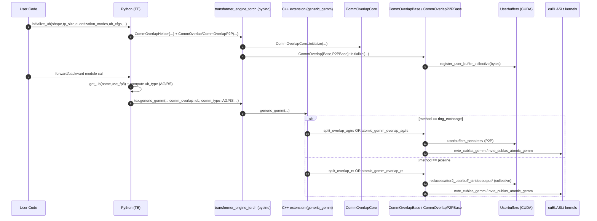
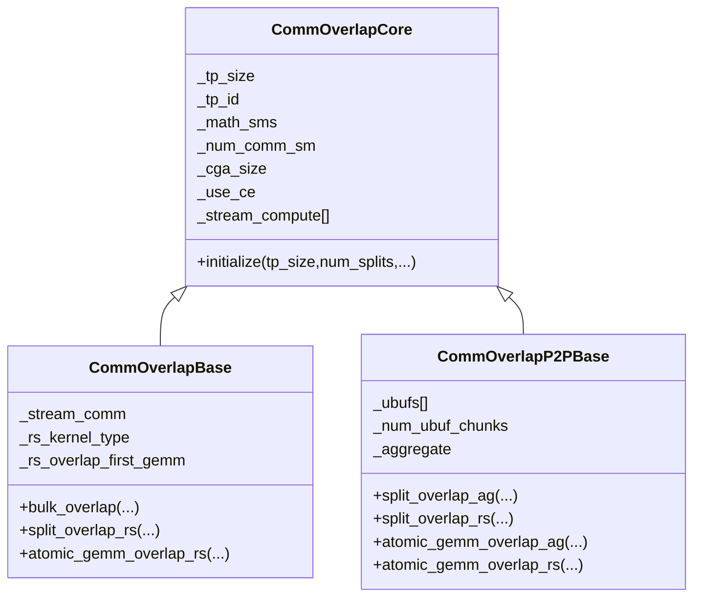

# Transformer Engine Async TP (Userbuffers) — Implementations, Config, and Full Traces

This document maps **all async TP implementations in Transformer Engine (TE)** that overlap tensor-parallel communication with GEMM compute via **Userbuffers**, focusing on the two “async TP” overlap methods you called out:

- `ring_exchange` (P2P ring-exchange) — implemented by `CommOverlapP2PBase`
- `pipeline` (pipelined RS with a collective comm stream) — implemented by `CommOverlapBase`

and the config/feature knobs that affect them:

- `RS` vs `AG`
- `cga_size`, `set_sm_margin` (“SM margin”), `num_sm`
- `aggregate`, `atomic_gemm`
- `use_ce`
- `fp8_buf`

> Note: TE also defines `bulk` and `external` overlap methods in the same subsystem; they’re part of the overall setup and dispatch path, but they are not the primary focus here since you requested `ring_exchange` and `pipeline`. They’re still referenced where they impact config validation and call chains.

---

## Key Files (clickable)

### Python (setup + dispatch)

- Userbuffers initialization/config (`initialize_ub`, defaults, validation): [`../transformer_engine/pytorch/module/base.py#L95`](../transformer_engine/pytorch/module/base.py#L95)
- UB selection at callsite (`get_ub`): [`../transformer_engine/pytorch/module/base.py#L446`](../transformer_engine/pytorch/module/base.py#L446)
- GEMM wrapper passes `comm_overlap` + `comm_type`: [`../transformer_engine/pytorch/cpp_extensions/gemm.py#L92`](../transformer_engine/pytorch/cpp_extensions/gemm.py#L92)
- Example fused forward op using UB + GEMM: [`../transformer_engine/pytorch/ops/fused/userbuffers_forward_linear.py#L85`](../transformer_engine/pytorch/ops/fused/userbuffers_forward_linear.py#L85)
- Example fused backward op using UB + GEMM: [`../transformer_engine/pytorch/ops/fused/userbuffers_backward_linear.py#L83`](../transformer_engine/pytorch/ops/fused/userbuffers_backward_linear.py#L83)
- High-level feature toggles (`ub_tp_comm_overlap`, `ub_overlap_*`): [`../transformer_engine/pytorch/transformer.py#L325`](../transformer_engine/pytorch/transformer.py#L325)

### C++ (overlap core + algorithm implementations)

- Public C++ API and capability split (Base vs P2P): [`../transformer_engine/common/include/transformer_engine/comm_gemm_overlap.h#L43`](../transformer_engine/common/include/transformer_engine/comm_gemm_overlap.h#L43)
- `CommOverlapCore` (streams, SM partitioning, cga_size, use_ce): [`../transformer_engine/common/comm_gemm_overlap/comm_gemm_overlap.cpp#L48`](../transformer_engine/common/comm_gemm_overlap/comm_gemm_overlap.cpp#L48)
- `CommOverlapBase` (pipeline RS, bulk, external AG): [`../transformer_engine/common/comm_gemm_overlap/comm_gemm_overlap.cpp#L279`](../transformer_engine/common/comm_gemm_overlap/comm_gemm_overlap.cpp#L279)
- `CommOverlapP2PBase` (ring_exchange AG/RS, aggregate, RS extra buffers): [`../transformer_engine/common/comm_gemm_overlap/comm_gemm_overlap.cpp#L647`](../transformer_engine/common/comm_gemm_overlap/comm_gemm_overlap.cpp#L647)

### C++ extension dispatch (PyTorch -> TE overlap)

- `generic_gemm` dispatches to `split_overlap_*` / `atomic_gemm_overlap_*`: [`../transformer_engine/pytorch/csrc/extensions/gemm.cpp#L260`](../transformer_engine/pytorch/csrc/extensions/gemm.cpp#L260)
- `CommOverlapP2P` wrapper delegates into `CommOverlapP2PBase`: [`../transformer_engine/pytorch/csrc/extensions/comm_gemm_overlap.cpp#L229`](../transformer_engine/pytorch/csrc/extensions/comm_gemm_overlap.cpp#L229)

### Userbuffers CUDA (what the knobs actually change)

- `communicator` fields (`sms`, `cga_size`, `use_ce`): [`../transformer_engine/common/comm_gemm_overlap/userbuffers/userbuffers.h#L90`](../transformer_engine/common/comm_gemm_overlap/userbuffers/userbuffers.h#L90)
- `cga_size` sets CUDA cluster dimension at launch: [`../transformer_engine/common/comm_gemm_overlap/userbuffers/userbuffers.cu#L1360`](../transformer_engine/common/comm_gemm_overlap/userbuffers/userbuffers.cu#L1360)
- `use_ce` switches send/recv to `cudaMemcpyAsync` + “signal-only” kernels: [`../transformer_engine/common/comm_gemm_overlap/userbuffers/userbuffers.cu#L2307`](../transformer_engine/common/comm_gemm_overlap/userbuffers/userbuffers.cu#L2307)

---

## Key Functions Index

| Function | File | Purpose |
|----------|------|---------|
| `initialize_ub(...)` | `../transformer_engine/pytorch/module/base.py#L95` | Build per-layer UB communicators and apply per-method defaults/constraints |
| `get_default_config(name)` | `../transformer_engine/pytorch/module/base.py#L290` | Provide default method+knob values for each TE layer name |
| `add_ub(...)` | `../transformer_engine/pytorch/module/base.py#L313` | Validate knobs (AG vs RS, pipeline restriction, atomic pairing), then construct `CommOverlap` or `CommOverlapP2P` |
| `general_gemm(...)` | `../transformer_engine/pytorch/cpp_extensions/gemm.py#L92` | Python wrapper that forwards `comm_overlap` + `comm_type` to the C++ extension |
| `generic_gemm(...)` | `../transformer_engine/pytorch/csrc/extensions/gemm.cpp#L260` | Runtime dispatch to the chosen overlap implementation |
| `CommOverlapCore::initialize(...)` | `../transformer_engine/common/comm_gemm_overlap/comm_gemm_overlap.cpp#L72` | Creates compute streams, sets SM budget, stores `cga_size` and `use_ce`, allocates atomic counters |
| `CommOverlapP2PBase::initialize(...)` | `../transformer_engine/common/comm_gemm_overlap/comm_gemm_overlap.cpp#L662` | Ring-exchange buffer sizing (`tp_size` vs `2*tp_size-1`) and per-chunk views (`_ubufs[]`) |
| `CommOverlapP2PBase::split_overlap_ag(...)` | `../transformer_engine/common/comm_gemm_overlap/comm_gemm_overlap.cpp#L887` | Ring exchange: all-gather of `B` while launching chunked GEMMs |
| `CommOverlapP2PBase::split_overlap_rs(...)` | `../transformer_engine/common/comm_gemm_overlap/comm_gemm_overlap.cpp#L1118` | Ring exchange: produce output chunks, exchange them, then locally reduce to `rs_output` |
| `CommOverlapBase::split_overlap_rs(...)` | `../transformer_engine/common/comm_gemm_overlap/comm_gemm_overlap.cpp#L479` | Pipeline RS: interleave GEMM chunks with `reducescatter2_userbuff_stridedoutput*` calls |

---

## Big Picture: “Async TP” in TE = Userbuffers overlap

At a system level, TE’s async TP overlap works like this:

1. **Initialize UB communicators** (once) via `initialize_ub`:
   - Choose a method per TE layer name (default map: ring_exchange / pipeline / bulk / external).
   - Create either `CommOverlapP2P` (ring_exchange) or `CommOverlap` (pipeline/bulk/external).
   - Configure comm kernel launch parameters (SM count, CGA cluster size, CE usage, etc.).
2. At runtime, TE’s fused linear/MLP/attention paths:
   - Fetch the correct communicator (`get_ub(layer_name + "_fprop/_dgrad/_wgrad", use_fp8)`).
   - Call `general_gemm(..., ub=comm, ub_type=AG|RS, extra_output=...)`.
   - The C++ extension dispatches into the chosen overlap algorithm.

---

## Call Chain Visualization (sequence diagram)



---

## Dataflow Visualization (flowchart)

```mermaid
flowchart TD
  subgraph Setup[Setup Phase]
    A[initialize_ub] --> B[get_default_config / user_ub_cfg merge]
    B --> C{method?}
    C -->|ring_exchange| D[CommOverlapP2PBase + register UB]
    C -->|pipeline| E[CommOverlapBase + register UB]
  end

  subgraph Runtime[Runtime Phase]
    R1[get_ub(name,use_fp8)] --> R2[general_gemm(ub,ub_type)]
    R2 --> R3[generic_gemm dispatch]
    R3 -->|ring_exchange AG| R4[split_overlap_ag / atomic_gemm_overlap_ag]
    R3 -->|ring_exchange RS| R5[split_overlap_rs / atomic_gemm_overlap_rs]
    R3 -->|pipeline RS| R6[CommOverlapBase::split_overlap_rs / atomic_gemm_overlap_rs]
  end
```

---

## Module Relationships (class diagram)



---

## Configuration & Setup Trace (frame-by-frame)

This section is the *shared* setup path for both `ring_exchange` and `pipeline`.

### Frame S1 — User calls `initialize_ub(...)`

Source: [`../transformer_engine/pytorch/module/base.py#L95`](../transformer_engine/pytorch/module/base.py#L95)

```py
def initialize_ub(shape, tp_size, use_fp8=False, quantization_modes=None, dtype=torch.bfloat16,
                  ub_cfgs=None, bootstrap_backend=None) -> None:
    ...
```

Key invariants established here:

- `shape` is a **2D** UB buffer shape; TE treats dim0 as the “chunked” dimension for TP overlap.
- `tp_size` sets the TP group size used by overlap algorithms.
- `quantization_modes` selects whether we create a “NONE” UB (bf16/fp16) or an “FP8” UB (byte storage).
- `ub_cfgs` controls per-layer overlap method and knobs.

### Frame S2 — TE bootstraps the communicator (MPI vs torch.distributed)

Source: [`../transformer_engine/pytorch/module/base.py#L188`](../transformer_engine/pytorch/module/base.py#L188)

```py
if tex.ubuf_built_with_mpi():
    helper = tex.CommOverlapHelper()
else:
    world_group = torch.distributed.new_group(backend=bootstrap_backend)
    ...
    helper = tex.CommOverlapHelper(world_group, tp_domain_group?)
```

What this means:

- `CommOverlapHelper` provides **callbacks** (`ub_allgather`, `ub_barrier`) used only during UB initialization and communicator setup.
- After the communicator is created, the actual fast-path communication is handled by the Userbuffers CUDA kernels.

### Frame S3 — Default per-layer method mapping and AG/RS classification

Source: [`../transformer_engine/pytorch/module/base.py#L251`](../transformer_engine/pytorch/module/base.py#L251)

```py
layers_all_gather_overlap = [ ... ]
layers_reduce_scatter_overlap = [ ... ]
methods = {
  "ring_exchange": [...],
  "pipeline": [...],
  "bulk": [...],
  "external": [...],
}
```

Interpretation:

- Whether a layer is **AG** vs **RS** is derived from membership in `layers_reduce_scatter_overlap`.
- The algorithm family is derived from `methods[...]`.
- This is the “routing table” that ultimately selects `CommOverlapP2P` vs `CommOverlap`.

#### Default routing table (as-shipped)

Source: [`../transformer_engine/pytorch/module/base.py#L251`](../transformer_engine/pytorch/module/base.py#L251)

| Method | Layer names (default) | AG or RS? (default) |
|--------|------------------------|---------------------|
| `ring_exchange` | `qkv_fprop`, `fc1_fprop`, `proj_dgrad`, `fc2_dgrad` | AG (all are in `layers_all_gather_overlap`) |
| `pipeline` | `proj_fprop`, `fc2_fprop` | RS (both are in `layers_reduce_scatter_overlap`) |
| `bulk` | `qkv_dgrad`, `qkv_wgrad`, `fc1_dgrad`, `fc1_wgrad` | mixed: `*_dgrad` are AG by default; `*_wgrad` are RS by default |
| `external` | `proj_wgrad`, `fc2_wgrad` | “external AG overlap” paired with an external `ring_exchange` GEMM |

How to read this:

- The **method** decides which C++ class is instantiated (`CommOverlapP2PBase` vs `CommOverlapBase`).
- The **AG/RS classification** decides which C++ virtual method will be invoked at runtime
  (`split_overlap_ag` vs `split_overlap_rs` / `atomic_*` variants), via the `comm_type` argument.

### Frame S4 — Default knob values (per method)

Source: [`../transformer_engine/pytorch/module/base.py#L290`](../transformer_engine/pytorch/module/base.py#L290)

```py
default_cfg = {
  "method": method,
  "is_reduce_scatter": is_reduce_scatter,
  "num_sm": 1 if method == "ring_exchange" else 16,
  "cga_size": 1 if method == "ring_exchange" else 2,
  "set_sm_margin": not method == "ring_exchange",
  "num_splits": tp_size if method == "ring_exchange" else 4,
  "aggregate": False,
  "atomic_gemm": False,
  "use_ce": True,
  "fp8_buf": name in layers_all_gather_overlap,
  "comm_priority": _MAX_STREAM_PRIORITY,
  "gemm_priority": _MIN_STREAM_PRIORITY,
  "pipeline_rs_overlap_first_gemm": False,
}
```

Why these defaults matter:

- `ring_exchange`:
  - `num_splits = tp_size` (the loop steps over TP chunks)
  - `cga_size = 1`, `num_sm = 1`, `set_sm_margin = False` (comm kernels are light; no SM budget carved from GEMM by default)
- `pipeline`:
  - `num_splits = 4` by default (pipelining granularity, independent of `tp_size`)
  - `cga_size = 2`, `num_sm = 16`, `set_sm_margin = True` (reserve comm SMs by default)

### Frame S4.1 — Stream priorities and “how many compute streams do we get?”

Source: [`../transformer_engine/common/comm_gemm_overlap/comm_gemm_overlap.cpp#L72`](../transformer_engine/common/comm_gemm_overlap/comm_gemm_overlap.cpp#L72)

```cpp
if (gemm_priority == 0 && comm_priority == 0) {
  transformer_engine::cuda::stream_priority_range(&_gemm_priority, &_comm_priority);
} else {
  _gemm_priority = gemm_priority;
  _comm_priority = comm_priority;
}
for (int i = 0; i < std::min(num_max_streams, num_splits); i++) {
  cudaStream_t stream;
  cudaStreamCreateWithPriority(&stream, cudaStreamNonBlocking, _gemm_priority);
  _stream_compute.push_back(stream);
}
```

Interpretation:

- `gemm_priority` / `comm_priority` flow from Python defaults (`get_default_config`) into C++.
- TE creates `min(num_max_streams, num_splits)` compute streams, so:
  - `num_splits` controls the pipelining granularity,
  - `num_max_streams` caps how much concurrency TE tries to extract.

### Frame S5 — Validate knobs + construct the communicator object

Source: [`../transformer_engine/pytorch/module/base.py#L313`](../transformer_engine/pytorch/module/base.py#L313)

```py
if atomic_gemm:
    assert quantization_mode == UserBufferQuantizationMode.FP8
    if method in ("bulk", "external"):
        atomic_gemm = 0
if not is_reduce_scatter and method == "pipeline":
    raise ValueError("pipeline overlap ... not supported for AllGather")
...
buffer_dtype = torch.uint8 if (quantization_mode == FP8 and fp8_buf) else dtype
if method == "ring_exchange":
    ub_obj = tex.CommOverlapP2P(..., comm_cga_size=cga_size, num_comm_sm=num_sm,
                                set_sm_margin=set_sm_margin, atomic_gemm=atomic_gemm,
                                use_ce=use_ce, aggregate=aggregate, ...)
else:
    ub_obj = tex.CommOverlap(..., num_splits=num_splits, comm_cga_size=cga_size, num_comm_sm=num_sm,
                             set_sm_margin=set_sm_margin, atomic_gemm=atomic_gemm,
                             rs_overlap_first_gemm=pipeline_rs_overlap_first_gemm, ...)
```

Line-by-line logic:

- `atomic_gemm`:
  - Allowed only when `quantization_mode == FP8` (TE treats this as “atomic GEMM overlap supported only for FP8 GEMM”).
  - Disabled for `bulk`/`external` methods.
  - Additionally, TE enforces pairing constraints so that AG/RS pairs both use `atomic_gemm` with `ring_exchange` (see the `layers_atomic_ring_exchange` logic at [`../transformer_engine/pytorch/module/base.py#L349`](../transformer_engine/pytorch/module/base.py#L349)).
- `pipeline`:
  - Explicitly **not supported for AG**.
  - Therefore `pipeline` is “RS-only” in TE by design.
- `fp8_buf`:
  - If `quantization_mode == FP8` and `fp8_buf == True`, the UB storage dtype becomes `torch.uint8`.
  - This is the mechanism that turns UB into an “FP8 buffer” (byte storage) for certain layers.
- `method` chooses the concrete implementation:
  - `ring_exchange` → `CommOverlapP2P` (`CommOverlapP2PBase` in C++).
  - otherwise → `CommOverlap` (`CommOverlapBase` in C++).

---

## Runtime Dispatch Trace (shared)

### Frame R1 — A TE module enables async TP overlap via flags

Source: [`../transformer_engine/pytorch/transformer.py#L325`](../transformer_engine/pytorch/transformer.py#L325)

```py
ub_tp_comm_overlap: bool = False
ub_overlap_ag: bool = True
ub_overlap_rs: bool = True
...
ub_overlap_ag = ub_tp_comm_overlap and ub_overlap_ag
ub_overlap_rs = ub_tp_comm_overlap and ub_overlap_rs
```

Interpretation:

- `ub_tp_comm_overlap` gates whether userbuffers overlap is used at all.
- The specific `ub_overlap_*` flags gate whether we pass `ub_type=AG` and/or `ub_type=RS` into GEMMs.

### Frame R2 — A fused operation selects AG vs RS and fetches the UB communicator

Example (forward op):

Source: [`../transformer_engine/pytorch/ops/fused/userbuffers_forward_linear.py#L191`](../transformer_engine/pytorch/ops/fused/userbuffers_forward_linear.py#L191)

```py
ub_comm = get_ub(ub_comm_name + "_fprop", with_quantized_compute)
with_ub_all_gather = tensor_parallel_mode == "column"
ub_type = CommOverlapType.AG if with_ub_all_gather else CommOverlapType.RS
...
gemm_output, *_, reduce_scatter_output = general_gemm(..., ub=ub_comm, ub_type=ub_type, ...)
```

State before:

- `ub_comm` is a configured `CommOverlapP2P` or `CommOverlap` object, built during `initialize_ub`.

State after:

- `general_gemm` will forward `comm_overlap=ub_comm` and `comm_type=AG/RS` into C++ for dispatch.

### Frame R3 — C++ dispatch chooses AG vs RS and atomic vs non-atomic

Source: [`../transformer_engine/pytorch/csrc/extensions/gemm.cpp#L260`](../transformer_engine/pytorch/csrc/extensions/gemm.cpp#L260)

```cpp
if (comm_overlap) {
  if (bulk_overlap) { comm_overlap->bulk_overlap(...); }
  else if (comm_type == AG) {
    if (comm_overlap->is_atomic_gemm()) comm_overlap->atomic_gemm_overlap_ag(...);
    else comm_overlap->split_overlap_ag(...);
  } else { // RS
    if (comm_overlap->is_atomic_gemm()) comm_overlap->atomic_gemm_overlap_rs(...);
    else comm_overlap->split_overlap_rs(...);
  }
}
```

This single dispatch point is where the implementation “forks” into:

- `CommOverlapP2PBase::{split,atomic}_overlap_{ag,rs}` (ring_exchange)
- `CommOverlapBase::{split,atomic}_overlap_rs` (pipeline RS)

---

## Implementation 1: `ring_exchange` (P2P) — AG and RS

### What “ring_exchange” selects (C++ type)

From setup (`add_ub`), `method == "ring_exchange"` constructs `tex.CommOverlapP2P(...)`, which wraps `CommOverlapP2PBase`:

Source: [`../transformer_engine/pytorch/csrc/extensions/comm_gemm_overlap.cpp#L229`](../transformer_engine/pytorch/csrc/extensions/comm_gemm_overlap.cpp#L229)

```cpp
CommOverlapP2P::CommOverlapP2P(..., te::CommOverlapType comm_type, ...)
  : te::CommOverlapP2PBase(..., comm_type, ...) {}
```

### Frame P2P-1 — P2P base initialization: RS vs AG changes UB buffer sizing

Source: [`../transformer_engine/common/comm_gemm_overlap/comm_gemm_overlap.cpp#L662`](../transformer_engine/common/comm_gemm_overlap/comm_gemm_overlap.cpp#L662)

```cpp
size_t buffer_bytes = get_buffer_size_bytes(buffer_shape[0], buffer_shape[1], buffer_dtype);
int buffer_chunk_bytes = buffer_bytes / _tp_size;
_num_ubuf_chunks = _tp_size;
if (_is_reduce_scatter) {
  buffer_bytes = buffer_bytes / _tp_size * (_tp_size * 2 - 1);
  _num_ubuf_chunks = _tp_size * 2 - 1;
}
...
_ubuf = TensorWrapper(buffer_ptr,
  {buffer_shape[0] / _tp_size * _num_ubuf_chunks, buffer_shape[1]}, buffer_dtype);
for (int i = 0; i < _num_ubuf_chunks; i++) {
  _ubufs.push_back(TensorWrapper(ubuf_byte_ptr,
    {buffer_shape[0] / _tp_size, buffer_shape[1]}, buffer_dtype));
  ubuf_byte_ptr += buffer_chunk_bytes;
}
```

Line-by-line meaning:

- The base buffer (`buffer_shape`) is conceptualized as `tp_size` equal chunks along dim0.
- **AG**: allocate exactly `tp_size` chunks → `_ubufs.size() == tp_size`.
- **RS**: allocate `2*tp_size-1` chunks → `_ubufs.size() == 2*tp_size-1`:
  - chunk IDs `[0 .. tp_size-1]` serve as “GEMM output slots”
  - chunk IDs `[tp_size .. 2*tp_size-2]` serve as “received slots” that will be locally reduced

### Frame P2P-2 — `aggregate` only affects P2P AG (fewer steps with 2× chunks)

Source (aggregate branch begins): [`../transformer_engine/common/comm_gemm_overlap/comm_gemm_overlap.cpp#L922`](../transformer_engine/common/comm_gemm_overlap/comm_gemm_overlap.cpp#L922)

```cpp
if (_aggregate) {
  const int num_steps = _tp_size / 2;
  // input_b_chunk_shape uses 2*n_chunk
  // ring exchange sends/recvs comm_bytes * 2
  ...
} else {
  // classic ring exchange: tp_size steps, comm_bytes per step
}
```

Interpretation:

- `aggregate=True` changes the all-gather ring exchange to operate on **paired chunks** (2× width),
  reducing the number of steps roughly by half (for even `tp_size`).
- This knob is **not used** in P2P RS.

### Frame P2P-3 — `atomic_gemm` and `NVTE_AG_P2P_MULTI_ATOMIC` special-case

Source: [`../transformer_engine/common/comm_gemm_overlap/comm_gemm_overlap.cpp#L701`](../transformer_engine/common/comm_gemm_overlap/comm_gemm_overlap.cpp#L701)

```cpp
if (_atomic_gemm && !_is_reduce_scatter) {
  _use_multiatomic_ag = getenv<bool>("NVTE_AG_P2P_MULTI_ATOMIC");
  if (_use_multiatomic_ag) {
    _use_ce = 0;
    _ub_comm->push = 1;
  }
  _self_chunk_id = 0;
  cudaMemset(_counter.dptr(), 0, sizeof(int32_t));
}
```

Meaning:

- Atomic GEMM with AG uses counters for producer/consumer synchronization.
- `NVTE_AG_P2P_MULTI_ATOMIC` flips into a different send/recv primitive (`userbuffers_sendrecv_multiatomic`),
  and explicitly disables `use_ce` in that mode.

---

## `ring_exchange` + AG — Full runtime trace

This is the path that ends at `CommOverlapP2PBase::split_overlap_ag` or `::atomic_gemm_overlap_ag`.

### Frame P2P-AG-1 — Python selects `ub_type=AG` and calls `general_gemm`

Source: [`../transformer_engine/pytorch/ops/fused/userbuffers_forward_linear.py#L191`](../transformer_engine/pytorch/ops/fused/userbuffers_forward_linear.py#L191)

```py
ub_comm = get_ub(ub_comm_name + "_fprop", with_quantized_compute)
ub_type = CommOverlapType.AG
gemm_output, *_, _ = general_gemm(..., ub=ub_comm, ub_type=ub_type, ...)
```

### Frame P2P-AG-2 — C++ dispatch enters `split_overlap_ag` (non-atomic)

Source: [`../transformer_engine/pytorch/csrc/extensions/gemm.cpp#L278`](../transformer_engine/pytorch/csrc/extensions/gemm.cpp#L278)

```cpp
comm_overlap->split_overlap_ag(...);
```

### Frame P2P-AG-3 — P2P AG ring exchange overlaps send/recv with per-chunk GEMMs

Source: [`../transformer_engine/common/comm_gemm_overlap/comm_gemm_overlap.cpp#L994`](../transformer_engine/common/comm_gemm_overlap/comm_gemm_overlap.cpp#L994)

```cpp
for (int i = 0; i < _tp_size; i++) {
  int send_chunk_id = (_tp_size + _tp_id - i) % _tp_size;
  int recv_chunk_id = (_tp_size + _tp_id - i - 1) % _tp_size;
  // GEMM consumes chunk send_chunk_id
  nvte_cublas_gemm(..., input_b_chunk(send_chunk_id), ...);
  // P2P exchange to make recv_chunk_id available for later iterations
  userbuffers_send(..., send_offset, ..., comm_bytes, ...);
  userbuffers_recv(..., recv_offset, ..., comm_bytes, ...);
}
```

What to track while “debugging” this loop:

- **Invariant**: the UB buffer gradually fills into an all-gathered tensor of `tp_size` chunks.
- **State update**: each iteration issues one GEMM on a chunk that is already present, while simultaneously
  initiating the transfer that will populate the next-needed chunk.

### Frame P2P-AG-4 — `use_ce` affects how `userbuffers_send/recv` move data

Source: [`../transformer_engine/common/comm_gemm_overlap/userbuffers/userbuffers.cu#L2307`](../transformer_engine/common/comm_gemm_overlap/userbuffers/userbuffers.cu#L2307)

```cpp
bool signalonly = (bytes / 16 == 0) || (comm->use_ce != 0);
if (comm->use_ce) {
  cudaMemcpyAsync(dstptr, srcptr, bytes, cudaMemcpyDeviceToDevice, stream);
}
SETUP_LAUNCH_CONFIG(signalonly ? 1 : comm->sms, signalonly ? 1 : 1024, stream);
cudaLaunchKernelExC(..., kuserbuffers_pushsend, ...);
```

Interpretation:

- `use_ce=1` means “use copy engine (`cudaMemcpyAsync`) for data movement”.
- The kernel launch becomes “signal-only” (1 block / 1 thread) and primarily exists to update/send flags.

### `ring_exchange` + AG + `atomic_gemm=True` — the atomic variant

This is the same high-level call path as non-atomic AG, except `generic_gemm` dispatches to
`CommOverlapP2PBase::atomic_gemm_overlap_ag`:

Source: [`../transformer_engine/common/comm_gemm_overlap/comm_gemm_overlap.cpp#L787`](../transformer_engine/common/comm_gemm_overlap/comm_gemm_overlap.cpp#L787)

```cpp
// Reset atomic counters (num_chunks = tp_size, allgather=true)
reset_counters(counter_ptr, _tp_size, true, stream_main);

for (int i = 0; i < _tp_size - 1; i++) {
  // 1) ring exchange: move next input chunk into place
  userbuffers_send(...);
  userbuffers_recv(...);
  producer(counter_ptr, recv_chunk_id, _stream_recv);

  // 2) launch atomic GEMM once; it waits on counters for chunks to become ready
  if (i == 0) {
    nvte_cublas_atomic_gemm(..., /*m_split=*/0, /*n_split=*/_tp_size,
                            /*gemm_producer=*/false, _counter.data(), stream_main);
  }
}
```

Debugging view:

- The atomic GEMM kernel is launched early and then “streams” through chunks as they arrive,
  using the `_counter` buffer for readiness signaling.
- If `NVTE_AG_P2P_MULTI_ATOMIC=1`, the code uses `userbuffers_sendrecv_multiatomic(...)` instead of
  `userbuffers_send/recv`, and disables `use_ce` for that mode (see [`../transformer_engine/common/comm_gemm_overlap/comm_gemm_overlap.cpp#L703`](../transformer_engine/common/comm_gemm_overlap/comm_gemm_overlap.cpp#L703)).

---

## `ring_exchange` + RS — Full runtime trace

This is the path that ends at `CommOverlapP2PBase::split_overlap_rs` or `::atomic_gemm_overlap_rs`.

### Frame P2P-RS-1 — Python selects `ub_type=RS` and provides `extra_output`

Source: [`../transformer_engine/pytorch/cpp_extensions/gemm.py#L128`](../transformer_engine/pytorch/cpp_extensions/gemm.py#L128)

```py
if ub is not None:
    assert ub_type is not None
    if ub_type == tex.CommOverlapType.RS:
        assert extra_output is not None, "GEMM+RS overlap requires extra output tensor."
```

Meaning:

- RS overlap writes the “reduce-scatter output” into `extra_output` (C++ names this `rs_output`).

### Frame P2P-RS-2 — C++ dispatch enters `split_overlap_rs` (non-atomic)

Source: [`../transformer_engine/pytorch/csrc/extensions/gemm.cpp#L303`](../transformer_engine/pytorch/csrc/extensions/gemm.cpp#L303)

```cpp
comm_overlap->split_overlap_rs(..., extra_output_tensor, main_stream);
```

### Frame P2P-RS-3 — P2P RS overlaps GEMM output production with send/recv of those outputs

Source: [`../transformer_engine/common/comm_gemm_overlap/comm_gemm_overlap.cpp#L1150`](../transformer_engine/common/comm_gemm_overlap/comm_gemm_overlap.cpp#L1150)

```cpp
for (int i = 0; i < _tp_size; i++) {
  auto output_chunk = get_buffer_chunk_by_id(D, i);   // writes into _ubufs[i]
  nvte_cublas_gemm(..., output_chunk.data(), ...);
  if (i > 0) {
    int send_offset = comm_bytes * (i - 1);           // send _ubufs[i-1]
    int recv_offset = comm_bytes * (i - 1 + _tp_size);// recv into _ubufs[i-1+tp_size]
    userbuffers_send(...);
    userbuffers_recv(...);
  }
}
```

Key state:

- `_ubufs[0 .. tp_size-1]` contain locally-produced GEMM output chunks.
- `_ubufs[tp_size .. 2*tp_size-2]` contain received peer chunks.

### Frame P2P-RS-4 — Final local reduction consumes a contiguous “reduce window”

Source: [`../transformer_engine/common/comm_gemm_overlap/comm_gemm_overlap.cpp#L1194`](../transformer_engine/common/comm_gemm_overlap/comm_gemm_overlap.cpp#L1194)

```cpp
char *reduce_buf_ptr = reinterpret_cast<char *>(_ubufs[_tp_size - 1].dptr());
reduce_bf16(reduce_buf_ptr, rs_output_ptr, _tp_size, _ubufs[0].numel(), stream_main);
```

Why RS needs extra chunks:

- The reduction reads `tp_size` inputs starting at chunk `tp_size-1`:
  - `tp_size-1` is the “self” chunk (local GEMM output that stays on this rank)
  - `tp_size .. 2*tp_size-2` are the `tp_size-1` received chunks
- This requires `(tp_size-1) + 1 + (tp_size-1) = 2*tp_size-1` total chunk slots in the UB buffer.

### `ring_exchange` + RS + `atomic_gemm=True` — the atomic variant

Dispatch enters `CommOverlapP2PBase::atomic_gemm_overlap_rs`:

Source: [`../transformer_engine/common/comm_gemm_overlap/comm_gemm_overlap.cpp#L1055`](../transformer_engine/common/comm_gemm_overlap/comm_gemm_overlap.cpp#L1055)

```cpp
// Reset counters (num_chunks=tp_size, allgather=false)
reset_counters(counter_ptr, _tp_size, false, stream_main);

// 1) Atomic GEMM produces chunks into the UB buffer
nvte_cublas_atomic_gemm(..., /*m_split=*/0, /*n_split=*/_tp_size,
                        /*gemm_producer=*/true, _counter.data(), stream_main);

// 2) For i=1..tp_size-1: wait for chunk (i-1), then send it, and receive peer chunk into slot (i-1+tp_size)
consumer(counter_ptr, send_chunk_id, _stream_recv);
userbuffers_send(... send_offset=comm_bytes*(i-1), recv_offset=comm_bytes*(i-1+tp_size) ...);
userbuffers_recv(...);

// 3) Local reduction over the contiguous reduce window
reduce_bf16(_ubufs[_tp_size - 1].dptr(), rs_output.dptr(), _tp_size, _ubufs[0].numel(), ...);
```

Debugging view:

- Compared to non-atomic RS, the GEMM completion condition for each chunk is tied to counters
  instead of implicit stream ordering.
- The buffer layout (`2*tp_size-1` chunks) is still required because the final reduction reads
  `tp_size` contiguous chunk buffers.

### Ring-exchange is intra-node (NVLink domain) P2P

The low-level send/recv path explicitly asserts peers are in the same “NV domain”:

Source: [`../transformer_engine/common/comm_gemm_overlap/userbuffers/userbuffers.cu#L2316`](../transformer_engine/common/comm_gemm_overlap/userbuffers/userbuffers.cu#L2316)

```cpp
assert(INTRANODE(peer));
```

Practical meaning:

- `ring_exchange` is designed for intra-node TP (or at least for peers that share the same `nvsize` domain).
- Inter-node TP still uses the same setup scaffolding (process groups), but the fast-path P2P send/recv is not intended to span nodes.

---

## Implementation 2: `pipeline` (CommOverlapBase) — RS only

### What “pipeline” selects (C++ type) and why AG is forbidden

The header explicitly shows `CommOverlapBase` does not implement split/atomic AG (they error out):

Source: [`../transformer_engine/common/include/transformer_engine/comm_gemm_overlap.h#L192`](../transformer_engine/common/include/transformer_engine/comm_gemm_overlap.h#L192)

```cpp
void atomic_gemm_overlap_ag(...) override { NVTE_ERROR("Operation not supported."); }
void split_overlap_ag(...) override { NVTE_ERROR("Operation not supported."); }
```

And Python enforces this at config time:

Source: [`../transformer_engine/pytorch/module/base.py#L343`](../transformer_engine/pytorch/module/base.py#L343)

```py
if not is_reduce_scatter and method == "pipeline":
    raise ValueError("pipeline overlap method is not supported for AllGather.")
```

So “pipeline” in TE means:

- a **pipelined ReduceScatter** implementation (RS-only),
- with `num_splits` GEMM chunks and a dedicated `_stream_comm` for comm kernels.

### Frame PIPE-1 — Pipeline base initialization registers a single UB buffer (no extra RS staging)

Source: [`../transformer_engine/common/comm_gemm_overlap/comm_gemm_overlap.cpp#L293`](../transformer_engine/common/comm_gemm_overlap/comm_gemm_overlap.cpp#L293)

```cpp
size_t buffer_bytes = get_buffer_size_bytes(buffer_shape[0], buffer_shape[1], buffer_dtype);
_ub_reg = register_user_buffer_collective(&buffer_ptr, buffer_bytes, _ub_comm, true);
_ubuf = TensorWrapper(buffer_ptr, buffer_shape, buffer_dtype);
cudaStreamCreateWithPriority(&_stream_comm, ..., _comm_priority);
```

Contrast with P2P RS:

- Pipeline RS does not allocate `2*tp_size-1` chunks because it uses **reduce-scatter kernels**
  that directly reduce/scatter the output without staging peer chunks for a later local reduction.

### Frame PIPE-2 — Pipeline RS overlap (`split_overlap_rs`) interleaves per-split GEMMs with RS kernels

Source: [`../transformer_engine/common/comm_gemm_overlap/comm_gemm_overlap.cpp#L479`](../transformer_engine/common/comm_gemm_overlap/comm_gemm_overlap.cpp#L479)

```cpp
for (int i = 0; i < _num_splits; i++) {
  // 1) GEMM chunk i writes into the UB buffer at offset i*output_chunk_size
  nvte_cublas_gemm(..., output_chunk.data(), ..., _stream_compute[...]);
  // 2) RS chunk i reads from UB buffer and writes into rs_output_ptr (strided output)
  cudaEventRecord(_start_comm, _stream_compute[...]);
  cudaStreamWaitEvent(_stream_comm, _start_comm, 0);
  reducescatter2_userbuff_stridedoutput(rs_output_ptr, _ub_reg, i*output_chunk_size, ...);
  rs_output_ptr += m_chunk * rs_output.element_size();
}
```

Debugging view:

- Each split produces a contiguous “stripe” of GEMM output in `_ubuf`.
- The RS kernel consumes that stripe and writes the reduced local shard into `rs_output`.

### Pipeline RS + `atomic_gemm=True` — atomic GEMM variant and RS kernel selection

Dispatch enters `CommOverlapBase::atomic_gemm_overlap_rs`:

Source: [`../transformer_engine/common/comm_gemm_overlap/comm_gemm_overlap.cpp#L382`](../transformer_engine/common/comm_gemm_overlap/comm_gemm_overlap.cpp#L382)

```cpp
reset_counters(counter_ptr, _num_splits, false, stream_main);
nvte_cublas_atomic_gemm(..., /*m_split=*/_num_splits, /*n_split=*/0,
                        /*gemm_producer=*/true, _counter.data(), _stream_compute[0]);

for (int i = 0; i < _num_splits; i++) {
  if (_rs_kernel_type == 1) {
    reducescatter2_userbuff_strided_atomic(..., &counter_ptr[i], ...);
  } else if (_rs_kernel_type == 2) {
    reducescatter2_userbuff_strided_multiatomic(..., counter_ptr, ...);
    break;
  } else {
    consumer(counter_ptr, i, _stream_comm);
    reducescatter2_userbuff_strided(...);
  }
}
```

Where `_rs_kernel_type` comes from:

Source: [`../transformer_engine/common/comm_gemm_overlap/comm_gemm_overlap.cpp#L296`](../transformer_engine/common/comm_gemm_overlap/comm_gemm_overlap.cpp#L296)

```cpp
_rs_kernel_type = getenv<int>("NVTE_RS_STRIDED_ATOMIC", 0);
```

Debugging view:

- Pipeline atomic RS is *two-dimensional pipelining*:
  - GEMM produces chunks with atomic counters.
  - RS kernels consume chunks using either consumer gating (`_rs_kernel_type==0`) or embedded atomic signaling (`==1/2`).

### Frame PIPE-3 — `pipeline_rs_overlap_first_gemm` changes the ordering of “first chunk” overlap

Source (branch point): [`../transformer_engine/common/comm_gemm_overlap/comm_gemm_overlap.cpp#L517`](../transformer_engine/common/comm_gemm_overlap/comm_gemm_overlap.cpp#L517)

```cpp
if (_rs_overlap_first_gemm) {
  // Run GEMM(0) first, then overlap RS of chunk (i-1) while GEMM(i) runs
} else {
  // For each i: GEMM(i) then RS(i)
}
```

This knob is only relevant to the pipeline RS implementation, and is wired from Python as
`rs_overlap_first_gemm=pipeline_rs_overlap_first_gemm` in `add_ub`:

Source: [`../transformer_engine/pytorch/module/base.py#L399`](../transformer_engine/pytorch/module/base.py#L399)

```py
ub_obj = tex.CommOverlap(..., rs_overlap_first_gemm=pipeline_rs_overlap_first_gemm)
```

---

## Knob Deep Dive: what each one does (with exact code hooks)

### `cga_size` — cluster dimension for Userbuffers kernel launches

Source: [`../transformer_engine/common/comm_gemm_overlap/userbuffers/userbuffers.cu#L1360`](../transformer_engine/common/comm_gemm_overlap/userbuffers/userbuffers.cu#L1360)

```cpp
attribute_ub[1].val.clusterDim.x = sms % comm->cga_size == 0 ? comm->cga_size : 1;
```

Interpretation:

- If the chosen grid size (`sms`) is divisible by `cga_size`, TE requests cluster launches with clusterDim.x = `cga_size`.
- Otherwise it falls back to `1`.
- This impacts how thread blocks are clustered/scheduled on architectures where cluster launches apply (notably Hopper+).

### `num_sm` and `set_sm_margin` (“SM margin”) — how many SMs comm uses, and how many GEMM keeps

CommOverlapCore chooses the GEMM SM budget:

Source: [`../transformer_engine/common/comm_gemm_overlap/comm_gemm_overlap.cpp#L98`](../transformer_engine/common/comm_gemm_overlap/comm_gemm_overlap.cpp#L98)

```cpp
int sm_count = transformer_engine::cuda::sm_count();
_math_sms = (set_sm_margin) ? sm_count - num_comm_sm : sm_count;
_math_sms -= getenv<int>("NVTE_EXT_MARGIN_SM", 0);
```

And each overlap call sets the comm kernel’s SM count:

Example (P2P RS): [`../transformer_engine/common/comm_gemm_overlap/comm_gemm_overlap.cpp#L1124`](../transformer_engine/common/comm_gemm_overlap/comm_gemm_overlap.cpp#L1124)

```cpp
_ub_comm->sms = _num_comm_sm;
```

Interpretation:

- `num_sm` is “how many SMs the comm kernels should use” (`comm->sms`).
- `set_sm_margin=True` reduces GEMM’s allowed SMs to `sm_count - num_comm_sm`, attempting to reduce contention.
- `NVTE_EXT_MARGIN_SM` is an extra global margin that always subtracts from GEMM SMs.

### `use_ce` — whether P2P send/recv uses CUDA copy engine for the payload

Source: [`../transformer_engine/common/comm_gemm_overlap/userbuffers/userbuffers.cu#L2327`](../transformer_engine/common/comm_gemm_overlap/userbuffers/userbuffers.cu#L2327)

```cpp
if (comm->use_ce) {
  cudaMemcpyAsync(dstptr, srcptr, bytes, cudaMemcpyDeviceToDevice, stream);
}
```

Interpretation:

- `use_ce=True` routes the data copy through `cudaMemcpyAsync` (copy engine), while a small kernel still updates flags.
- This primarily affects P2P `ring_exchange` (which uses `userbuffers_send/recv`); pipeline RS uses collective kernels and does not call `userbuffers_send/recv` for the payload.

### `aggregate` — P2P AG “2× chunk” aggregation mode

Source: [`../transformer_engine/common/comm_gemm_overlap/comm_gemm_overlap.cpp#L922`](../transformer_engine/common/comm_gemm_overlap/comm_gemm_overlap.cpp#L922)

```cpp
if (_aggregate) { /* exchange 2*n_chunk at a time */ }
```

Interpretation:

- Only meaningful for `ring_exchange + AG` (`split_overlap_ag`).
- Reduces the number of ring steps by sending “2× chunks”.

### `atomic_gemm` — cublasLt atomic GEMM + counter synchronization

Config-time constraints:

Source: [`../transformer_engine/pytorch/module/base.py#L330`](../transformer_engine/pytorch/module/base.py#L330)

```py
assert quantization_mode == UserBufferQuantizationMode.FP8
if method in ("bulk","external"): atomic_gemm = 0
```

Runtime dispatch selects `nvte_cublas_atomic_gemm(...)` and uses counters:

- Pipeline RS: [`../transformer_engine/common/comm_gemm_overlap/comm_gemm_overlap.cpp#L382`](../transformer_engine/common/comm_gemm_overlap/comm_gemm_overlap.cpp#L382)
- P2P AG: [`../transformer_engine/common/comm_gemm_overlap/comm_gemm_overlap.cpp#L787`](../transformer_engine/common/comm_gemm_overlap/comm_gemm_overlap.cpp#L787)
- P2P RS: [`../transformer_engine/common/comm_gemm_overlap/comm_gemm_overlap.cpp#L1055`](../transformer_engine/common/comm_gemm_overlap/comm_gemm_overlap.cpp#L1055)

Interpretation:

- Atomic GEMM introduces producer/consumer-style synchronization between GEMM output readiness and comm consumption.
- For P2P AG, TE additionally supports a “multi-atomic” ring-exchange mode controlled by `NVTE_AG_P2P_MULTI_ATOMIC`.

### `fp8_buf` — when UB storage is byte (FP8) vs bf16/fp16

Source: [`../transformer_engine/pytorch/module/base.py#L376`](../transformer_engine/pytorch/module/base.py#L376)

```py
buffer_dtype = torch.uint8 if (quantization_mode == FP8 and fp8_buf) else dtype
```

Important behavior:

- By default, only **AG layers** set `fp8_buf=True` (see `get_default_config`).
- Pipeline RS layers can opt in via user config; TE special-cases that merge here:
  [`../transformer_engine/pytorch/module/base.py#L438`](../transformer_engine/pytorch/module/base.py#L438)

```py
fp8_buf = (name in layers_all_gather_overlap) or (
  user_ub_cfg[name].get("fp8_buf", False) and name in methods["pipeline"]
)
```

---

## Practical constraints (what TE currently enforces in Python)

### Pipeline is RS-only

- Enforced at setup: [`../transformer_engine/pytorch/module/base.py#L343`](../transformer_engine/pytorch/module/base.py#L343)

### Some RS callsites disallow FP8 UB buffers

Example (Userbuffers backward op rejects FP8 ubuf for RS):

Source: [`../transformer_engine/pytorch/ops/fused/userbuffers_backward_linear.py#L255`](../transformer_engine/pytorch/ops/fused/userbuffers_backward_linear.py#L255)

```py
if ub_comm_wgrad.is_fp8_ubuf():
    raise RuntimeError("Userbuffers reduce-scatter is not supported with FP8 buffers")
```

Meaning:

- Even though the C++ layer contains FP8 RS code paths (e.g. reduction helpers), some high-level fused
  operations explicitly prohibit FP8 UB for RS today.
