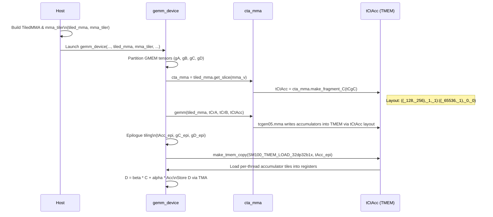
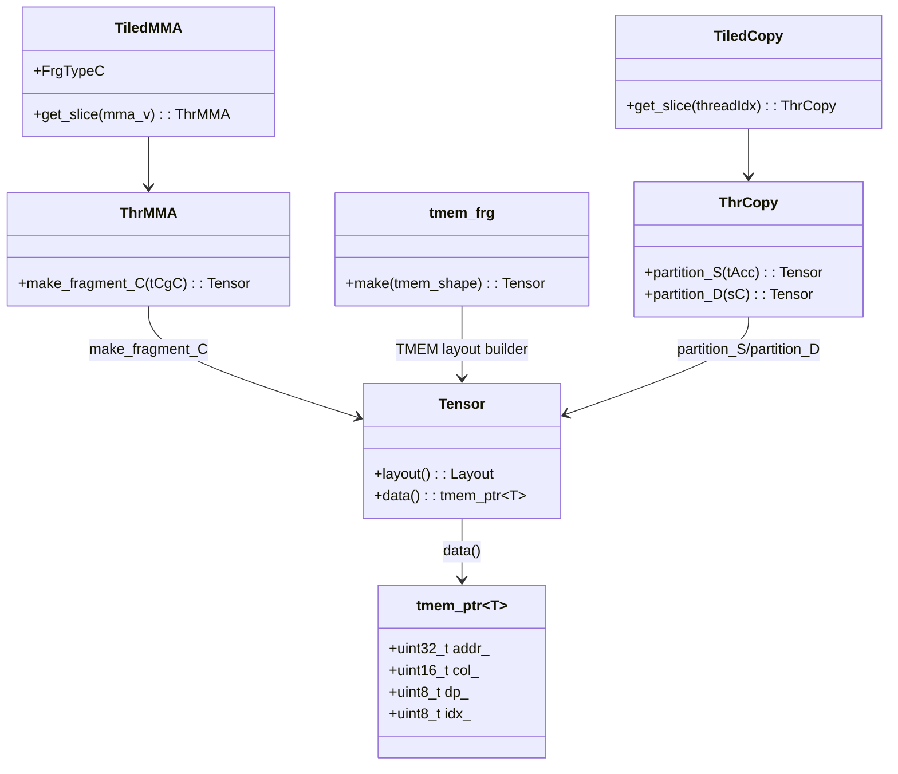

# SM100 TMEM Accumulator Addressing in `tutorial-05.cu`

This document explains how the SM100 TMEM (tensor memory) addressing is constructed and used for the accumulator tensor in `experiments/tutorial-05.cu`, and how that addressing flows through the MMA mainloop and the epilogue.

All source links are relative to this file and should be clickable in VS Code.

---

## 1. Key Files and Symbols

- GEMM tutorial kernel:
  - [`experiments/tutorial-05.cu`](../experiments/tutorial-05.cu#L320)
- TMEM allocator and DP stride:
  - [`3rdparty/cutlass/include/cute/arch/tmem_allocator_sm100.hpp`](../3rdparty/cutlass/include/cute/arch/tmem_allocator_sm100.hpp#L45)
- TMEM pointer encoding (`tmem_ptr`):
  - [`3rdparty/cutlass/include/cute/pointer.hpp`](../3rdparty/cutlass/include/cute/pointer.hpp#L272)
- TMEM fragment allocator for MMA (`tmem_frg`):
  - [`3rdparty/cutlass/include/cute/atom/mma_traits_sm100.hpp`](../3rdparty/cutlass/include/cute/atom/mma_traits_sm100.hpp#L424)
- TMEM load copy traits for epilogue:
  - [`3rdparty/cutlass/include/cute/atom/copy_traits_sm100.hpp`](../3rdparty/cutlass/include/cute/atom/copy_traits_sm100.hpp#L270)
- TMEM addressing constants and DP stride:
  - [`3rdparty/cutlass/include/cute/arch/tmem_allocator_sm100.hpp`](../3rdparty/cutlass/include/cute/arch/tmem_allocator_sm100.hpp#L45)

The main concrete object we trace is the TMEM accumulator tensor:

- `Tensor tCtAcc = cta_mma.make_fragment_C(tCgC);`
  - Defined in [`tutorial-05.cu`](../experiments/tutorial-05.cu#L336)
  - Printed as:
    ```text
    tCtAcc: tmem_[32b](TMEM_ADDR) o ((_128,_256),_1,_1):((_65536,_1),_0,_0)
    ```
    in [`experiments/epi.log`](../experiments/epi.log#L200).

---

## 2. TMEM Address Format (`tmem_ptr`)

TMEM addresses are not standard pointers; they are packed fields in a 32‑bit word:

```cpp
// 3rdparty/cutlass/include/cute/pointer.hpp#L272
template <class T>
struct tmem_ptr {
  ...
  // TMEM "Address" with active mask 0x007F.01FF
  // The upper 16 bits, the 0x007F portion, refers to the 128  DP lanes
  // The lower 16 bits, the 0x01FF portion, refers to the 512 COL lanes
  union {
    uint32_t addr_;
    struct {
      uint16_t col_;   // 0..511
      uint8_t  dp_;    // 0..127
      uint8_t  idx_;   // subword index inside the 32b word
    };
  };
};
```

- `col_` selects a column within the 512‑column TMEM extent.
- `dp_` selects which of the 128 data paths (DP lanes).
- `idx_` is used as a subword selector when `ValueType` is narrower than 32 bits.

For accumulators in this tutorial, we use `ValueType = float` (`32b`), so:

- `idx_` is always `0`.
- A `(dp_, col_)` pair uniquely identifies a scalar accumulator.

---

## 3. DP Stride and `TMEM::DP<float>{} == _65536`

The DP stride constants are defined in the TMEM allocator:

```cpp
// 3rdparty/cutlass/include/cute/arch/tmem_allocator_sm100.hpp#L45
// 128 DP x 512 COL x uint32_t-addressing
using MAX_CAPACITY_BITS = Int<128*512*32>;

// TMEM DP stride in bit-addressing (shift by 5 for conversion from uint32_t)
using DP_b = cute::constant<int32_t, (1 << 21)>;

// TMEM DP stride in type-T addressing
template <class T = uint32_t>
using DP = cute::constant<int32_t,
    shiftl((1 << 16), tmem_ptr<T>::OffsetShift)>;
```

The `OffsetShift` is determined by the element type `T`:

```cpp
// 3rdparty/cutlass/include/cute/pointer.hpp#L283
static constexpr int32_t OffsetShift =
  log_2(trait_ratio(sizeof_bits<uint32_t>{}, sizeof_bits<T>{}));
```

For `T = float` (32 bits):

- `sizeof_bits<uint32_t> = 32`, `sizeof_bits<float> = 32` → ratio = 1.
- `log2(1) = 0` → `OffsetShift = 0`.
- So:
  ```cpp
  TMEM::DP<float> = (1 << 16) << 0 = 1 << 16 = 65536;
  ```

In other words:

- Stepping by `TMEM::DP<float>` advances one DP lane (`dp_ += 1`) at fixed `col_` and `idx_ = 0`.
- The bit‑space stride `DP_b = 1 << 21` is consistent:  
  `65536 * 32 bits = 2^16 * 2^5 = 2^21`.

---

## 4. Building the TMEM Accumulator Layout

### 4.1. TMEM “restride” layout

`mma_traits_sm100.hpp` defines a generic TMEM fragment allocator:

```cpp
// 3rdparty/cutlass/include/cute/atom/mma_traits_sm100.hpp#L472
template <class ValueType, class StorageType, int N_SM, UMMA::TmemAllocMode TmemAlloc>
struct tmem_frg : tmem_frg_base
{
  template <class TmemShape>
  CUTE_HOST_DEVICE constexpr static auto make(TmemShape const& tmem_shape)
  {
    ...
    using COL_ADDR = C<sizeof_bits<StorageType>::value / sizeof_bits<ValueType>::value>;
    Layout tmem_restride = Layout<
      Shape <               _128,   _16384>,
      Stride<TMEM::DP<ValueType>, COL_ADDR>
    >{};
    ...
  }
};
```

Interpretation:

- Shape: `_128 × _16384`
  - 128 = number of DP lanes.
  - 16384 = 512 columns × 32 bits per column, flattened.
- Stride:
  - First mode: `TMEM::DP<ValueType>` = DP stride.
  - Second mode: `COL_ADDR = StorageBits / ValueBits`.
    - For `StorageType = uint32_t (32b)` and `ValueType = float (32b)`: `COL_ADDR = 1`.
    - For packed formats (e.g. 16b values in 32b storage), `COL_ADDR > 1`.

Thus, for `ValueType = float`:

```text
offset(dp, k_idx) = dp * 65536 + k_idx * 1
```

Later composition with the MMA’s logical layout maps `(M,N)` → `(dp, k_idx)`, then `tmem_restride` turns that into a `tmem_ptr` offset.

### 4.2. Accumulator tensor `tCtAcc`

In `tutorial-05.cu`, the accumulator fragment is created as:

```cpp
// experiments/tutorial-05.cu#L336
Tensor tCtAcc = cta_mma.make_fragment_C(tCgC);  // (MmaC, NumMma_M, NumMma_N)
```

Debug output (from `experiments/epi.log`) shows:

```text
tCtAcc: tmem_[32b](TMEM_ADDR) o ((_128,_256),_1,_1):((_65536,_1),_0,_0)
```

This means:

- Logical accumulator shape: `(M,N) = (128,256)`.
- Strides: `stride_M = 65536`, `stride_N = 1`.
- TMEM address for element `(m,n)` is:

```text
addr(m,n) = TMEM_ADDR + m * 65536 + n
```

In the packed pointer:

- `dp_ = m`, `col_ = n`, `idx_ = 0`.

So rows map 1:1 to DP lanes, and columns map 1:1 to TMEM columns (for this 128×256 tile).

---

## 5. Execution Flow: From MMA to Epilogue

### 5.1. Call sequence (high level)



---

## 6. MMA Mainloop: Using the Layout to Write Accumulators

The mainloop MMA call is:

```cpp
// experiments/tutorial-05.cu#L520
if (elect_one_cta) {
  ...
  if (elect_one_warp) {
    for (int k_block = 0; k_block < size<2>(tCrA); ++k_block) {
      gemm(tiled_mma, tCrA(_,_,k_block), tCrB(_,_,k_block), tCtAcc);
      tiled_mma.accumulate_ = UMMA::ScaleOut::One;
    }
  }
}
```

Inside `gemm`, the SM100 UMMA driver:

1. Uses `tCtAcc.layout()` to translate each `(m,n)` in the 256×256 MMA tile to a TMEM address:

   ```text
   addr(m,n) = TMEM_ADDR + m * 65536 + n
   ```

2. Encodes that as a `tmem_ptr<float>` (`dp_ = m`, `col_ = n`, `idx_ = 0`).
3. Passes these TMEM addresses to the tcgen05.mma instruction as accumulator pointers.
4. Each MMA operation accumulates into those TMEM locations across the K‑loop (`k_block`).

**Concrete example:**

- Full accumulator tile: `M=128`, `N=256`.
- Take element `(m=10, n=20)`:

  ```text
  offset = 10 * 65536 + 20 = 655360 + 20
  addr   = TMEM_ADDR + 655380
  ```

  Packed fields:

  - `dp_  = 10`
  - `col_ = 20`
  - `idx_ = 0`

This is where MMA writes the `(10,20)` accumulator for this CTA.

---

## 7. Epilogue: Loading TMEM Accumulators into Registers

After MMA, the epilogue tiles the accumulator and sets up TMEM loads:

```cpp
// experiments/tutorial-05.cu#L546
auto   epi_tiler_v = make_tile(epi_tiler_mn);               // (EpiTile)
Tensor tAcc_epi    = zipped_divide(tCtAcc, epi_tiler_v);    // (EpiTile,NumTiles)
...
TiledCopy t2r_copy = make_tmem_copy(SM100_TMEM_LOAD_32dp32b1x{}, tAcc_epi(_,_0{}));
ThrCopy   thr_t2r  = t2r_copy.get_slice(threadIdx.x);
Tensor tTR_tAcc    = thr_t2r.partition_S(tAcc_epi);         // (TmemCpy,NumTmemCpy,NumTiles)
Tensor tTR_rD      = make_fragment_like(tTR_sD);            // (TmemCpy,NumTmemCpy)
```

`make_tmem_copy` builds a warp‑level TMEM load pattern:

```cpp
// 3rdparty/cutlass/include/cute/atom/copy_traits_sm100.hpp#L270
auto atom_t_layout = Layout<
  Shape<_32,_4>,                                  // (thread, subpartition)
  Stride<_0, decltype(Int<32>{} * TMEM::DP<T>{})> // each subpartition offset by 32*DP
>{};

auto atom_v_layout =
  coalesce(upcast<sizeof_bits<T>::value>(typename Traits::ValID{}));

return make_cotiled_copy(atom, make_layout(atom_t_layout, atom_v_layout),
                         tmem.layout());
```

For `SM100_TMEM_LOAD_32dp32b1x`:

```cpp
// 3rdparty/cutlass/include/cute/atom/copy_traits_sm100.hpp#L1458
struct Copy_Traits<SM100_TMEM_LOAD_32dp32b1x> {
  using ThrID = Layout<_32>;
  using ValID = Layout<Shape <_32,       _32>,
                       Stride< _1,TMEM::DP_b>>;
  using SrcLayout = Layout<Shape <_32,_1024>, Stride< _0,_1>>;
  using DstLayout = Layout<Shape <_32,_32>,   Stride<_32,_1>>;
};
```

Interpretation:

- 32 threads (one warp) participate.
- Each TMEM load covers a 32×32 “bit tile” across 32 DPs and 32 columns.
- `ValID` says: second index steps by `TMEM::DP_b`, i.e., moves to the next DP lane.
- `DstLayout` is a 32×32 register tile (row‑major).

### 7.1. Concrete per‑warp, per‑thread example

Consider the first epilogue tile, covering rows `m = 0..31` and columns `n = 0..31` of the accumulator (a 32×32 block in the top‑left of the 128×256 tile):

- Warp 0 (threads `threadIdx.x` 0–31) is handling this tile.
- For this block:
  - Row indices: `m = 0..31`.
  - Column indices: `n = 0..31`.

Under the `tCtAcc` layout, element `(m,n)` lives at:

```text
addr(m,n) = TMEM_ADDR + m * 65536 + n
```

Now focus on **lane 7** of warp 0:

1. Its logical row index in this 32×32 block is `m = 7`.
2. It needs the 32 accumulators in that row:

   ```text
   {(7,0), (7,1), ..., (7,31)}
   ```

3. Their TMEM addresses are:

   ```text
   addr(7,n) = TMEM_ADDR + 7 * 65536 + n,  n = 0..31
   ```

   In packed fields:

   - `dp_  = 7`
   - `col_ = n`
   - `idx_ = 0`

4. When we call:

   ```cpp
   copy(t2r_copy, tTR_tAcc(_,_,epi_tile_idx), tTR_rD);
   ```

   - `tTR_tAcc` for lane 7 is exactly this row of TMEM coordinates.
   - `tTR_rD` for lane 7 becomes a 32‑element register vector holding those accumulators.

The same pattern extends to:

- Other lanes in warp 0: `lane l` maps to row `m = l` of that 32×32 block.
- Other warps / TMEM loads: they cover additional rows or columns of the 128×256 tile by varying the subpartition and column offset.

### 7.2. Epilogue computation flow

```mermaid
flowchart TD
  A[TMEM accumulators tCtAcc\n128x256, layout (_65536,_1)] --> B[tAcc_epi\n(EpiTile,NumTiles)]
  B --> C[make_tmem_copy\nSM100_TMEM_LOAD_32dp32b1x]
  C --> D[Warp-level TMEM loads\n(tTR_tAcc -> tTR_rD)]
  D --> E[Load C from SMEM\n(tTR_sC -> tTR_rC)]
  E --> F[axpby(beta, C, alpha, Acc)\nper-thread, per-element]
  F --> G[Store D to SMEM\n(tTR_rD -> tTR_sD)]
  G --> H[TMA store D to GMEM\n(tSG_sD -> tSG_gD)]
```

---

## 8. Class / Type Relationships (Simplified)



---

## 9. Summary

- `TMEM::DP<float>{} == _65536` is the **row stride** of the accumulator in TMEM and corresponds to a single increment of the `dp_` field in `tmem_ptr<float>`.
- The accumulator tensor `tCtAcc` uses layout `((_128,_256),_1,_1):((_65536,_1),_0,_0)`, mapping `(m,n)` to TMEM address `TMEM_ADDR + m*65536 + n`.
- During the MMA mainloop, tcgen05.mma writes directly into these TMEM addresses, one DP lane per row.
- In the epilogue, `make_tmem_copy(SM100_TMEM_LOAD_32dp32b1x, ...)` partitions the same TMEM layout across warps and lanes so that each warp loads rectangular (e.g., 32×32) tiles of the accumulator into registers, performs `D = beta * C + alpha * Acc`, and then returns results to GMEM via TMA.

This layout is the critical bridge between:

- The logical `(M,N)` accumulator space used by CuTe’s `TiledMMA`, and
- The physical `(dp_, col_, idx_)` TMEM address fields consumed by the SM100 UMMA and TMEM load/store instructions.

